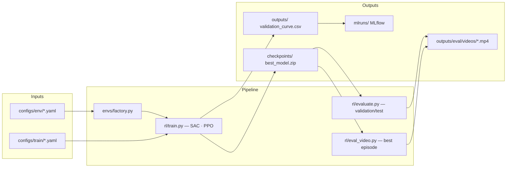

# RoboCasa — Ouverture de porte avec PandaOmron (IA705, Telecom Paris)

> **Tâche atomique** : apprendre à ouvrir une porte de placard dans RoboCasa  
> **Robot** : PandaOmron (bras Panda sur base mobile Omron — navigation exclue)  
> **Méthode** : SAC comme algorithme principal · PPO comme baseline comparative  
> **Contexte** : projet académique IA705 — Apprentissage pour la robotique, Mastère Spécialisé IA Multimodale, Telecom Paris

[](pyproject.toml)
[](scripts/setup_uv.sh)
[](docs/EXPERIMENTS.md)
[](docs/EXPERIMENTS.md)

---

## Sommaire

- [Vue d'ensemble](#vue-densemble)
- [Objectif du projet](#objectif-du-projet)
- [Tâche et environnement](#tâche-et-environnement)
- [Méthode RL](#méthode-rl)
- [Choix méthodologiques](#choix-méthodologiques)
- [Reward shaping](#reward-shaping)
- [Métriques](#métriques)
- [Structure du repo](#structure-du-repo)
- [Installation](#installation)
- [Démarrage rapide](#démarrage-rapide)
- [Entraînement](#entraînement)
- [Évaluation](#évaluation)
- [Génération vidéo](#génération-vidéo)
- [MLflow](#mlflow)
- [Résultats](#résultats)
- [Reproductibilité](#reproductibilité)
- [Troubleshooting](#troubleshooting)
- [Checklist de rendu](#checklist-de-rendu)
- [Références](#références)

---

## Vue d'ensemble

Ce projet applique l'apprentissage par renforcement profond à la manipulation robotique en simulation : un agent apprend à ouvrir une porte de placard de cuisine sans aucune démonstration préalable, à partir de zéro.

```
Entrée : config YAML  →  Entraînement SAC/PPO  →  Checkpoint  →  Évaluation / Vidéo
```

**Pipeline complet :**



---

## Objectif du projet

**Question de recherche :**  
> Sur la tâche atomique *ouvrir une porte* dans RoboCasa, quelle méthode RL est la plus adaptée — SAC ou PPO — et à partir de quand le surentraînement apparaît-il ?

**Choix méthodologiques :**
- **SAC** (Soft Actor-Critic) comme méthode principale : off-policy, sample-efficient, maximisation d'entropie pour l'exploration
- **PPO** (Proximal Policy Optimization) comme baseline comparative : on-policy, stable, simple à tuner
- **Observations état bas niveau** (vecteurs de joints, positions) plutôt que RGB pour tenir la deadline
- **Métrique principale** : *validation success rate* (pas la reward brute)
- **Sélection de checkpoint** : meilleur succès validation, **jamais** le dernier step

---

## Tâche et environnement

### Tâche : OpenCabinet

| Propriété | Valeur |
|---|---|
| Nom RoboCasa | `OpenCabinet` (alias `OpenSingleDoor`) |
| Objectif | Ouvrir la porte d'un placard de cuisine ≥ 90 % de son angle maximal |
| Succès | `theta_normalised ≥ 0.90` (vérifié par `fxtr.is_open(th=0.90)`) |
| Horizon | 500 steps par épisode |
| Fréquence de contrôle | 10 Hz |
| Observation | État bas niveau : joints, EEF, distance poignée (~50 scalaires) |
| Action | Espace continu : commande différentielle du bras (7 DoF) |
| Réseau de neurones | MLP [256, 256] (acteur + critique) |

### Robot : PandaOmron

Le robot PandaOmron est un **Franka Panda** (7 DoF, manipulation précise) monté sur une **base mobile Omron**. Dans ce projet, **la navigation est explicitement exclue** : seul le bras est entraîné, la base reste fixe. Le robot est positionné face au placard dès le reset.

### Environnement

- **Simulateur** : MuJoCo 3.x via RoboSuite 1.5.2
- **Framework haut niveau** : RoboCasa 1.0.0 (scènes de cuisine procédurales)
- **Interface RL** : Gymnasium 0.29.1 (via adaptateur `RawRoboCasaAdapter`)
- **Parallélisation** : `SubprocVecEnv` avec 12 workers pour SAC
- **Assets** : objets Objaverse (variantes procédurales de portes et de cuisines)

---

## Méthode RL

### SAC (algorithme principal)

SAC maximise simultanément la récompense cumulée et l'entropie de la politique, ce qui favorise une exploration naturelle sans avoir à fixer manuellement un calendrier d'exploration.

| Hyperparamètre | Valeur |
|---|---:|
| `learning_rate` | 3 × 10⁻⁴ |
| `buffer_size` | 1 000 000 |
| `batch_size` | 512 |
| `learning_starts` | 1 000 |
| `tau` (soft update) | 0.005 |
| `gamma` | 0.99 |
| `train_freq` | 1 step / env step |
| `gradient_steps` | 12 (par step) |
| `ent_coef` | auto (entropie cible adaptée) |
| `n_envs` | 12 workers parallèles |
| Architecture | MLP [256, 256] |

### PPO (baseline comparative)

| Hyperparamètre | Valeur |
|---|---:|
| `learning_rate` | 3 × 10⁻⁴ |
| `n_steps` | 1 024 |
| `batch_size` | 256 |
| `n_epochs` | 10 |
| `gamma` | 0.99 |
| `gae_lambda` | 0.95 |
| `clip_range` | 0.2 |
| `ent_coef` | 0.01 |
| Architecture | MLP [256, 256] |

### Plan d'expériences

| # | Run | Config | Algo | Steps | Rôle |
|---|---|---|---|---:|---|
| 0 | SAC debug | `open_single_door_sac_debug.yaml` | SAC | 300 k | Sanity — validation reward shaping |
| 1 | SAC principal | `open_single_door_sac.yaml` | SAC | 3 M | Référence principale |
| 2 | SAC tuned | `open_single_door_sac_tuned.yaml` | SAC | 2 M | Variante (lr=1e-4, ent=auto_0.2) |
| 3 | PPO baseline | `open_single_door_ppo_baseline.yaml` | PPO | 5 M | Baseline comparative |

---

## Choix méthodologiques

Cette section résume *pourquoi* chaque choix technique a été fait, en lien avec le cours IA705. La version complète avec toutes les justifications formelles est dans [docs/project_report.md §17](docs/project_report.md#17-justification-of-methods-and-tools).

### Pourquoi RoboCasa / MuJoCo ?

RoboCasa fournit un cadre simulation réaliste aligné sur le cours : interaction agent–environnement, reward sparse, espace d'action continu, physique des contacts. La simulation permet de collecter des millions d'interactions sans risque matériel — impossible avec un vrai robot dans la durée du projet.

### Pourquoi SAC comme algorithme principal ?

SAC (Haarnoja et al., 2018) est **off-policy** + **maximisation d'entropie**. Ces deux propriétés le rendent adapté à la manipulation continue :

- **Off-policy** : le replay buffer réutilise chaque transition ~12 fois (`gradient_steps=12`), rendant 3M steps équivalents à ~36M updates réseau — critique quand chaque épisode dure 50 s simulées.
- **Entropie** : l'exploration est intrinsèque, sans calendrier ε-greedy manuel. L'agent découvre naturellement des stratégies de contact variées.
- **Espace d'action continu** : DQN et Q-learning tabulaire sont inapplicables sur un bras 7-DoF — SAC paramétrise une politique gaussienne directement dans ℝ^7.

### Pourquoi PPO comme baseline ?

PPO (Schulman et al., 2017) est **on-policy** — il n'a pas de replay buffer et recalcule des rollouts frais à chaque update. Plus stable mais moins sample-efficient. Il sert de **baseline comparative** : montrer que SAC converge avec moins de steps justifie son choix comme méthode principale.

### Pourquoi 12 workers parallèles ?

12 workers `SubprocVecEnv` saturent les 12 cœurs CPU disponibles et maximisent la diversité des trajectoires dans le replay buffer SAC. La contrepartie : le rendu vidéo est impossible depuis les workers (contextes OpenGL non partageables entre processus) → génération vidéo post-training via `eval_video.py`.

### Pourquoi le reward shaping ?

La reward sparse native (`R=1` si succès) crée un problème d'exploration extrême : depuis des actions aléatoires, la probabilité d'ouvrir accidentellement une porte est quasi-nulle. Le reward shaping fournit des signaux intermédiaires (approche, progression θ, succès) tout en prévenant le reward hacking via un design anti-hacking (high-watermark, gating, pénalités conditionnelles).

### Pourquoi MLflow ?

Les algorithmes RL sont instables et sensibles aux seeds. MLflow permet de comparer plusieurs runs côte-à-côte, de détecter les dérives de `approach_frac` (hover hacking) en temps réel, et de lier chaque résultat au checkpoint exact et à la config qui l'a produit.

### Pourquoi ne pas utiliser uniquement la reward totale ?

**Goodhart's Law** : quand une mesure devient un objectif, elle cesse d'être une bonne mesure. Un agent peut maximiser le return en restant immobile devant la poignée (`approach_frac → 1`, `success_rate → 0`). La métrique principale reste donc `val_success_rate`, complétée par les métriques anti-hacking.

Documentation complète : [docs/project_report.md](docs/project_report.md) · [docs/issues_and_limitations.md](docs/issues_and_limitations.md) · [docs/model_improvements.md](docs/model_improvements.md)

---

## Reward shaping

La reward naive de RoboCasa encourage le robot à s'approcher de la poignée, ce qui peut conduire à du **reward hacking** : l'agent apprend à rester immobile devant la poignée pour accumuler la reward d'approche sans jamais ouvrir la porte.

### Formule complète

```
R = w_approach  × r_approach   (gated : désactivé une fois la porte ouverte)
  + w_progress  × r_progress   (high-watermark, anti-oscillation)
  + w_success   × r_success    (bonus sparse, dominant)
  - w_action_reg × ‖a‖²        (régularisation action)
  - w_stagnation × p_stag      (pénalité conditionnelle : proche + bloqué)
  - w_wrong_dir  × p_back      (pénalité : porte repoussée)
  - w_oscillation × p_osc      (pénalité : oscillations répétées)
```

### Composantes et coefficients

| Composante | Description | Coefficient | Risque évité | Métrique associée |
|---|---|---:|---|---|
| `approach` | Distance EEF → poignée normalisée, gated | 0.05 | Hover hacking | `approach_frac_mean` |
| `progress` | Δθ high-watermark (θ_best − θ_précédent) | 1.0 | Oscillation | `door_angle_max_mean` |
| `success` | Bonus sparse si θ ≥ 0.90 | 5.0 | Ignorer la tâche | `success_rate` |
| `action_reg` | −‖a‖² (jerk penalty) | 0.01 | Actions parasites | `action_smoothness_mean` |
| `stagnation` | −1 si près poignée + bloqué ≥ 50 steps | 0.05 | Hover hacking long | `stagnation_steps_mean` |
| `wrong_dir` | −Δθ_négatif si θ < θ_best − tol | 0.3 | Refermer la porte | `sign_changes_mean` |
| `oscillation` | −sign_changes/window si fenêtre saturée | 0.2 | Oscillation rapide | `sign_changes_mean` |

**Mécanismes clés :**
- **High-watermark progress** : l'agent ne peut recevoir de reward de progression qu'en battant son meilleur angle de porte de l'épisode. Impossible de gagner en oscillant.
- **Gating de l'approche** : la reward d'approche est nulle une fois la porte ouverte (θ ≥ 0.90), évitant de récompenser le stationnement devant la poignée.
- **Pénalité de stagnation conditionnelle** : elle ne s'active que si le robot est déjà proche de la poignée (d < 0.12 m) ET n'a pas progressé depuis 50 steps — évitant les faux positifs.

Documentation complète : [docs/reward_shaping.md](docs/reward_shaping.md)

---

## Métriques

| Métrique | Description | Cible |
|---|---|---|
| `val_success_rate` | Taux de succès sur split validation (épisodes où θ ≥ 0.90) | > 80 % |
| `val_return_mean` | Return moyen par épisode sur validation | Croissant |
| `val_door_angle_final_mean` | Angle de porte normalisé à la fin de l'épisode | → 1.0 |
| `val_door_angle_max_mean` | Meilleur angle atteint dans l'épisode (high-watermark) | → 1.0 |
| `val_stagnation_steps_mean` | Steps passés près de la poignée sans progrès | ↓ 0 |
| `val_approach_frac_mean` | Part de la reward qui vient de l'approche (> 0.5 = hover hack) | < 0.3 |
| `val_sign_changes_mean` | Changements de signe de Δθ par épisode (oscillation) | ↓ 0 |
| `val_action_smoothness_mean` | Jerkiness moyenne des actions | Stable |
| `train/reward_hack/*` | Fractions intra-épisode (approach, stagnation, oscillation) | Toutes ↓ |

Documentation complète : [docs/metrics.md](docs/metrics.md)

---

## Structure du repo

```text
robocasa-project-B/
├── README.md                          ← ce fichier
├── Makefile                           ← toutes les commandes courantes
├── pyproject.toml                     ← dépendances Python (uv)
├── uv.lock                            ← lock file reproductible
├── pytest.ini
│
├── configs/
│   ├── env/open_single_door.yaml      ← env + reward shaping
│   └── train/
│       ├── open_single_door_sac_debug.yaml   ← 300k (sanity)
│       ├── open_single_door_sac.yaml         ← 3M (référence)
│       ├── open_single_door_sac_tuned.yaml   ← 2M (variante)
│       ├── open_single_door_ppo.yaml         ← 200k (smoke PPO)
│       └── open_single_door_ppo_baseline.yaml ← 5M (baseline)
│
├── robocasa_telecom/
│   ├── envs/
│   │   ├── factory.py    ← adapters Gymnasium ↔ RoboCasa
│   │   └── reward.py     ← AntiHackingReward + RewardConfig
│   ├── rl/
│   │   ├── train.py      ← entraînement SAC/PPO + callbacks
│   │   ├── evaluate.py   ← évaluation validation/test
│   │   ├── eval_video.py ← génération vidéo two-pass
│   │   └── render_best_run.py
│   ├── utils/
│   │   ├── metrics.py    ← summarize_rollout_episodes, CI Wilson
│   │   ├── checkpoints.py ← resolve, auto-resume
│   │   ├── success.py    ← infer_success (hiérarchique)
│   │   ├── video.py      ← save_mp4, grid_2x2
│   │   └── io.py
│   └── tools/sanity.py   ← smoke test reset/step
│
├── scripts/
│   ├── setup_uv.sh        ← installation complète
│   ├── plot_training.py   ← génère les courbes PNG
│   ├── run_train.sh, run_eval.sh
│   └── slurm/            ← sbatch pour cluster HPC
│
├── docs/
│   ├── project_report.md      ← rapport pour le professeur
│   ├── reward_shaping.md      ← documentation reward détaillée
│   ├── metrics.md             ← toutes les métriques
│   ├── experiments.md         ← protocole expérimental
│   ├── video_generation.md    ← génération vidéo
│   ├── reproducibility.md     ← guide de reproductibilité
│   ├── troubleshooting.md     ← dépannage
│   ├── results.md             ← résultats (mis à jour après runs)
│   ├── submission_checklist.md ← checklist de rendu
│   ├── ARCHITECTURE.md, METHODS.md, RUNBOOK.md, ...
│
├── external/
│   ├── robocasa/    ← clone local (commit fixé dans setup_uv.sh)
│   └── robosuite/   ← clone local (commit fixé)
│
├── checkpoints/     ← modèles sauvegardés (non versionnés Git)
├── outputs/         ← courbes CSV, JSON, vidéos (non versionnés Git)
├── mlruns/          ← MLflow local (non versionné Git)
└── logs/            ← TensorBoard (non versionné Git)
```

---

## Installation

**Compatibilité plateformes :** macOS Apple Silicon (MPS/CPU), Linux/WSL2 (CUDA), Windows 11 (CUDA). Voir [docs/platform_compatibility.md](docs/platform_compatibility.md) pour les instructions détaillées par OS.

**Pré-requis communs :** `uv`, `git`, Python ≥ 3.11.

| OS | Pré-requis supplémentaires |
|---|---|
| macOS Apple Silicon | `brew install cmake` |
| Windows 11 | Visual C++ Build Tools 2022, CUDA Toolkit 12.x |
| WSL2 / Linux | `sudo apt install cmake libgl1-mesa-glx`, drivers NVIDIA |

```bash
# Cloner le repo
git clone https://github.com/YiZeems/robocasa-project-B.git
cd robocasa-project-B

# Installation complète (clone robocasa/robosuite, assets, .venv)
bash scripts/setup_uv.sh
```

Le script `setup_uv.sh` :
1. Clone `external/robosuite` et `external/robocasa` aux commits figés
2. Crée `.venv` via `uv` avec Python 3.11
3. Installe toutes les dépendances listées dans `pyproject.toml`
4. Relie ou télécharge les assets RoboCasa
5. Valide les imports et les assets critiques

**Installation avec contrôle complet :**

```bash
PYTHON_VERSION=3.11 \
DOWNLOAD_ASSETS=1 VERIFY_ASSETS=1 \
DOWNLOAD_DATASETS=0 RUN_SETUP_MACROS=1 \
bash scripts/setup_uv.sh
```

**Vérification post-installation :**

```bash
pytest tests/test_platform_smoke.py -v   # smoke tests cross-plateforme (11 tests, < 5s)
make check    # compile + pip check
make sanity   # smoke test reset/step 20 pas
```

---

## Démarrage rapide

### Run de debug (2–5 minutes)

Valide l'installation, le reward shaping, et MLflow. 12 workers, 300k steps.

```bash
make train-sac-debug SEED=0
```

Équivalent complet :

```bash
uv run python -m robocasa_telecom.train \
  --config configs/train/open_single_door_sac_debug.yaml \
  --seed 0
```

Résultat attendu : 4 évaluations validation, `validation_curve.csv` généré, checkpoint `best_model.zip` sauvegardé.

### Smoke test minimal (< 1 minute)

```bash
uv run python -m robocasa_telecom.train \
  --config configs/train/open_single_door_sac_debug.yaml \
  --seed 0 --total-timesteps 10 --no-auto-resume
```

---

## Entraînement

### Commandes Make

```bash
make train-sac-debug SEED=0      # 300k — sanity + validation reward
make train-sac       SEED=0      # 3M   — run principal (référence)
make train-sac-tuned SEED=0      # 2M   — variante hyperparamètres
make train-ppo-baseline SEED=0   # 5M   — baseline PPO
```

### Run complet SAC (3M steps, référence)

```bash
uv run python -m robocasa_telecom.train \
  --config configs/train/open_single_door_sac.yaml \
  --seed 0
```

Durée estimée : ~19 h sur macOS M-series (MPS), ~8 h sur RTX 4070.

### Run PPO baseline (5M steps)

```bash
uv run python -m robocasa_telecom.train \
  --config configs/train/open_single_door_ppo_baseline.yaml \
  --seed 0
```

### Reprise automatique

Par défaut, `train.py` détecte et reprend le dernier run incomplet compatible (même task/algo/seed). Pour forcer un départ neuf :

```bash
uv run python -m robocasa_telecom.train \
  --config configs/train/open_single_door_sac.yaml \
  --seed 0 --no-auto-resume
```

Reprise explicite depuis un checkpoint :

```bash
uv run python -m robocasa_telecom.train \
  --config configs/train/open_single_door_sac.yaml \
  --seed 0 \
  --resume-from checkpoints/<run_id>/sac_100000_steps.zip
```

### Artefacts générés par l'entraînement

```text
outputs/<run_id>/
  monitor.csv              ← reward/longueur d'épisode (SB3 Monitor)
  validation_curve.csv     ← toutes les métriques validation par step
  train_summary.json       ← résumé complet du run
  resolved_train_config.yaml ← config résolue (reproductibilité)

checkpoints/<run_id>/
  best_model.zip           ← meilleur succès validation → UTILISER POUR LE RAPPORT
  final_model.zip          ← état au dernier step
  sac_<step>_steps.zip     ← checkpoints périodiques (tous les 100k)
  sac_<step>_steps_replay_buffer.pkl
```

---

## Évaluation

### Évaluer le meilleur checkpoint

```bash
# Split validation (seeds vus pendant l'entraînement)
make eval-validation \
  CONFIG=configs/train/open_single_door_sac.yaml \
  CHECKPOINT=checkpoints/<run_id>/best_model.zip \
  EPISODES=50

# Split test (seeds non vus — résultats finaux)
make eval-test \
  CONFIG=configs/train/open_single_door_sac.yaml \
  CHECKPOINT=checkpoints/<run_id>/best_model.zip \
  EPISODES=50
```

CLI direct :

```bash
uv run python -m robocasa_telecom.evaluate \
  --config configs/train/open_single_door_sac.yaml \
  --checkpoint checkpoints/<run_id>/best_model.zip \
  --num-episodes 50 \
  --split test \
  --deterministic
```

Résultat : `outputs/eval/eval_SAC_test_<timestamp>.json` avec success_rate, return_mean, door_angle_final, etc.

### Critères d'interprétation

| Condition | Interprétation |
|---|---|
| `train_success − val_success > 20 %` | Surentraînement |
| `val_success` stagne 20 évals consécutives | Convergence atteinte (early stopping) |
| `best_step ≪ final_step` | Modèle a sur-fitté après le best |
| `approach_frac > 0.5` | Reward hacking (hover) |

---

## Génération vidéo

La génération vidéo utilise une approche **two-pass** pour contourner la limite de rendu dans les workers parallèles :
- **Pass 1** : score N épisodes sans rendu (rapide)
- **Pass 2** : re-joue le meilleur épisode avec le même seed (reproductible)

**Critère de sélection** : `score = 1000×success + 100×θ_final + 10×θ_max + 1×return − 0.1×stagnation − 0.01×length`

```bash
# Génère la vidéo du meilleur épisode parmi 20
make eval-video \
  CONFIG=configs/train/open_single_door_sac.yaml \
  CHECKPOINT=checkpoints/<run_id>/best_model.zip \
  EPISODES=20 SEED=0
```

CLI direct :

```bash
uv run python -m robocasa_telecom.rl.eval_video \
  --config configs/train/open_single_door_sac.yaml \
  --checkpoint checkpoints/<run_id>/best_model.zip \
  --episodes 20 --seed 0 \
  --out outputs/eval/videos/
```

**Fichiers générés :**
```text
outputs/eval/videos/
  <run_id>_best_episode_<ts>.mp4
  <run_id>_worst_episode_<ts>.mp4
  <run_id>_best_episode_metadata_<ts>.json
  <run_id>_video_selection_debug_<ts>.csv
```

Documentation complète : [docs/video_generation.md](docs/video_generation.md)

---

## MLflow

MLflow trace automatiquement toutes les métriques à chaque évaluation.

### Lancer l'interface MLflow

```bash
uv run mlflow ui --backend-store-uri ./mlruns
```

Puis ouvrir : **http://127.0.0.1:5000**

Si le port 5000 est occupé :

```bash
uv run mlflow ui --backend-store-uri ./mlruns --port 5001
```

### Métriques loggées

- `train/reward_hack/*` : fractions intra-épisode (approach, stagnation, oscillation)
- `validation/*` : success_rate, return_mean, door_angle_final, door_angle_max, sign_changes, stagnation_steps, approach_frac
- `eval_video/*` : métriques du meilleur épisode après run complet

### Générer les courbes PNG

```bash
make plot PLOT_RUNS="outputs/OpenCabinet_SAC_seed0_*/" SMOOTH=3
# → outputs/plots/success_rate.png, summary.png, door_angle.png, ...
```

Comparaison multi-runs :

```bash
uv run python scripts/plot_training.py \
  --run outputs/OpenCabinet_SAC_seed0_*/ outputs/OpenCabinet_PPO_seed0_*/ \
  --label "SAC seed0" "PPO seed0" \
  --out outputs/plots/
```

### TensorBoard

```bash
make tensorboard
# → http://localhost:6006
```

---

## Résultats

> **Note** : cette section est mise à jour après chaque run complet. Les placeholders `[À compléter]` seront remplis avec les valeurs réelles.

### Tableau comparatif

| Run | Algo | Steps | Val. Success Rate | Test Success Rate | Best Step | Écart train/val |
|---|---|---:|---:|---:|---:|---|
| SAC debug | SAC | 300k | [À compléter] | — | [À compléter] | [À compléter] |
| SAC principal | SAC | 3M | [À compléter] | [À compléter] | [À compléter] | [À compléter] |
| SAC tuned | SAC | 2M | [À compléter] | [À compléter] | [À compléter] | [À compléter] |
| PPO baseline | PPO | 5M | [À compléter] | [À compléter] | [À compléter] | [À compléter] |

### Métriques anti-hacking (SAC principal)

| Métrique | Valeur finale |
|---|---|
| `approach_frac_mean` | [À compléter] |
| `stagnation_steps_mean` | [À compléter] |
| `sign_changes_mean` | [À compléter] |
| `door_angle_max_mean` | [À compléter] |

Documentation et analyse complètes : [docs/results.md](docs/results.md)

---

## Reproductibilité

| Élément | Mécanisme |
|---|---|
| Python | 3.11, fixé dans `pyproject.toml` |
| Dépendances | `uv.lock` — versions exactes gelées |
| RoboCasa/RoboSuite | Commits figés dans `setup_uv.sh` |
| Seeds | Explicites dans config (`seed: 0`) et CLI (`--seed`) |
| Configs | `resolved_train_config.yaml` sauvegardé par run |
| Checkpoints | `best_model.zip` + `replay_buffer.pkl` pour reprise SAC |
| Évaluation | Seeds séparés : `validation_seed=10000`, `test_seed=20000` |

**Reproduire un run depuis zéro :**

```bash
git clone https://github.com/YiZeems/robocasa-project-B.git && cd robocasa-project-B
bash scripts/setup_uv.sh
make train-sac SEED=0
make eval-test CONFIG=configs/train/open_single_door_sac.yaml \
               CHECKPOINT=checkpoints/<run_id>/best_model.zip EPISODES=50
```

Documentation complète : [docs/reproducibility.md](docs/reproducibility.md)

---

## Troubleshooting

| Symptôme | Solution |
|---|---|
| `.venv` manquant | `bash scripts/setup_uv.sh` |
| Assets manquants | `DOWNLOAD_ASSETS=1 VERIFY_ASSETS=1 bash scripts/setup_uv.sh` |
| Port 5000 occupé (MLflow) | `uv run mlflow ui --port 5001` |
| Reward haute mais 0 % succès | Hover hacking — vérifier `approach_frac > 0.5` dans MLflow |
| Run reprend en boucle | `--no-auto-resume` pour forcer un départ neuf |
| Vidéo vide / noire | Vérifier `has_offscreen_renderer: true` dans la config ou utiliser `eval_video.py` |
| OOM avec 12 workers | Réduire `n_envs` dans le YAML |
| Warnings `mink`, `mimicgen` | Non bloquants — connus, hérités des dépendances amont |

Documentation complète : [docs/troubleshooting.md](docs/troubleshooting.md)

---

## Checklist de rendu

- [ ] `make sanity` passe sans erreur
- [ ] Au moins un run SAC complet (3M) terminé
- [ ] `best_model.zip` présent dans `checkpoints/`
- [ ] `make eval-test` exécuté sur `best_model.zip` — résultats dans `outputs/eval/`
- [ ] Courbes `make plot` générées dans `outputs/plots/`
- [ ] Vidéo du meilleur épisode générée : `make eval-video`
- [ ] MLflow UI : métriques visibles sur http://127.0.0.1:5000
- [ ] `docs/results.md` rempli avec les valeurs réelles
- [ ] `docs/project_report.md` finalisé

Checklist complète : [docs/submission_checklist.md](docs/submission_checklist.md)

---

## Références

| Référence | Lien |
|---|---|
| RoboCasa (Nasiriany et al., 2024) | https://robocasa.ai |
| RoboSuite (Zhu et al., 2020) | https://robosuite.ai |
| SAC (Haarnoja et al., 2018) | https://arxiv.org/abs/1801.01290 |
| PPO (Schulman et al., 2017) | https://arxiv.org/abs/1707.06347 |
| Stable-Baselines3 | https://stable-baselines3.readthedocs.io |
| MuJoCo | https://mujoco.org |
| Gymnasium | https://gymnasium.farama.org |

---

## Documentation associée

| Document | Contenu |
|---|---|
| [docs/project_report.md](docs/project_report.md) | Rapport académique complet pour le professeur |
| [docs/reward_shaping.md](docs/reward_shaping.md) | Reward shaping détaillé — formules, coefficients, anti-hacking |
| [docs/metrics.md](docs/metrics.md) | Définition et interprétation de toutes les métriques |
| [docs/experiments.md](docs/EXPERIMENTS.md) | Protocole expérimental, commandes, tableau des runs |
| [docs/video_generation.md](docs/video_generation.md) | Guide de génération vidéo two-pass |
| [docs/reproducibility.md](docs/reproducibility.md) | Guide de reproductibilité complet |
| [docs/troubleshooting.md](docs/troubleshooting.md) | Résolution des problèmes courants |
| [docs/results.md](docs/results.md) | Résultats, courbes et interprétation |
| [docs/submission_checklist.md](docs/submission_checklist.md) | Checklist de rendu |
| [docs/ARCHITECTURE.md](docs/ARCHITECTURE.md) | Architecture technique détaillée |
| [docs/METHODS.md](docs/METHODS.md) | Cadre méthodologique RL |
| [docs/RUNBOOK.md](docs/RUNBOOK.md) | Procédures opératoires step-by-step |

---

> **Rappel** : pour le rapport, toujours utiliser **`best_model.zip`** (meilleur succès validation), **jamais** `final_model.zip`. La métrique principale est le **validation success rate**.
