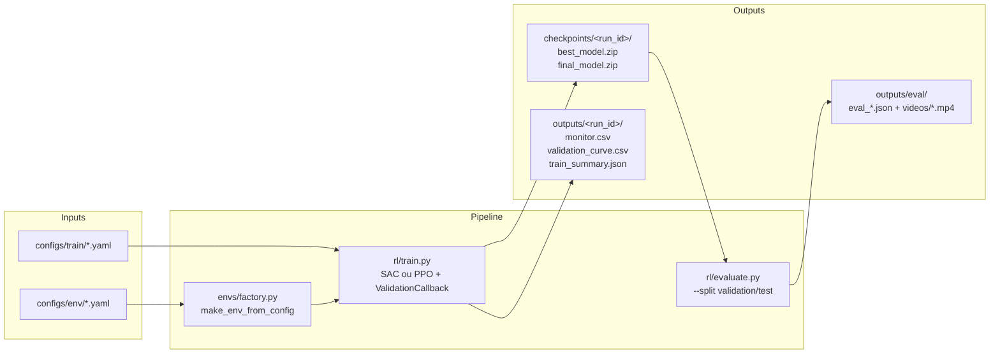
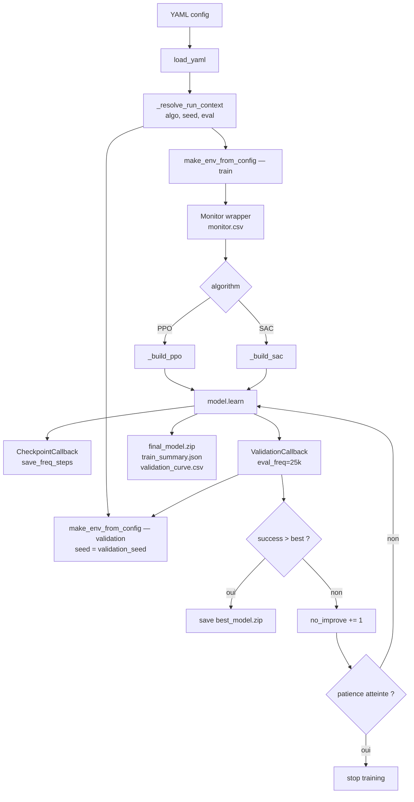
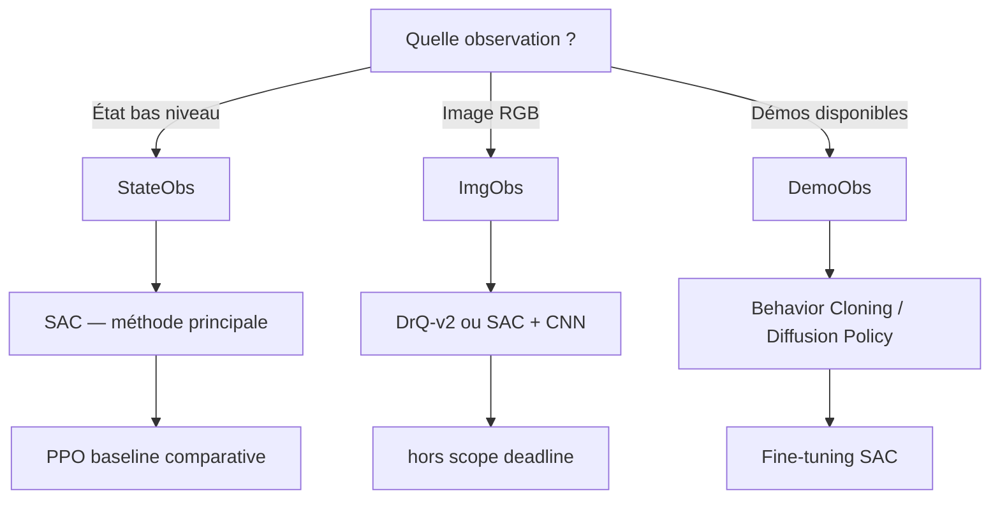
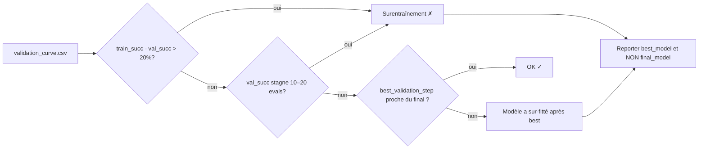

# RoboCasa Project B — Telecom Paris (IA705)

> **Mission** : entraîner et comparer un agent RL sur la tâche atomique
> **« ouvrir une porte »** dans RoboCasa, en s'appuyant sur **SAC** comme
> méthode principale et **PPO** comme baseline.

[](pyproject.toml)
[](scripts/setup_uv.sh)
[](docs/EXPERIMENTS.md)
[](docs/EXPERIMENTS.md)

---

## Sommaire

- [1. Contexte et question de recherche](#1-contexte-et-question-de-recherche)
- [2. Vue d'ensemble](#2-vue-densemble)
- [3. Architecture](#3-architecture)
- [4. Installation](#4-installation)
- [5. Lancer un run](#5-lancer-un-run)
- [6. Évaluer un checkpoint](#6-évaluer-un-checkpoint)
- [7. Plan d'expériences](#7-plan-dexpériences)
- [8. Configurations YAML](#8-configurations-yaml)
- [9. Artefacts produits](#9-artefacts-produits)
- [10. Détection du surentraînement](#10-détection-du-surentraînement)
- [11. Planning](#11-planning)
- [12. SLURM et calcul cluster](#12-slurm-et-calcul-cluster)
- [13. Documentation associée](#13-documentation-associée)

---

## 1. Contexte et question de recherche

Sur la tâche `OpenCabinet` (alias `OpenSingleDoor` / `OpenDoor`) avec un robot
`PandaOmron`, on cherche à répondre à :

> **Quelle méthode RL est la plus adaptée pour ouvrir une porte — SAC, PPO, ou
> une combinaison — et à partir de quand l'entraînement devient-il du
> surentraînement ?**

Choix retenus, justifiés en détail dans
[docs/guide_general_prompting_projet_rl_robocasa_porte.md](docs/guide_general_prompting_projet_rl_robocasa_porte.md) :

- **SAC** comme méthode principale : off-policy, sample-efficient sur le
  contrôle continu, exploration via maximisation d'entropie.
- **PPO** comme baseline comparative : on-policy, stable.
- **Observations état bas niveau** privilégiées (le RGB est volontairement écarté
  pour tenir la deadline).
- **Métrique principale** : *validation success rate*, pas le reward seul.
- **Sélection de checkpoint** : meilleur succès validation, **pas** le dernier.

## 2. Vue d'ensemble



## 3. Architecture

```text
.
├── robocasa_telecom/
│   ├── envs/factory.py         # adapters Gymnasium pour RoboCasa/RoboSuite
│   ├── rl/train.py             # entrainement algo-agnostique (PPO + SAC)
│   ├── rl/evaluate.py          # eval avec split validation/test, vidéos MP4
│   ├── tools/sanity.py         # smoke test reset/step
│   └── utils/                  # io.py, success.py, video.py
├── configs/
│   ├── env/open_single_door.yaml
│   └── train/
│       ├── open_single_door_sac_debug.yaml
│       ├── open_single_door_sac.yaml
│       ├── open_single_door_sac_tuned.yaml
│       ├── open_single_door_ppo.yaml          # smoke (200k)
│       └── open_single_door_ppo_baseline.yaml # baseline (5M)
├── scripts/
│   ├── setup_uv.sh             # bootstrap uv + clones robosuite/robocasa
│   ├── with_env.sh             # exécution dans le venv uv
│   ├── run_train.sh, run_eval.sh
│   └── slurm/{train_array,eval}.sbatch
├── docs/
│   ├── EXPERIMENTS.md          # plan de runs et protocole
│   ├── guide_general_prompting_projet_rl_robocasa_porte.md
│   ├── planning_deadline_runs_rapport_rl_robocasa.md
│   ├── ARCHITECTURE.md, METHODS.md, RUNBOOK.md, CI.md, FILE_REFERENCE.md, PACKAGES.md
├── tests/test_config_loading.py
├── pyproject.toml + uv.lock
└── Makefile
```

### 3.1 Boucle d'entraînement



### 3.2 Décision algo / observation



## 4. Installation

Pré-requis : `uv`, `git`, `python ≥ 3.11`. macOS/Linux supportés ; Windows via
WSL ou Git Bash.

```bash
bash scripts/setup_uv.sh
```

Ce script clone `external/robosuite` + `external/robocasa` aux commits fixés,
crée `.venv` via `uv`, installe le package en editable, télécharge les assets
RoboCasa et valide les imports.

Variables d'environnement utiles :

```bash
PYTHON_VERSION=3.11 \
DOWNLOAD_ASSETS=1 VERIFY_ASSETS=1 \
DOWNLOAD_DATASETS=0 RUN_SETUP_MACROS=1 \
bash scripts/setup_uv.sh
```

Sanity check :

```bash
make sanity
# ou
uv run python -m robocasa_telecom.sanity --config configs/env/open_single_door.yaml --steps 20
```

## 5. Lancer un run

Cibles `make` prêtes à l'emploi (paramétrables via `SEED=<n>`) :

```bash
make train-sac-debug      # 300k — sanity SAC
make train-sac            # 3M    — run principal SAC
make train-sac-tuned      # 2M    — variante (lr=1e-4, batch=512, ent=auto_0.2)
make train-ppo-baseline   # 5M    — baseline PPO
```

Équivalent direct :

```bash
uv run python -m robocasa_telecom.train \
  --config configs/train/open_single_door_sac.yaml --seed 0
```

Override CLI :

```bash
# Forcer un autre algo / nombre de steps sans toucher au YAML
uv run python -m robocasa_telecom.train \
  --config configs/train/open_single_door_sac.yaml \
  --algorithm SAC --total-timesteps 500000 --seed 1
```

Reprise depuis un checkpoint:

```bash
uv run python -m robocasa_telecom.train \
  --config configs/train/open_single_door_sac.yaml \
  --seed 1 \
  --resume-from checkpoints/<run_id>/sac_100000_steps.zip
```

`--resume-from` accepte aussi un dossier `checkpoints/<run_id>/` et reprend alors
depuis le dernier `*_steps.zip` disponible. Pour SAC, le replay buffer est
sauvegardé avec chaque checkpoint périodique.

## 6. Évaluer un checkpoint

Le run produit `best_model.zip` (meilleur succès validation) et `final_model.zip`.
Pour le rapport, utiliser **best**, pas **final**.

```bash
# Validation seeds (déclarés dans le YAML : eval.validation_seed = 10000)
make eval-validation \
  CONFIG=configs/train/open_single_door_sac.yaml \
  CHECKPOINT=checkpoints/<run_id>/best_model.zip \
  EPISODES=50

# Test seeds non vus (eval.test_seed = 20000)
make eval-test \
  CONFIG=configs/train/open_single_door_sac.yaml \
  CHECKPOINT=checkpoints/<run_id>/best_model.zip \
  EPISODES=50
```

CLI direct (avec export vidéo MP4 mosaïque 4 caméras) :

```bash
uv run python -m robocasa_telecom.evaluate \
  --config configs/train/open_single_door_sac.yaml \
  --checkpoint checkpoints/<run_id>/best_model.zip \
  --num-episodes 50 \
  --split validation \
  --deterministic \
  --video-every 5 --video-fps 20
```

## 7. Plan d'expériences

| # | Run | Config YAML | Algo | Steps | Rôle |
|---|---|---|---|---:|---|
| 0 | SAC debug | [`open_single_door_sac_debug.yaml`](configs/train/open_single_door_sac_debug.yaml) | SAC | 300k | Sanity + reward shaping |
| 1 | SAC principal | [`open_single_door_sac.yaml`](configs/train/open_single_door_sac.yaml) | SAC | 3M | Référence |
| 2 | SAC tuned | [`open_single_door_sac_tuned.yaml`](configs/train/open_single_door_sac_tuned.yaml) | SAC | 2M | Variante |
| 3 | PPO baseline | [`open_single_door_ppo_baseline.yaml`](configs/train/open_single_door_ppo_baseline.yaml) | PPO | 5M | Baseline |

Détails opérationnels (stratégie, critères, debug) dans
[docs/EXPERIMENTS.md](docs/EXPERIMENTS.md).

## 8. Configurations YAML

Toutes les configs train partagent la même structure :

```yaml
project: { name, task }
paths: { output_root, checkpoint_root, tensorboard_root }
env:
  config_path: configs/env/open_single_door.yaml
train:
  algorithm: SAC | PPO       # nouveau — sélectionne PPO ou SAC
  policy: MlpPolicy
  total_timesteps: ...
  # Hyperparamètres spécifiques (PPO : n_steps, clip_range, gae_lambda…)
  # (SAC  : buffer_size, tau, learning_starts, train_freq, gradient_steps,
  #         ent_coef, target_update_interval, …)
  net_arch: [256, 256]       # appliqué à pi/qf via policy_kwargs
  seed: 0
  save_freq_steps: 100000
  device: auto
eval:                          # nouveau — pilote ValidationCallback
  eval_freq: 25000
  n_eval_episodes: 50
  validation_seed: 10000
  test_seed: 20000
  early_stopping_patience: 20
  deterministic: true
```

`eval.eval_freq = 0` désactive l'eval périodique (compatible avec l'ancien
fonctionnement smoke 200k de [`open_single_door_ppo.yaml`](configs/train/open_single_door_ppo.yaml)).

## 9. Artefacts produits

Pour chaque run `<run_id> = <task>_<algo>_seed<seed>_<timestamp>` :

```text
outputs/<run_id>/
  monitor.csv                 ← reward / longueur d'épisode (SB3 Monitor)
  training_curve.csv          ← export plot-friendly
  validation_curve.csv        ← step / val_success / return / length / action magnitude / door angle
  train_summary.json          ← run_id, algo, train/validation metrics, best step, best success, etc.
  resolved_train_config.yaml  ← config résolue pour reproductibilité

checkpoints/<run_id>/
  best_model.zip              ← meilleur succès validation (à utiliser pour le rapport)
  final_model.zip             ← état final
  <algo>_<step>_steps.zip     ← checkpoints périodiques
  <algo>_<step>_steps_replay_buffer.pkl ← replay buffer SAC pour reprise
  <algo>_<step>_steps.json     ← métadonnées de reprise du checkpoint
  final_model.json            ← métadonnées du checkpoint final

outputs/eval/
  eval_<algo>_<split>_<timestamp>.json
  videos/eval_ep<NNN>_<timestamp>.mp4
```

Visualiser les courbes TensorBoard :

```bash
make tensorboard
# puis ouvrir http://localhost:6006
```

## 10. Détection du surentraînement



La `ValidationCallback` arrête automatiquement l'entraînement si
`eval.early_stopping_patience > 0` et que le succès n'a pas progressé
pendant `patience` évaluations consécutives.

## 11. Planning

```text
Lundi 4 mai     → SAC debug 300k → SAC principal 3M (nuit)
Mardi 5 mai     → analyse SAC, SAC tuned 2M, PPO baseline 5M (nuit)
Mercredi 6 mai  → analyse PPO, graphes, tableau comparatif, rédaction
Jeudi 7 mai     → finalisation rapport, figures, rendu avant 23h59
```

Détail horaire dans
[docs/planning_deadline_runs_rapport_rl_robocasa.md](docs/planning_deadline_runs_rapport_rl_robocasa.md).

## 12. SLURM et calcul cluster

Toujours pris en charge — les sbatch acceptent `CONFIG_PATH` pour basculer
PPO ↔ SAC sans toucher au script.

```bash
# Train sur 3 seeds (array 0-2)
sbatch --export=ALL,CONFIG_PATH=configs/train/open_single_door_sac.yaml \
       scripts/slurm/train_array.sbatch

# Eval d'un best checkpoint sur le split test
sbatch --export=ALL,\
CONFIG_PATH=configs/train/open_single_door_sac.yaml,\
CHECKPOINT_PATH=checkpoints/<run_id>/best_model.zip,\
SPLIT=test \
       scripts/slurm/eval.sbatch
```

## 13. Documentation associée

| Document | Sujet |
|---|---|
| [docs/EXPERIMENTS.md](docs/EXPERIMENTS.md) | Plan de runs, protocole, métriques, debug |
| [docs/guide_general_prompting_projet_rl_robocasa_porte.md](docs/guide_general_prompting_projet_rl_robocasa_porte.md) | Méthode RL, hyperparamètres, reward shaping |
| [docs/planning_deadline_runs_rapport_rl_robocasa.md](docs/planning_deadline_runs_rapport_rl_robocasa.md) | Deadline, planning quotidien, rapport |
| [docs/ARCHITECTURE.md](docs/ARCHITECTURE.md) | Couches du projet et flux d'exécution |
| [docs/METHODS.md](docs/METHODS.md) | Cadre méthodologique RL |
| [docs/RUNBOOK.md](docs/RUNBOOK.md) | Procédures opératoires |
| [docs/CI.md](docs/CI.md) | Pipeline GitHub Actions |
| [docs/FILE_REFERENCE.md](docs/FILE_REFERENCE.md) | Référence fichier par fichier |
| [docs/PACKAGES.md](docs/PACKAGES.md) | Dépendances Python et système |

---

> **Rappel critique** : le rapport doit présenter le **best checkpoint validation**,
> pas le dernier. La métrique principale est le **validation success rate**.
