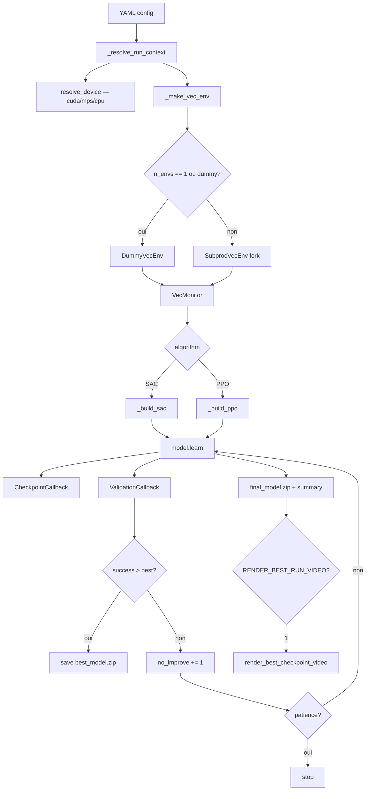

# Architecture détaillée

## 1) Principes d'architecture

Le dépôt suit une logique proche de `robosuite` :

- un package Python principal à la racine (`robocasa_telecom/`),
- des scripts d'orchestration séparés (`scripts/`),
- des configurations déclaratives (`configs/`),
- des documents opératoires (`docs/`).

Cette séparation permet de garder la logique métier testable hors cluster, d'avoir des entrées CLI simples, et de limiter l'impact quand on remplace une méthode RL ou une tâche RoboCasa.

## 2) Vue des couches

### Couche Configuration

- `configs/env/open_single_door.yaml` : paramètres de la simulation RoboCasa.
- `configs/train/open_single_door_sac.yaml` : hyperparamètres SAC + chemins d'artefacts.
- `configs/train/open_single_door_ppo_baseline.yaml` : hyperparamètres PPO baseline.
- Tous les configs `train` déclarent `device: auto` — résolu au runtime par `utils/device.py`.

### Couche Environnement

- `robocasa_telecom/envs/factory.py` : traduit la config YAML en env RoboCasa exécutable.
  - Auto-détecte `MUJOCO_GL` à l'import (`egl` Linux, `cgl` macOS, `wgl` Windows).
  - Fournit deux adaptateurs Gymnasium :
    - `GymnasiumAdapter` (si le `GymWrapper` RoboSuite garde une shape stable),
    - `RawRoboCasaAdapter` (fallback robuste, flatten dict observations).

### Couche RL

- `robocasa_telecom/rl/train.py` : boucle d'entraînement PPO + SAC, checkpoints, export courbes, vidéo post-training.
- `robocasa_telecom/rl/evaluate.py` : chargement checkpoint + rollouts d'évaluation (splits validation/test).
- `robocasa_telecom/rl/eval_video.py` : passage deux phases (scoring + rendu) pour la vidéo best-episode.
- `robocasa_telecom/rl/render_best_run.py` : rendu vidéo post-training du meilleur checkpoint.

### Couche Utilitaires

- `robocasa_telecom/utils/device.py` : résolution cross-plateforme du device PyTorch (`cuda > mps > cpu`). Contourne le bug SB3 v2.3.x qui ignore MPS sur macOS.
- `robocasa_telecom/utils/io.py` : IO YAML + création de dossiers.
- `robocasa_telecom/utils/success.py` : logique homogène de détection du succès de tâche.
- `robocasa_telecom/utils/metrics.py` : calcul de métriques (door angle, action magnitude, anti-hacking).
- `robocasa_telecom/utils/checkpoints.py` : résolution et sauvegarde des artefacts de checkpoint.
- `robocasa_telecom/utils/video.py` : helpers MP4 (grid 2×2, uint8, imageio-ffmpeg).

### Couche Exécution

- `scripts/setup_uv.sh` : provisioning environnement (clone externals, `uv sync`, assets).
- `scripts/run_train.sh` / `scripts/run_eval.sh` : wrappers locaux.
- `scripts/slurm/*.sbatch` : exécution GPU cluster.

## 3) Flux d'exécution détaillé

### 3.1 Train

1. `uv run python -m robocasa_telecom.train --config ... --seed N`
2. `parse_args()` → `_resolve_run_context()` : merge YAML + overrides CLI (`--n-envs`, `--vec-env`, `--total-timesteps`).
3. `resolve_device(cfg["train"]["device"])` → string `"cuda"` / `"mps"` / `"cpu"`.
4. `_make_vec_env(n_envs, vec_env_backend)` :
   - `vec_env_backend="dummy"` ou `n_envs=1` → `DummyVecEnv` (single-process).
   - Sinon → `SubprocVecEnv(start_method="fork")` (multiprocessing, Linux/WSL2).
5. Chargement ou construction du modèle PPO/SAC.
6. `model.learn(...)` avec `PeriodicCheckpointCallback` + `ValidationCallback`.
7. `ValidationCallback` : rollouts périodiques sur seed=10000, sauvegarde `best_model.zip` si succès améliore.
8. Arrêt anticipé si `patience` atteinte (SAC uniquement).
9. `final_model.zip` + `train_summary.json` + `validation_curve.csv`.
10. Optionnel : `render_best_checkpoint_video()` si `ROBOCASA_RENDER_BEST_RUN_VIDEO=1`.



### 3.2 Évaluation

1. `uv run python -m robocasa_telecom.evaluate --checkpoint ... --split test`
2. Résolution du seed selon le split (`validation_seed=10000`, `test_seed=20000`, ou `--seed N`).
3. Rollouts déterministes/non-déterministes.
4. Calcul `return_mean`, `success_rate`, `door_angle_final`, `action_magnitude`.
5. Export JSON + log MLflow (URI absolue `file://`).

### 3.3 Vidéo best-episode (eval_video)

Deux passes sur les mêmes N épisodes (même seed, politique déterministe) :

1. **Pass 1 — scoring** : rollouts rapides sans rendu pour identifier le meilleur épisode.
2. **Pass 2 — rendu** : replay du meilleur épisode avec capture caméra 4 vues (grid 2×2).

Les `SubprocVecEnv` workers ne peuvent pas rendre — le rendu se fait en single-process dans `eval_video.py`.

### 3.4 Sanity

1. `uv run python -m robocasa_telecom.sanity ...`
2. Reset env + N pas aléatoires.
3. Succès si aucune exception + fermeture propre.

## 4) Device resolution

`utils/device.py::resolve_device(preference)` :

```
"auto"  → cuda si disponible, sinon mps (macOS Darwin + torch.backends.mps), sinon cpu
"cuda"  → cuda si disponible, sinon cpu (warning)
"mps"   → mps si disponible, sinon cpu (warning)
"cpu"   → cpu toujours
```

SB3 v2.3.x `get_device("auto")` retourne `"cpu"` même si MPS est disponible. Ce wrapper corrige ce comportement.

## 5) VecEnv et multiprocessing

`_make_vec_env(n_envs, vec_env_backend)` choisit le backend :

| Condition | Backend | Usage |
|---|---|---|
| `n_envs == 1` ou `--vec-env dummy` | `DummyVecEnv` | Single-process, debug, Windows |
| `n_envs > 1` et `--vec-env subproc` (défaut) | `SubprocVecEnv(start_method="fork")` | Parallèle, production (Linux/WSL2) |

`fork` est le mode natif Linux/WSL2 : plus rapide que `spawn` (pas de re-import), pas de contrainte de picklabilité. Sur macOS avec MPS, il faudrait revenir à `spawn`.

## 6) Gestion de compatibilité robosuite / robocasa

- Le code importe `robocasa` avant `robosuite.make(...)` pour enregistrer les tâches RoboCasa.
- Les alias `OpenSingleDoor` et `OpenDoor` sont convertis en `OpenCabinet`.
- Le contrôleur est résolu avec fallback : `load_composite_controller_config` → `load_part_controller_config` → composite par défaut.
- Le `GymWrapper` est sondé sur plusieurs resets ; s'il dérive, bascule automatique sur `RawRoboCasaAdapter`.

## 7) Artefacts et reproductibilité

- Le nom de run inclut `task`, `algo`, `seed`, timestamp.
- Chaque checkpoint périodique est accompagné d'un `.json` de métadonnées (step, run_id).
- Le replay buffer SAC est sauvegardé avec chaque checkpoint (`*_replay_buffer.pkl`).
- Les chemins sont tous en `pathlib.Path` — cross-plateforme.
- Le tracking MLflow est ancré sur un URI absolu `file://` à l'init — fonctionne depuis n'importe quel répertoire de travail.

## 8) Extensibilité

**Nouvelle tâche :** dupliquer `configs/env/open_single_door.yaml`, changer `env.task`, dupliquer la config train.

**Nouvel algo :** ajouter l'entrée dans `SUPPORTED_ALGOS`, implémenter `_build_<algo>()` dans `train.py`, réutiliser `envs.factory` et `utils.success`.
