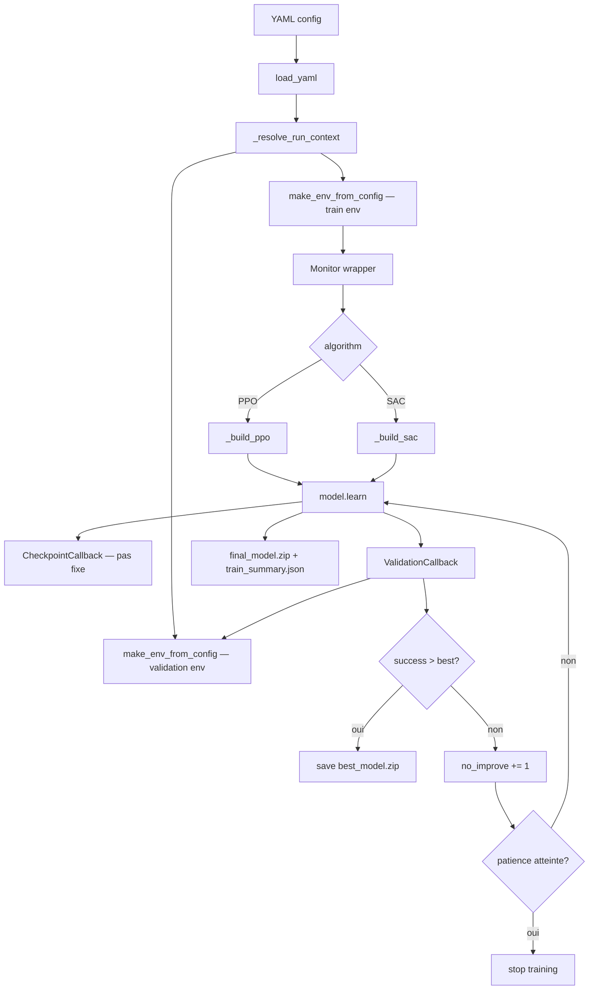

# Plan d'expériences — RoboCasa : ouvrir une porte

Document opérationnel qui relie le code et les configs YAML aux deux références
projet :

- [`guide_general_prompting_projet_rl_robocasa_porte.md`](guide_general_prompting_projet_rl_robocasa_porte.md) — méthode, reward shaping, hyperparamètres, debug.
- [`planning_deadline_runs_rapport_rl_robocasa.md`](planning_deadline_runs_rapport_rl_robocasa.md) — deadline, planning quotidien, rapport.

> Deadline : **jeudi 7 mai 2026 à 23h59**.

## 1. Question de recherche

> Sur la tâche atomique *ouvrir une porte* dans RoboCasa, quelle méthode RL est
> la plus adaptée — SAC ou PPO — et à partir de quand le surentraînement
> apparaît-il ?

Méthode principale retenue : **SAC** (off-policy, sample-efficient, contrôle
continu). Baseline comparative : **PPO** (on-policy, stable).

## 2. Vue d'ensemble du plan de runs

| # | Run | Config | Algorithme | Steps | Rôle |
|---|---|---|---|---:|---|
| 0 | SAC debug | [`open_single_door_sac_debug.yaml`](../configs/train/open_single_door_sac_debug.yaml) | SAC | 300k | Sanity / pré-validation reward |
| 1 | SAC principal | [`open_single_door_sac.yaml`](../configs/train/open_single_door_sac.yaml) | SAC | 3M | Run de référence |
| 2 | SAC tuned | [`open_single_door_sac_tuned.yaml`](../configs/train/open_single_door_sac_tuned.yaml) | SAC | 2M | Variante (lr=1e-4, batch=512, ent_coef=auto_0.2) |
| 3 | PPO baseline | [`open_single_door_ppo_baseline.yaml`](../configs/train/open_single_door_ppo_baseline.yaml) | PPO | 5M | Baseline comparative |

> La config existante [`open_single_door_ppo.yaml`](../configs/train/open_single_door_ppo.yaml) reste utilisable pour des smoke tests rapides (200k steps, eval désactivée).

## 3. Diagramme — boucle d'entraînement avec validation et best checkpoint



## 4. Lancer un run

### Local (RTX 4070, i5-13600K, 64 Go)

```bash
make train-sac-debug SEED=0          # 300k — sanity
make train-sac SEED=0                # 3M    — run principal
make train-sac-tuned SEED=0          # 2M    — variante
make train-ppo-baseline SEED=0       # 5M    — baseline
```

ou directement :

```bash
uv run python -m robocasa_telecom.train \
  --config configs/train/open_single_door_sac.yaml --seed 0
```

### Cluster SLURM (1 GPU, array 0-2 par seed)

```bash
sbatch --export=ALL,CONFIG_PATH=configs/train/open_single_door_sac.yaml \
       scripts/slurm/train_array.sbatch
```

## 5. Évaluer un checkpoint

Le run produit `best_model.zip` (meilleur succès validation) et `final_model.zip`.
Le rapport doit présenter le **best**, pas le **final**.

```bash
# Validation seeds (déclarés dans le YAML eval.validation_seed = 10000)
make eval-validation \
  CONFIG=configs/train/open_single_door_sac.yaml \
  CHECKPOINT=checkpoints/<run_id>/best_model.zip \
  EPISODES=50

# Test seeds non vus (eval.test_seed = 20000)
make eval-test \
  CONFIG=configs/train/open_single_door_sac.yaml \
  CHECKPOINT=checkpoints/<run_id>/best_model.zip \
  EPISODES=50
```

ou en SLURM :

```bash
sbatch --export=ALL,\
CONFIG_PATH=configs/train/open_single_door_sac.yaml,\
CHECKPOINT_PATH=checkpoints/<run_id>/best_model.zip,\
SPLIT=test \
       scripts/slurm/eval.sbatch
```

## 6. Artefacts produits

Pour chaque run `<run_id> = <task>_<algo>_seed<seed>_<timestamp>` :

```text
outputs/<run_id>/
  monitor.csv                  ← reward / longueur d'épisode (SB3 Monitor)
  training_curve.csv           ← export plot-friendly
  validation_curve.csv         ← step / val_success_rate / val_return_mean / std
  train_summary.json           ← run_id, algo, best step, best success, etc.
  resolved_train_config.yaml   ← config résolue pour reproductibilité

checkpoints/<run_id>/
  best_model.zip               ← meilleur succès validation (à utiliser pour le rapport)
  final_model.zip              ← état final
  <algo>_<step>_steps.zip      ← checkpoints périodiques
```

## 7. Métriques de comparaison (à reporter dans le rapport)

| Métrique | Source | Cible |
|---|---|---|
| Train success rate | `train_summary.json:eval_success_rate` | > 90 % |
| Validation success rate | `validation_curve.csv` (max) | > 80 % |
| Test success rate | eval split=test | > 60–70 % |
| Écart train ↔ test | différence | < 15–20 points |
| Step du best | `train_summary.json:best_validation_step` | Avant stagnation |
| Return moyen | `monitor.csv` | Croissant puis plateau |
| Episode length | `monitor.csv` | Doit décroître |

## 8. Détection du surentraînement

Le surentraînement est signalé si l'une des conditions est vraie :

- `train_success_rate − validation_success_rate > 20 %`
- `validation_success_rate` ne progresse pas pendant 10–20 évaluations consécutives (la callback `ValidationCallback` arrête automatiquement avec `eval.early_stopping_patience = 20`)
- `train_reward` croît mais `test_success_rate` baisse

Le rapport doit comparer **best validation** (stocké dans `best_model.zip`) vs **final** pour exhiber l'écart.

## 9. Planning calendaire (rappel)

```text
Lundi 4 mai     : SAC debug (300k) → si OK, SAC 3M la nuit
Mardi 5 mai     : analyse SAC, SAC tuned (2M), PPO baseline (3M–5M) la nuit
Mercredi 6 mai  : analyse PPO, graphes, tableau comparatif, rédaction 60–70 %
Jeudi 7 mai     : finalisation rapport, figures, conclusion, rendu 23h59
```

## 10. Critères pour un rapport valide

```text
1. Protocole (env, reward, observation, action, success)
2. Méthodes (SAC, PPO, hyperparamètres)
3. Résultats (tableau + courbes reward / success / longueur)
4. Analyse stagnation / surentraînement
5. Comparaison best vs final
6. Limites et perspectives
```
