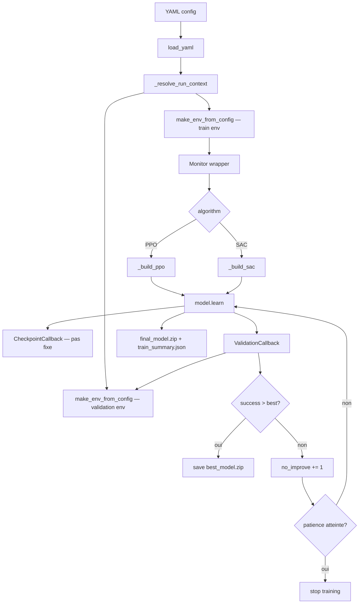

# Plan d'expériences — RoboCasa : ouvrir une porte

Document opérationnel qui relie le code et les configs YAML aux deux références
projet :

- [`guide_general_prompting_projet_rl_robocasa_porte.md`](guide_general_prompting_projet_rl_robocasa_porte.md) — méthode, reward shaping, hyperparamètres, debug.
- [`planning_deadline_runs_rapport_rl_robocasa.md`](planning_deadline_runs_rapport_rl_robocasa.md) — deadline, planning quotidien, rapport.

> Deadline : **jeudi 7 mai 2026 à 23h59**.

## 1. Question de recherche

> Sur la tâche atomique *ouvrir une porte* dans RoboCasa, quelle méthode RL est
> la plus adaptée — SAC ou PPO — et à partir de quand le surentraînement
> apparaît-il ?

Méthode principale retenue : **SAC** (off-policy, sample-efficient, contrôle
continu). Baseline comparative : **PPO** (on-policy, stable).

## 2. Vue d'ensemble du plan de runs

> **Note (7 mai 2026) :** Le plan initial (SAC debug → SAC principal → SAC tuned → PPO baseline) a été révisé en cours de projet suite aux diagnostics successifs. Le tableau ci-dessous reflète le plan **réel exécuté**.

### Plan réel (runs exécutés)

| # | Run | Config | Algorithme | Steps | Résultat | Statut |
|---|---|---|---|---:|---|---|
| 1 | SAC v1 | [`open_single_door_sac.yaml`](../configs/train/open_single_door_sac.yaml) | SAC | 500k | 0% — crash ent_coef (α→0) | Terminé |
| 2 | SAC v2 | [`open_single_door_sac_v2.yaml`](../configs/train/open_single_door_sac_v2.yaml) | SAC | 900k | 0% — crash ent_coef inévitable | Terminé |
| 3 | SAC v3 | [`open_single_door_sac_v3.yaml`](../configs/train/open_single_door_sac_v3.yaml) | SAC | 400k | 0% — cold start (porte quasi-fermée) | Terminé |
| 4 | SAC v3 Curriculum | [`open_single_door_sac_v3_curriculum.yaml`](../configs/train/open_single_door_sac_v3_curriculum.yaml) | SAC | 500k | 0% — buffer sans signal succès | Terminé |
| 5 | SAC HER v1 | [`open_single_door_sac_her.yaml`](../configs/train/open_single_door_sac_her.yaml) | SAC + HER | 200k | 0% — cold start (reward sparse pur) | Termine |
| 6 | SAC HER v2 | [`open_single_door_sac_her_v2.yaml`](../configs/train/open_single_door_sac_her_v2.yaml) | SAC + HER | 300k | 0% — door_max=0.133 rad, hover-hacking | Termine |
| 7 | SAC HER v3 | [`open_single_door_sac_her_v3.yaml`](../configs/train/open_single_door_sac_her_v3.yaml) | SAC + HER | en cours | — | En cours |

### Plan initial (non exécuté — révisé)

| # | Run | Config | Algorithme | Steps | Pourquoi non exécuté |
|---|---|---|---|---:|---|
| — | SAC debug | `open_single_door_sac_debug.yaml` | SAC | 300k | Remplacé par SAC v1 (diagnostic similaire) |
| — | SAC principal | `open_single_door_sac.yaml` | SAC | 3M | Stoppé à 500k (α=0 dès 200k, inutile de continuer) |
| — | SAC tuned | `open_single_door_sac_tuned.yaml` | SAC | 2M | Non lancé : problème fondamental (cold start) d'abord à résoudre |
| — | PPO baseline | `open_single_door_ppo_baseline.yaml` | PPO | 5M | Non lancé : PPO n'a pas d'équivalent HER — attente de premiers succès SAC |

## 3. Diagramme — boucle d'entraînement avec validation et best checkpoint



## 4. Lancer un run

### Local (RTX 4070, i5-13600K, 64 Go)

```bash
make train-sac-debug SEED=0          # 300k — sanity
make train-sac SEED=0                # 3M    — run principal
make train-sac-tuned SEED=0          # 2M    — variante
make train-ppo-baseline SEED=0       # 5M    — baseline
```

ou directement :

```bash
uv run python -m robocasa_telecom.train \
  --config configs/train/open_single_door_sac.yaml --seed 0
```

### Cluster SLURM (1 GPU, array 0-2 par seed)

```bash
sbatch --export=ALL,CONFIG_PATH=configs/train/open_single_door_sac.yaml \
       scripts/slurm/train_array.sbatch
```

## 5. Évaluer un checkpoint

Le run produit `best_model.zip` (meilleur succès validation) et `final_model.zip`.
Le rapport doit présenter le **best**, pas le **final**.

```bash
# Validation seeds (déclarés dans le YAML eval.validation_seed = 10000)
make eval-validation \
  CONFIG=configs/train/open_single_door_sac.yaml \
  CHECKPOINT=checkpoints/<run_id>/best_model.zip \
  EPISODES=50

# Test seeds non vus (eval.test_seed = 20000)
make eval-test \
  CONFIG=configs/train/open_single_door_sac.yaml \
  CHECKPOINT=checkpoints/<run_id>/best_model.zip \
  EPISODES=50
```

ou en SLURM :

```bash
sbatch --export=ALL,\
CONFIG_PATH=configs/train/open_single_door_sac.yaml,\
CHECKPOINT_PATH=checkpoints/<run_id>/best_model.zip,\
SPLIT=test \
       scripts/slurm/eval.sbatch

# Rendu vidéo 4 vues du best checkpoint
sbatch --export=ALL,\
CONFIG_PATH=configs/train/open_single_door_sac.yaml,\
CHECKPOINT_PATH=checkpoints/<run_id>/best_model.zip,\
SEED=0 \
       scripts/slurm/render_best_run.sbatch
```

### Vidéo du meilleur run

Pour produire un MP4 local avec 4 vues centrées sur le bras et la main du
robot, à partir de `best_model.zip` :

```bash
uv run python -m robocasa_telecom.render_best_run \
  --config configs/train/open_single_door_sac.yaml \
  --checkpoint checkpoints/<run_id> \
  --seed 0
```

Pour l’intégrer directement à la fin d’un run de `train`, activer :

```bash
ROBOCASA_RENDER_BEST_RUN_VIDEO=1
```

La vidéo sort alors sous `outputs/<run_id>/videos/<run_id>_best_arm_views.mp4`
avec son JSON voisin. Désactivation explicite :

```bash
ROBOCASA_RENDER_BEST_RUN_VIDEO=0
```

Par défaut, le hook empile plusieurs épisodes jusqu'à atteindre au moins
`12s` de vidéo, avec un plafond de `5` épisodes et `500` pas par épisode.
Les paramètres sont ajustables via:

```bash
ROBOCASA_RENDER_BEST_RUN_VIDEO_MIN_SECONDS=12
ROBOCASA_RENDER_BEST_RUN_VIDEO_MAX_EPISODES=5
ROBOCASA_RENDER_BEST_RUN_VIDEO_MAX_STEPS=500
ROBOCASA_RENDER_BEST_RUN_VIDEO_FPS=20
```

## 6. Artefacts produits

Pour chaque run `<run_id> = <task>_<algo>_seed<seed>_<timestamp>` :

```text
outputs/<run_id>/
  monitor.csv                  ← reward / longueur d'épisode (SB3 Monitor)
  training_curve.csv           ← export plot-friendly
  validation_curve.csv         ← step / val_success_rate / val_return_mean / std
  train_summary.json           ← run_id, algo, best step, best success, etc.
  resolved_train_config.yaml   ← config résolue pour reproductibilité

checkpoints/<run_id>/
  best_model.zip               ← meilleur succès validation (à utiliser pour le rapport)
  final_model.zip              ← état final
  <algo>_<step>_steps.zip      ← checkpoints périodiques
  <algo>_<step>_steps_replay_buffer.pkl ← replay buffer SAC pour reprise
  <algo>_<step>_steps.json     ← métadonnées de reprise du checkpoint
  final_model.json             ← métadonnées du checkpoint final
```

La vidéo locale du meilleur run est écrite sous
`outputs/<run_id>/videos/<run_id>_best_arm_views.mp4`.

## 7. Métriques de comparaison (à reporter dans le rapport)

| Métrique | Source | Cible |
|---|---|---|
| Train success rate | `train_summary.json:train_success_rate` | > 90 % |
| Validation success rate | `validation_curve.csv` (max) | > 80 % |
| Test success rate | eval split=test | > 60–70 % |
| Écart train ↔ test | différence | < 15–20 points |
| Step du best | `train_summary.json:best_validation_step` | Avant stagnation |
| Return moyen | `monitor.csv` | Croissant puis plateau |
| Episode length | `monitor.csv` | Doit décroître |

## 8. Détection du surentraînement

Le surentraînement est signalé si l'une des conditions est vraie :

- `train_success_rate − validation_success_rate > 20 %`
- `validation_success_rate` ne progresse pas pendant 10–20 évaluations consécutives (la callback `ValidationCallback` arrête automatiquement avec `eval.early_stopping_patience = 20`)
- `train_reward` croît mais `test_success_rate` baisse

Le rapport doit comparer **best validation** (stocké dans `best_model.zip`) vs **final** pour exhiber l'écart.

Les checkpoints périodiques peuvent être repris via `--resume-from
checkpoints/<run_id>/` ou un fichier `*_steps.zip`.

## 9. Planning calendaire (rappel)

```text
Lundi 4 mai     : SAC debug (300k) → si OK, SAC 3M la nuit
Mardi 5 mai     : analyse SAC, SAC tuned (2M), PPO baseline (3M–5M) la nuit
Mercredi 6 mai  : analyse PPO, graphes, tableau comparatif, rédaction 60–70 %
Jeudi 7 mai     : finalisation rapport, figures, conclusion, rendu 23h59
```

## 10. Critères pour un rapport valide

```text
1. Protocole (env, reward, observation, action, success)
2. Méthodes (SAC, PPO, hyperparamètres)
3. Résultats (tableau + courbes reward / success / longueur)
4. Analyse stagnation / surentraînement
5. Comparaison best vs final
6. Limites et perspectives
```

---

## 11. Tableau complet des expériences

### Expériences réellement exécutées (7 mai 2026)

| Expérience | But | Commande | Timesteps | Résultat | Diagnostic |
|---|---|---|---:|---|---|
| SAC v1 | Premier run, valider infra | `make train-sac` | 500k | 0% succès | `ent_coef` crash α→0 dès 200k |
| SAC v2 | Corriger initialisation α | `make train-sac-v2` | 900k | 0% succès | Auto-tuning toujours α→0 (log_prob < target) |
| SAC v3 | `ent_coef=0.1` fixe | `make train-sac-v3` | 400k | 0% succès | Stabilité OK, cold start (pas de contact poignée) |
| SAC v3 Curriculum | Seuil facile + spawn réduit | `make train-sac-v3-curriculum` | 500k | 0% succès | Pic 300k (0.021 rad), buffer sans succès |
| SAC HER | Relabellisation rétroactive | `make train-sac-her` | en cours | — | Débloque buffer sans succès réels |
| Courbes PNG | Figures pour le rapport | `python scripts/plot_runs.py` | — | PNG dans `docs/courbes/` | — |

### Expériences initialement prévues (non exécutées)

| Expérience | But prévu | Pourquoi non exécutée |
|---|---|---|
| SAC principal (3M) | Run de référence long | Stoppé à 500k — même problème α=0 |
| SAC tuned (2M) | Variante hyperparamètres | Bloqué par cold start — pas de sens de tuner sans premiers succès |
| PPO baseline (5M) | Comparaison on-policy | Reporté — PPO sans HER subirait le même cold start |
| Eval test / vidéos | Métriques finales | Pas de checkpoint viable (0% succès partout) |

---

## 12. Justification du protocole expérimental

### Pourquoi séparer debug / principal / tuned / PPO ?

Chaque run a un rôle précis dans la démarche expérimentale :

- **SAC debug (300k)** — valide que le reward shaping n'induit pas de hover hacking avant de lancer 19h de calcul. C'est le filet de sécurité.
- **SAC principal (3M)** — le run de référence. Suffisamment long pour que SAC converge sur cette tâche (basé sur les benchmarks de la littérature sur des tâches de manipulation de difficulté comparable).
- **SAC tuned (2M)** — teste la sensibilité aux hyperparamètres. Si SAC tuned performe significativement mieux ou moins bien, cela révèle l'importance du tuning pour cet algorithme.
- **PPO baseline (5M)** — PPO est on-policy et moins sample-efficient : il a besoin de plus de steps pour converger. 5M steps garantit une comparaison équitable en termes de performance finale (pas de steps bruts).

### Pourquoi seeds séparés pour validation et test ?

- `seed=0` : seed d'entraînement. Toutes les configurations initiales générées avec ce seed ont été vues pendant l'entraînement.
- `seed=10000` : split validation. Jamais utilisé pendant l'entraînement, mais utilisé pour sélectionner `best_model.zip`. Il peut donc y avoir un léger biais de sélection.
- `seed=20000` : split test. **Jamais utilisé avant la fin du run**. Les métriques sur ce split sont les seules qui prouvent la généralisation réelle.

Ce protocole est analogue au train/val/test split en apprentissage supervisé — un concept central du cours.

### Pourquoi `n_eval_episodes=50` ?

50 épisodes donnent un intervalle de confiance Wilson à 95% de ±7% autour d'un taux de succès de 50%, ce qui est suffisamment précis pour distinguer un agent à 60% d'un agent à 40%. Avec N=10, l'intervalle serait ±16% — trop incertain pour des conclusions valides.

### Pourquoi `early_stopping_patience=20` ?

20 évaluations consécutives sans progrès correspondent à 20 × 25k = 500k steps. Si le succès ne progresse pas sur 500k steps, le modèle a convergé ou est bloqué dans un minimum local — continuer l'entraînement ne ferait qu'augmenter le risque de surentraînement.

### Pourquoi `gradient_steps=12` pour SAC ?

`gradient_steps=12` signifie que SAC effectue 12 mises à jour réseau par step d'environnement. Avec 12 workers, cela représente 12 × 12 = 144 mises à jour réseau par "round" de collecte. Ce ratio élevé maximise l'utilisation du replay buffer (chaque transition est réutilisée ~12 fois) au prix d'un coût GPU plus important. C'est le trade-off sample efficiency vs. wall-clock time, documenté dans les ablations SAC de la littérature.

---

## 13. Anti-hacking monitoring protocol

À surveiller dans MLflow après chaque validation callback (tous les 25k steps) :

| Signal | Seuil d'alerte | Action si dépassé |
|---|---|---|
| `val_approach_frac_mean > 0.5` | Hover hacking confirmé | Augmenter `w_stagnation`, réduire `w_approach` |
| `val_stagnation_steps_mean > 100` | Blocage chronique | Réduire `stagnation_n` ou augmenter `d_prox` |
| `val_sign_changes_mean > 15` | Oscillation pathologique | Augmenter `w_oscillation` |
| `val_door_angle_max_mean < 0.2` | Agent bloqué loin | Vérifier reward approche, augmenter `learning_starts` |
| `val_success_rate` stagne 20 evals | Early stopping déclenché | Analyse du best checkpoint |
| `train_success - val_success > 20%` | Surentraînement | Reporter best_model, pas final_model |
