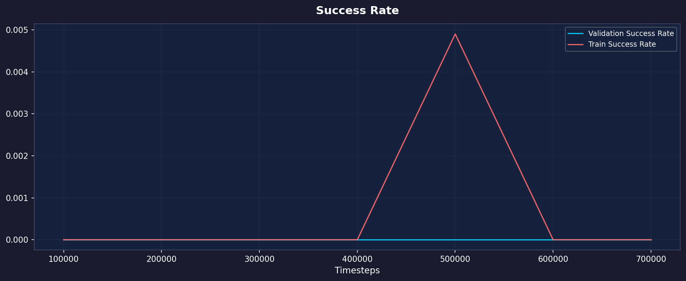
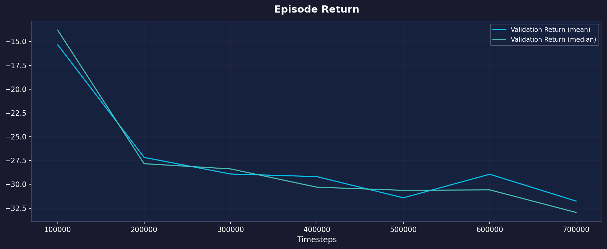
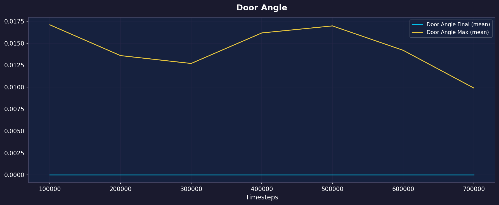
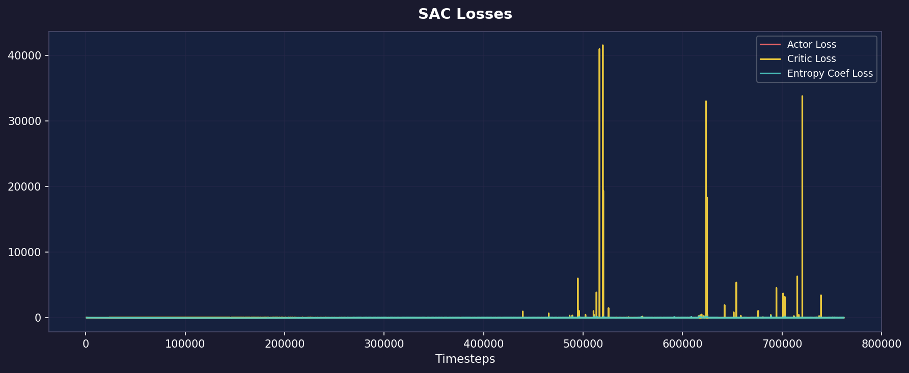
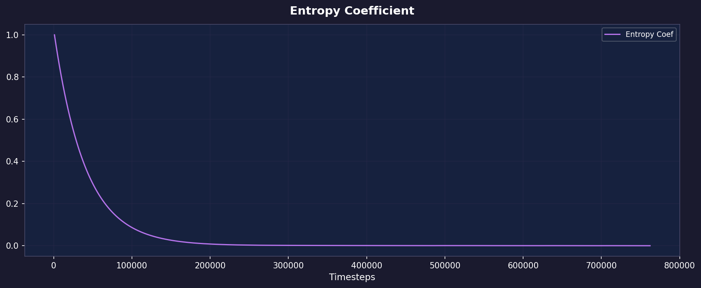
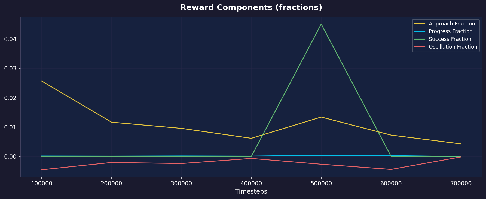
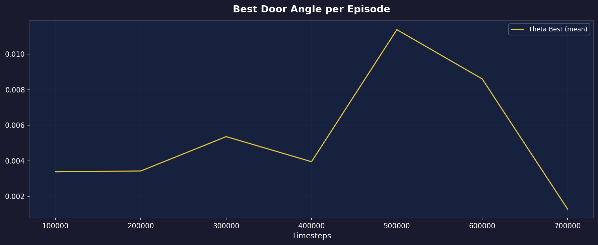
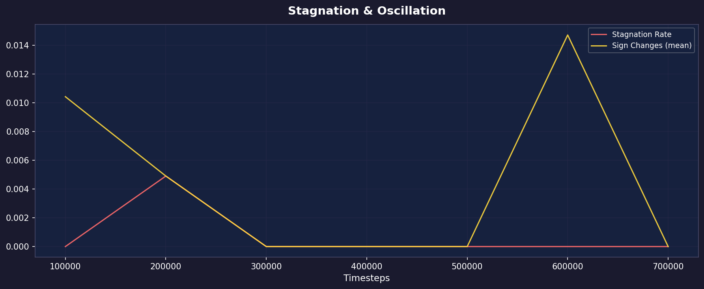
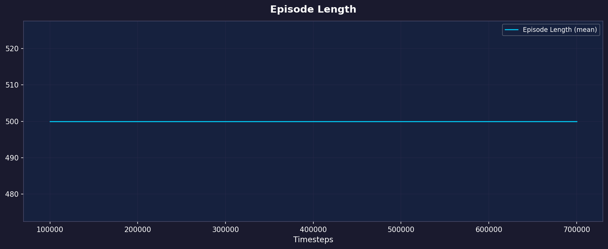
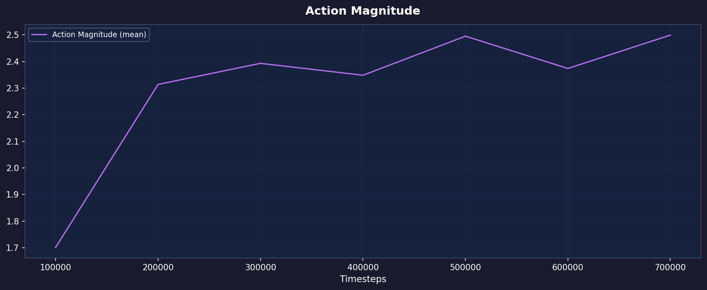

# Courbes d'entraînement — RoboCasa OpenCabinet SAC

Métriques exportées depuis MLflow. Run principal : `OpenCabinet_SAC_seed0`, algorithme SAC, tâche `OpenCabinet` (ouvrir une porte de placard).

---

## 01 — Success Rate

- **Validation Success Rate** : taux de succès sur des épisodes de validation (seed fixe = 10000)
- **Train Success Rate** : taux de succès sur les épisodes d'entraînement (rolling)

---

## 02 — Episode Return

Récompense cumulée par épisode sur le set de validation.

---

## 03 — Door Angle

- **Final** : angle d'ouverture de la porte en fin d'épisode (normalisé 0→1, succès à 0.90)
- **Max** : meilleur angle atteint pendant l'épisode

---

## 04 — SAC Losses

Pertes internes de l'algorithme SAC (actor, critic, entropy coefficient).

---

## 05 — Entropy Coefficient

Coefficient d'entropie automatique de SAC — contrôle l'exploration.

---

## 06 — Reward Components

Décomposition de la récompense shapée :
- **Approach** : guidage vers la poignée (doit rester faible, sinon hover-hacking)
- **Progress** : ouverture progressive de la porte (signal principal)
- **Success** : bonus sparse (domination souhaitée en fin d'entraînement)
- **Oscillation** : pénalité pour oscillations

---

## 07 — Best Door Angle

Meilleur angle de porte atteint en moyenne par épisode d'entraînement.

---

## 08 — Stagnation & Oscillation

Diagnostics anti-reward-hacking : taux de stagnation et changements de direction.

---

## 09 — Episode Length

Longueur moyenne des épisodes de validation.

---

## 10 — Action Magnitude

Norme L2 moyenne des actions — indique si la politique est agressive ou douce.
