# Courbes d'entraînement — RoboCasa OpenCabinet SAC

Run : `OpenCabinet_SAC_seed0_20260507_073628` — algorithme SAC, tâche `OpenCabinet` (ouvrir une porte de placard avec un bras robotique).

Les courbes sont dans le dossier [`run_sac_3M/`](run_sac_3M/).

---

## Contexte général

L'agent apprend à ouvrir une porte de placard en 3 millions de steps d'environnement. À chaque step, il reçoit une observation (positions, vitesses, état de la porte) et produit une action (commande du bras). La récompense est shapée : elle guide l'agent vers la poignée, récompense l'ouverture progressive, et donne un bonus sparse quand la porte dépasse 90% d'ouverture (= succès).

Les métriques sont divisées en 3 catégories :

- **Train** : métriques internes de l'algorithme SAC, loguées à chaque gradient update (~65 000 points)
- **Reward Hack Monitor** : métriques sur les épisodes d'entraînement rolling, loguées tous les 100 000 steps (7 points au total)
- **Validation** : métriques sur des épisodes avec seed fixe, loguées tous les 100 000 steps (7 points)

---

## TRAIN — Métriques internes SAC (6 courbes)

Ces métriques viennent directement de l'algorithme SAC (Stable-Baselines3). Elles permettent de surveiller la santé de l'apprentissage au niveau des réseaux de neurones.

### train_01 — Actor Loss

**Ce que c'est :** la perte de l'acteur (la politique). En SAC, l'acteur est entraîné à maximiser la valeur Q tout en maintenant une entropie élevée. La loss est donc négative (on maximise, donc on minimise son opposé).

**Ce qu'on veut voir :** une valeur négative qui descend (devient de plus en plus négative), ce qui signifie que la politique trouve de meilleures actions. Une stagnation ou une remontée peut indiquer un problème d'exploration ou un critic instable.

---

### train_02 — Critic Loss

**Ce que c'est :** l'erreur du critic (le réseau qui estime la valeur Q). C'est une erreur quadratique moyenne (MSE) entre la valeur Q prédite et la cible TD (Temporal Difference).

**Ce qu'on veut voir :** une valeur qui diminue au fil du temps. Si elle reste très élevée ou explose, le critic n'arrive pas à apprendre une bonne estimation de la récompense future — ce qui bloque aussi l'acteur.

---

### train_03 — Entropy Coefficient (α)

**Ce que c'est :** SAC ajuste automatiquement un coefficient α qui pondère l'entropie dans l'objectif. L'entropie mesure à quel point la politique est aléatoire. Un α élevé force l'agent à explorer ; un α faible le laisse se spécialiser.

**Ce qu'on veut voir :** α commence élevé (exploration) puis diminue progressivement à mesure que la politique converge. Si α reste trop haut jusqu'à la fin, l'agent n'a pas convergé. Si il chute trop tôt, l'agent peut se coincer dans un comportement sous-optimal.

---

### train_04 — Entropy Coef Loss
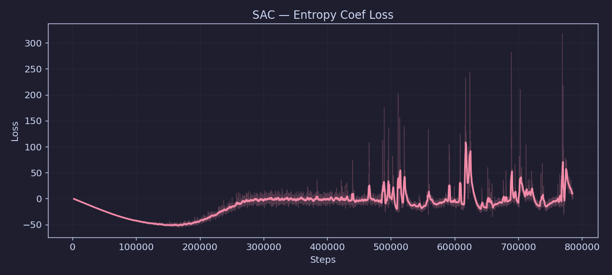

**Ce que c'est :** le gradient qui ajuste α automatiquement. C'est la différence entre l'entropie actuelle de la politique et l'entropie cible (target entropy). Quand la politique est trop déterministe, cette loss est positive et pousse α à la hausse.

**Ce qu'on veut voir :** une valeur qui oscille autour de zéro et converge, signe que l'entropie de la politique est proche de la cible fixée.

---

### train_05 — Learning Rate

**Ce que c'est :** le taux d'apprentissage utilisé par l'optimiseur Adam pour mettre à jour les poids des réseaux (acteur et critic).

**Ce qu'on veut voir :** constant à 3e-4 dans ce run (pas de scheduler). Une courbe plate est normale ici.

---

### train_06 — Gradient Updates (n_updates)
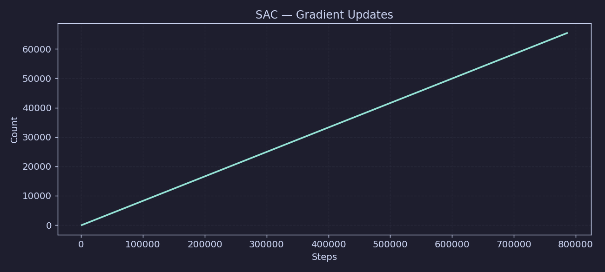

**Ce que c'est :** le nombre cumulé de mises à jour de gradient depuis le début du run. Avec `gradient_steps=1`, il y a un update par step d'environnement (après le remplissage du replay buffer).

**Ce qu'on veut voir :** une droite croissante. Permet de vérifier que l'entraînement n'a pas été interrompu ou ralenti.

---

## REWARD HACK MONITOR — Métriques d'entraînement rolling (12 courbes)

Ces métriques sont calculées sur les épisodes d'entraînement en cours (fenêtre glissante). Elles servent à détecter les comportements de **reward hacking** : l'agent qui exploite le shaping de récompense sans vraiment apprendre la tâche.

*Note : seulement 7 points car loguées tous les 100 000 steps sur 700 000 steps effectifs.*

---

### rh_01 — Train Success Rate
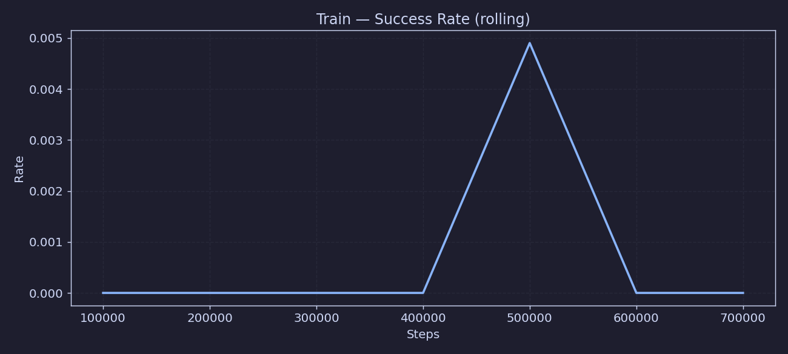

**Ce que c'est :** taux de succès sur les épisodes d'entraînement récents (rolling). Un épisode est un succès si la porte dépasse 90% d'ouverture avant la fin.

**Ce qu'on veut voir :** une valeur qui monte au cours du temps. C'est un indicateur précoce de progression, disponible entre deux évaluations de validation.

---

### rh_02 — Success Fraction
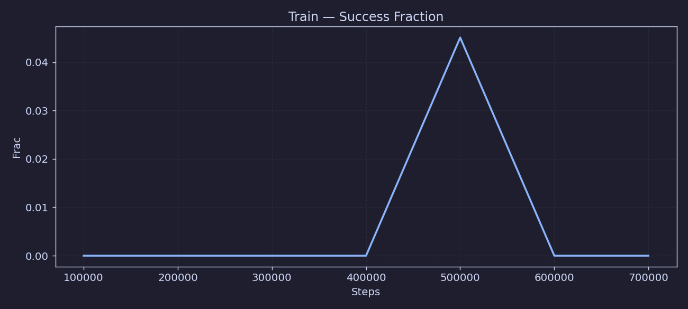

**Ce que c'est :** similaire au train success rate mais calculé sur la fenêtre de monitoring complète (pas rolling). Fraction des épisodes terminés en succès dans la fenêtre courante.

**Ce qu'on veut voir :** monte vers 1.0 en fin d'entraînement.

---

### rh_03 — Best Door Angle (mean)

**Ce que c'est :** meilleur angle de porte atteint **pendant** l'épisode (pas à la fin), moyenné sur tous les épisodes de la fenêtre. Normalisé entre 0 (porte fermée) et 1 (porte complètement ouverte). Le seuil de succès est à 0.90.

**Ce qu'on veut voir :** une valeur qui monte progressivement. Même si l'agent ne tient pas la porte ouverte jusqu'à la fin (donc pas de succès), ce graphe montre qu'il progresse dans l'ouverture. Très utile en début d'entraînement quand le success rate est encore à 0.

---

### rh_04 — Approach Fraction
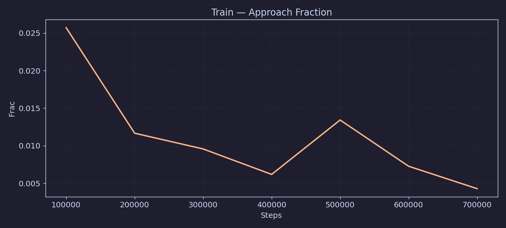

**Ce que c'est :** fraction de la récompense totale provenant du signal d'approche (guidage du bras vers la poignée). Ce signal est donné dès que le bras se rapproche de la poignée, même sans ouvrir la porte.

**Ce qu'on veut voir :** une valeur **faible et décroissante**. Si cette fraction est élevée, l'agent a appris à rester près de la poignée sans ouvrir la porte pour accumuler de la récompense — c'est du **hover-hacking**. En fin d'entraînement, la récompense de succès doit dominer.

---

### rh_05 — Progress Fraction

**Ce que c'est :** fraction de la récompense provenant du signal de progression (ouverture progressive de la porte). C'est le signal principal du shaping.

**Ce qu'on veut voir :** élevée en milieu d'entraînement (l'agent apprend à ouvrir), puis remplacée par la récompense de succès en fin d'entraînement.

---

### rh_06 — Reward Without Success Bonus

**Ce que c'est :** récompense cumulée par épisode en excluant le bonus sparse de succès. Permet de voir si l'agent accumule de la récompense par le shaping seul, sans vraiment réussir la tâche.

**Ce qu'on veut voir :** cette valeur peut croître en début d'apprentissage (l'agent apprend le shaping). En fin d'entraînement, si elle est très élevée mais que le success rate est bas, c'est un signe de reward hacking.

---

### rh_07 — Oscillation Fraction

**Ce que c'est :** fraction des épisodes dans lesquels une oscillation de la porte a été détectée (la porte va et vient sans progresser).

**Ce qu'on veut voir :** proche de 0. Une valeur élevée indique que l'agent secoue la porte sans l'ouvrir vraiment, ce qui peut être un comportement de hacking du signal de progression.

---

### rh_08 — Oscillation Steps (mean)
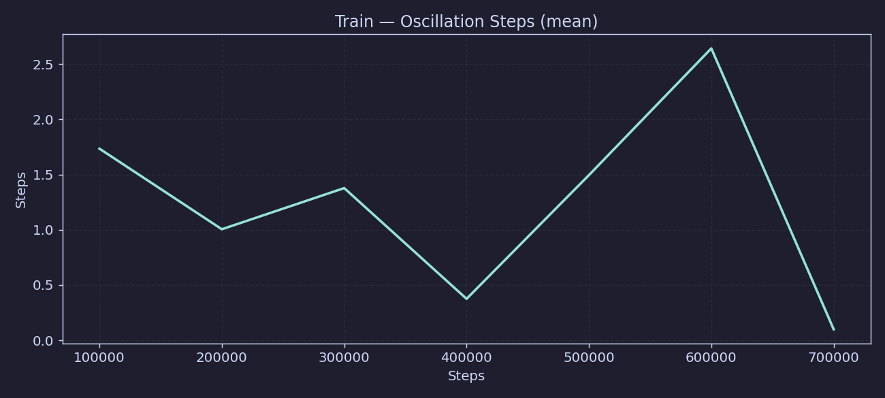

**Ce que c'est :** nombre moyen de steps passés en oscillation par épisode (parmi les épisodes où une oscillation est détectée).

**Ce qu'on veut voir :** faible. Si l'agent passe beaucoup de temps à osciller, il gaspille du temps d'épisode et exploite le shaping.

---

### rh_09 — Sign Changes (mean)

**Ce que c'est :** nombre moyen de fois où la direction de mouvement de la porte change de signe (ouverture → fermeture ou inverse) par épisode. Indicateur brut d'oscillation.

**Ce qu'on veut voir :** faible et décroissant. En début d'entraînement, beaucoup de changements de direction = comportement aléatoire. En fin d'entraînement, l'agent doit ouvrir la porte de manière monotone.

---

### rh_10 — Stagnation Rate

**Ce que c'est :** taux d'épisodes où la porte ne bouge plus pendant une longue période (stagnation). L'agent peut être bloqué (bras coincé, politique convergée vers rester immobile).

**Ce qu'on veut voir :** proche de 0 en fin d'entraînement. Une valeur élevée indique que l'agent abandonne souvent au milieu d'un épisode.

---

### rh_11 — Stagnation Steps (mean)

**Ce que c'est :** nombre moyen de steps passés en stagnation par épisode (parmi ceux qui stagnent).

**Ce qu'on veut voir :** faible. Si l'agent stagne longtemps, il perd du temps d'épisode sans apprendre.

---

### rh_12 — Episodes Logged

**Ce que c'est :** nombre total d'épisodes enregistrés dans la fenêtre de monitoring depuis le début du run.

**Ce qu'on veut voir :** croissance régulière. Permet de vérifier que les épisodes sont bien collectés et que le monitoring fonctionne.

---

## VALIDATION — Métriques de validation (19 courbes)

Évaluées sur des épisodes déterministes avec un seed fixe (`validation_seed=10000`), donc reproductibles. Ces métriques sont plus fiables que les métriques d'entraînement car elles ne dépendent pas de l'exploration.

---

### val_01 — Success Rate
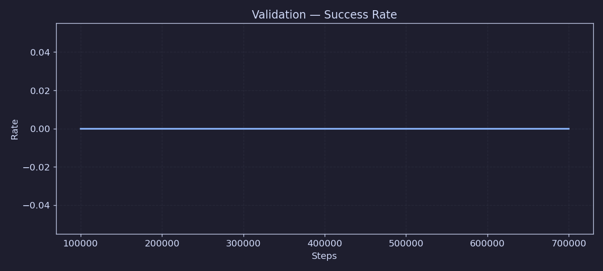

**Ce que c'est :** taux de succès sur les épisodes de validation. **C'est la métrique principale du projet.** Un épisode est un succès si la porte dépasse 90% d'ouverture avant la fin (500 steps max).

**Ce qu'on veut voir :** monte vers 1.0. Le meilleur modèle est sauvegardé au checkpoint avec le success rate le plus élevé.

---

### val_02 — Success Rate + Intervalle de Confiance
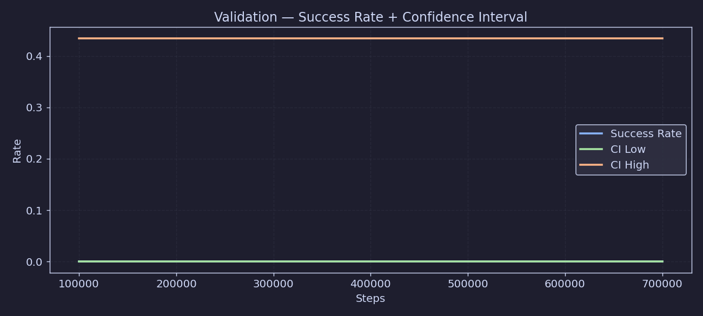

**Ce que c'est :** le même success rate mais avec les bornes basse et haute de l'intervalle de confiance à 95% (calculé sur le petit nombre d'épisodes de validation).

**Ce qu'on veut voir :** les 3 courbes qui montent ensemble avec un intervalle qui se resserre (plus d'épisodes = estimation plus précise).

---

### val_03 — Failure Rate

**Ce que c'est :** taux d'échec = 1 - success rate. Complémentaire du val_01, utile pour visualiser les régressions (si le success rate baisse, le failure rate monte).

**Ce qu'on veut voir :** descend vers 0.

---

### val_04 — Episode Return (mean)

**Ce que c'est :** récompense cumulée moyenne par épisode de validation. Inclut toutes les composantes du shaping + le bonus de succès.

**Ce qu'on veut voir :** monte au cours du temps. Corrélé avec le success rate mais plus granulaire : même si l'agent ne réussit pas encore, un return croissant indique qu'il progresse (il ouvre davantage la porte).

---

### val_05 — Episode Return (mean / median / std)
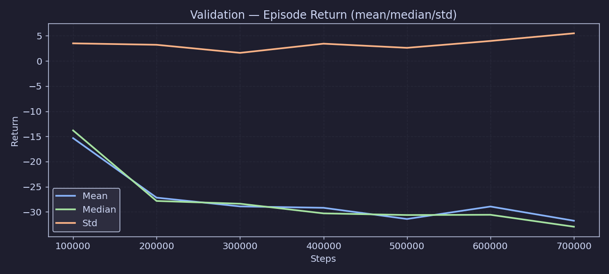

**Ce que c'est :** vue complète du return : moyenne, médiane et écart-type sur les épisodes de validation.

**Ce qu'on veut voir :** moyenne et médiane qui convergent (distribution symétrique = comportement stable), écart-type qui diminue (moins de variance entre épisodes).

---

### val_06 — Door Angle Final (mean)
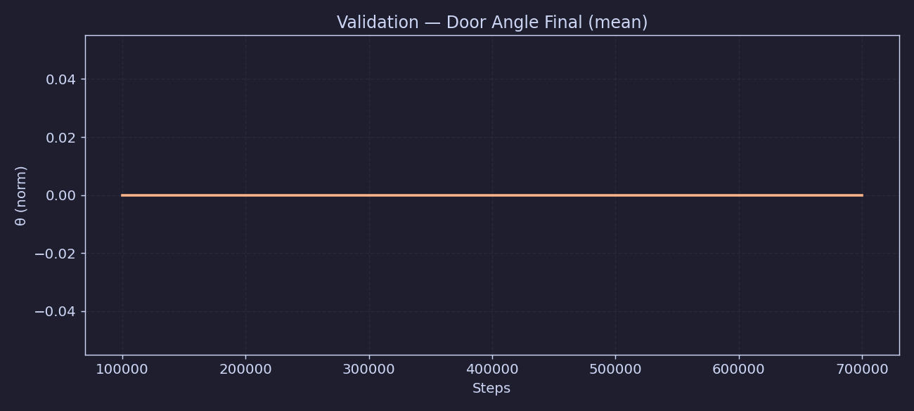

**Ce que c'est :** angle d'ouverture de la porte **à la fin** de l'épisode, moyenné sur tous les épisodes de validation. Normalisé entre 0 (fermée) et 1 (complètement ouverte). Le seuil de succès est à 0.90.

**Ce qu'on veut voir :** monte vers 0.90+. Même si l'épisode se termine sans succès, un angle final élevé indique que l'agent avance dans la bonne direction.

---

### val_07 — Door Angle (final mean / final std / max mean)
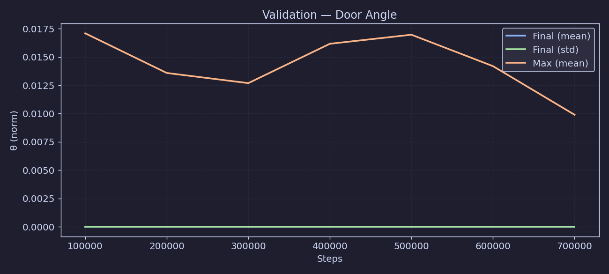

**Ce que c'est :** trois angles en un graphe : l'angle final moyen, son écart-type, et le meilleur angle atteint pendant l'épisode (max). La différence entre max et final indique si l'agent ouvre la porte mais ne la maintient pas ouverte.

**Ce qu'on veut voir :** final mean et max mean proches (l'agent tient la porte ouverte), std faible (comportement stable).

---

### val_08 — Episode Length (mean)

**Ce que c'est :** durée moyenne des épisodes en nombre de steps. Les épisodes se terminent soit par un succès (porte ouverte à 90%), soit par timeout (500 steps).

**Ce qu'on veut voir :** diminue au cours du temps si l'agent apprend à réussir plus vite. Attention : si les épisodes sont tous très courts ET que le success rate est bas, c'est un problème (l'agent se bloque tôt).

---

### val_09 — Episode Length (mean / std)

**Ce que c'est :** longueur des épisodes avec l'écart-type.

**Ce qu'on veut voir :** std qui diminue = comportement de plus en plus cohérent entre les épisodes.

---

### val_10 — Action Magnitude (mean)

**Ce que c'est :** norme L2 moyenne des actions produites par la politique. Les actions sont les commandes du bras (en espace OSC — position/orientation cible). Une magnitude élevée = mouvements amples et brusques. Une magnitude faible = mouvements petits et précis.

**Ce qu'on veut voir :** modérée et stable. Trop élevée = risque de mouvements violents. Trop faible = l'agent bouge à peine.

---

### val_11 — Action Magnitude (mean / std)
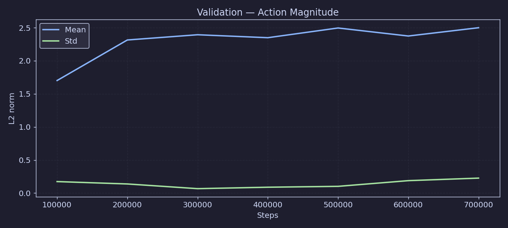

**Ce que c'est :** magnitude des actions avec l'écart-type.

**Ce qu'on veut voir :** std faible = politique stable et déterministe.

---

### val_12 — Action Smoothness

**Ce que c'est :** score de fluidité des actions. Mesure à quel point les actions consécutives sont similaires (faible variation = mouvements fluides). Calculé comme la corrélation ou la variation entre actions successives.

**Ce qu'on veut voir :** monte vers 1.0. Une valeur faible indique des jerks (changements brusques de commande) qui peuvent stresser le robot et indiquer une politique instable.

---

### val_13 — Approach Fraction (validation)
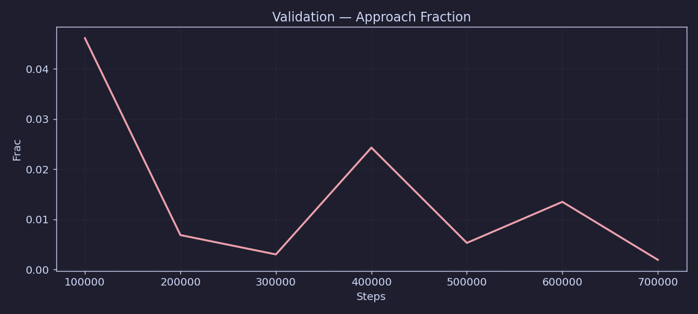

**Ce que c'est :** même métrique que rh_04, mais calculée sur les épisodes de validation déterministes. Fraction de la récompense provenant du guidage vers la poignée.

**Ce qu'on veut voir :** faible et décroissant. Si c'est élevé sur la validation, l'agent a vraiment appris à hover-hack et pas juste sur les épisodes d'entraînement bruités.

---

### val_14 — Reward Without Success (validation)

**Ce que c'est :** même métrique que rh_06, sur les épisodes de validation. Récompense cumulée sans le bonus de succès.

**Ce qu'on veut voir :** croît progressivement. En fin d'entraînement, si le success rate est proche de 1, ce signal doit être dominé par le bonus de succès (visible sur val_04).

---

### val_15 — Sign Changes (validation)
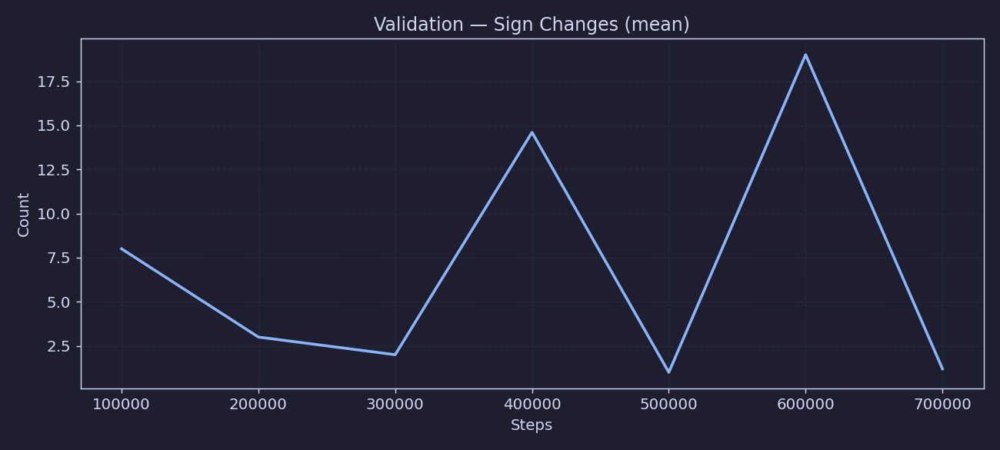

**Ce que c'est :** même que rh_09, sur les épisodes de validation. Nombre moyen de changements de direction de la porte.

**Ce qu'on veut voir :** proche de 0 en fin d'entraînement. Sur les épisodes déterministes, si l'agent oscille encore, c'est un vrai problème de politique.

---

### val_16 — Stagnation Steps (validation)
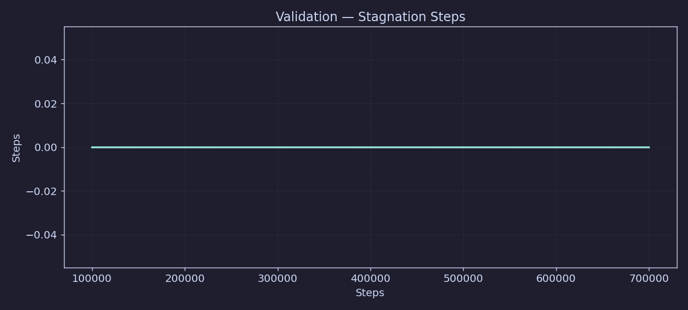

**Ce que c'est :** même que rh_11, sur les épisodes de validation. Steps de stagnation par épisode.

**Ce qu'on veut voir :** proche de 0. Sur la validation déterministe, la stagnation est un signe que la politique est bloquée.

---

### val_17 — Num Episodes Run
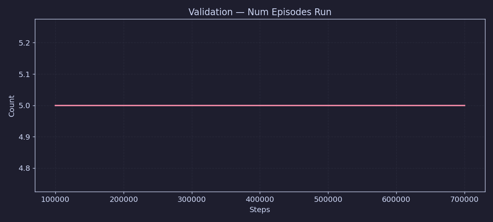

**Ce que c'est :** nombre d'épisodes évalués à chaque checkpoint de validation. Configuré à `n_eval_episodes=5` dans ce run.

**Ce qu'on veut voir :** constant à 5. Si ce nombre varie, c'est qu'il y a eu un problème lors de l'évaluation (timeout, crash worker).

---

### val_18 — Success CI Low
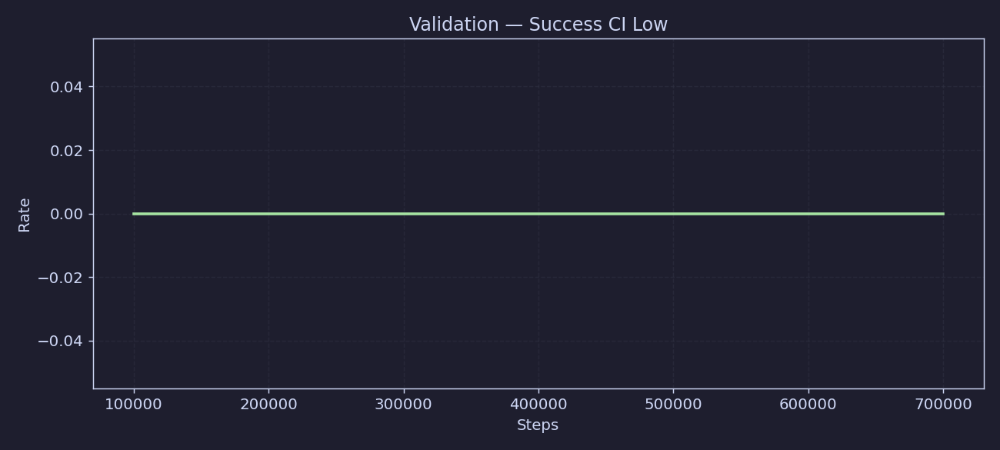

**Ce que c'est :** borne basse de l'intervalle de confiance à 95% sur le success rate. Avec seulement 5 épisodes, cet intervalle est large — il faut l'interpréter avec prudence.

**Ce qu'on veut voir :** monte vers 1.0 avec la borne haute (val_19).

---

### val_19 — Success CI High

**Ce que c'est :** borne haute de l'intervalle de confiance. Indique le meilleur cas plausible du success rate réel.

**Ce qu'on veut voir :** monte vers 1.0. Idéalement les bornes basse et haute convergent (plus d'épisodes de validation = intervalles plus serrés).
