# Courbes d'entraînement — RoboCasa OpenCabinet SAC

Métriques exportées depuis MLflow. Run principal : `OpenCabinet_SAC_seed0_20260507_073628`, algorithme SAC, tâche `OpenCabinet`.

---

## Train — Métriques internes SAC (6)

Ces métriques sont loguées à chaque gradient update (~65k points).

### train_01 — Actor Loss
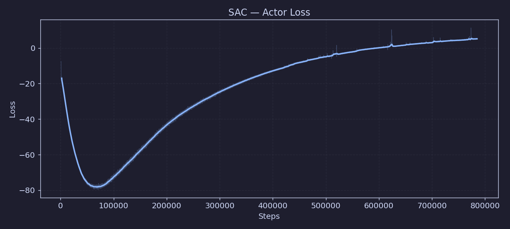
Perte de l'acteur SAC (policy gradient). Doit être négative et décroître.

### train_02 — Critic Loss
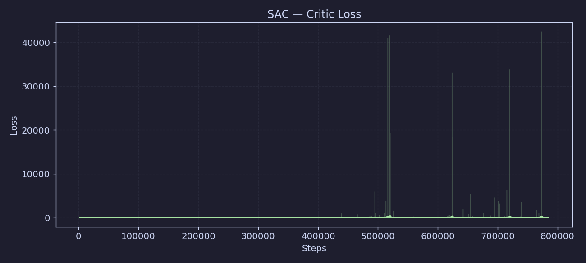
Erreur TD du critic (MSE sur la valeur Q). Doit converger vers 0.

### train_03 — Entropy Coefficient (α)
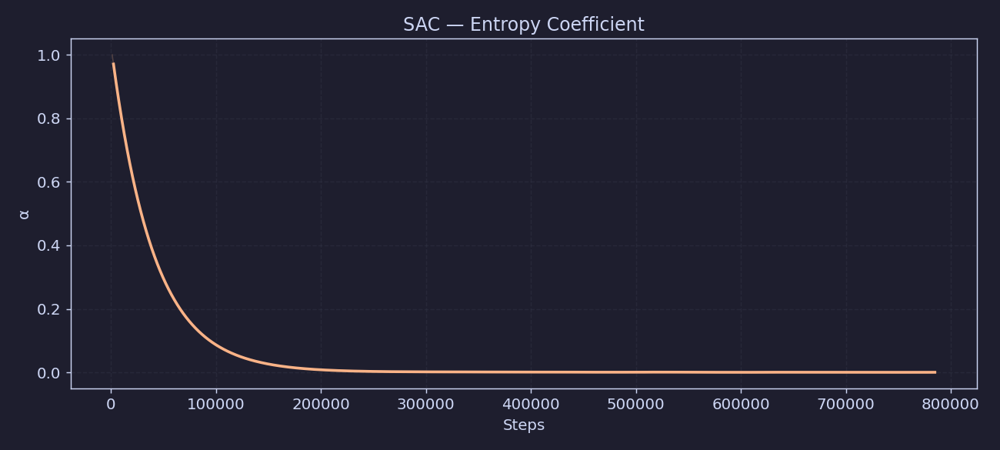
Coefficient d'entropie automatique — contrôle l'exploration. Diminue quand la politique devient plus déterministe.

### train_04 — Entropy Coef Loss

Gradient de l'ajustement automatique de α.

### train_05 — Learning Rate
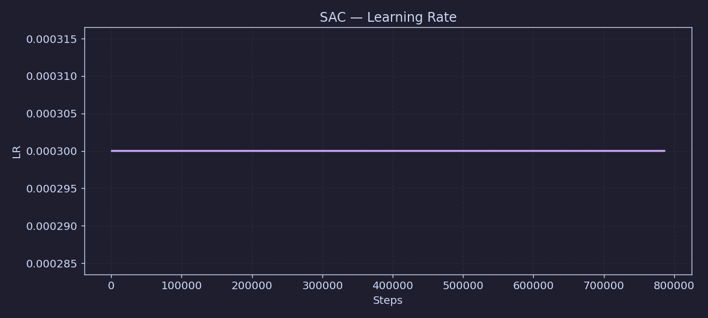
Taux d'apprentissage (constant ici à 3e-4).

### train_06 — Gradient Updates (n_updates)

Nombre cumulé de mises à jour du gradient.

---

## Reward Hack Monitor — Métriques par épisode d'entraînement (12)

Ces métriques sont loguées à chaque `eval_freq` steps depuis les épisodes d'entraînement rolling (7 points = 7 évaluations).

### rh_01 — Train Success Rate

Taux de succès sur les épisodes d'entraînement (rolling). Indicateur précoce avant la validation.

### rh_02 — Success Fraction

Fraction d'épisodes terminés avec succès (porte ouverte à ≥ 90%).

### rh_03 — Best Door Angle (mean)
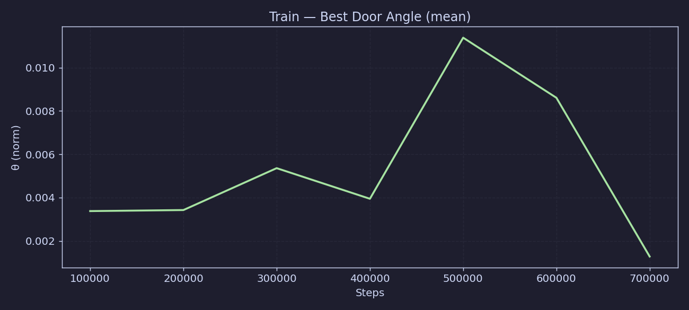
Meilleur angle de porte atteint en moyenne par épisode. Normalisé 0→1, succès à 0.90. Indicateur de progression même sans succès complet.

### rh_04 — Approach Fraction

Fraction de la récompense provenant du guidage vers la poignée. Doit rester faible — une valeur élevée indique du **hover-hacking** (l'agent tourne autour sans ouvrir).

### rh_05 — Progress Fraction
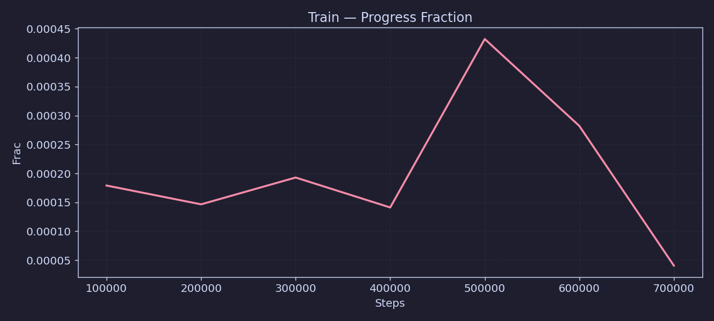
Fraction de la récompense provenant de l'ouverture progressive (signal principal). Doit dominer en milieu d'entraînement.

### rh_06 — Reward Without Success Bonus
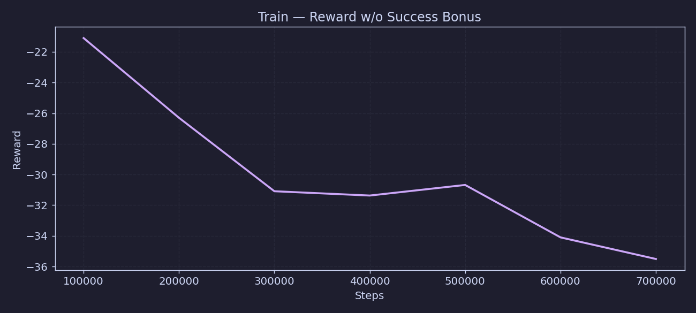
Récompense shapée sans le bonus sparse de succès. Utile pour détecter si l'agent exploite le shaping sans vraiment réussir.

### rh_07 — Oscillation Fraction
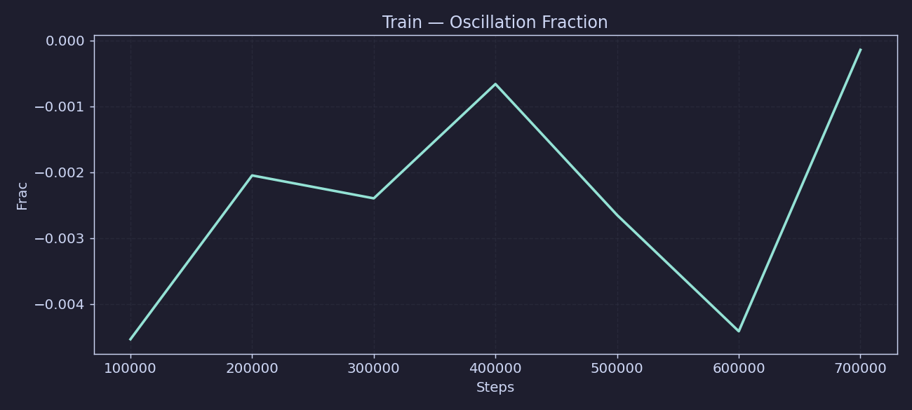
Fraction d'épisodes présentant des oscillations détectées. Doit être faible.

### rh_08 — Oscillation Steps (mean)

Nombre moyen de steps en oscillation par épisode.

### rh_09 — Sign Changes (mean)
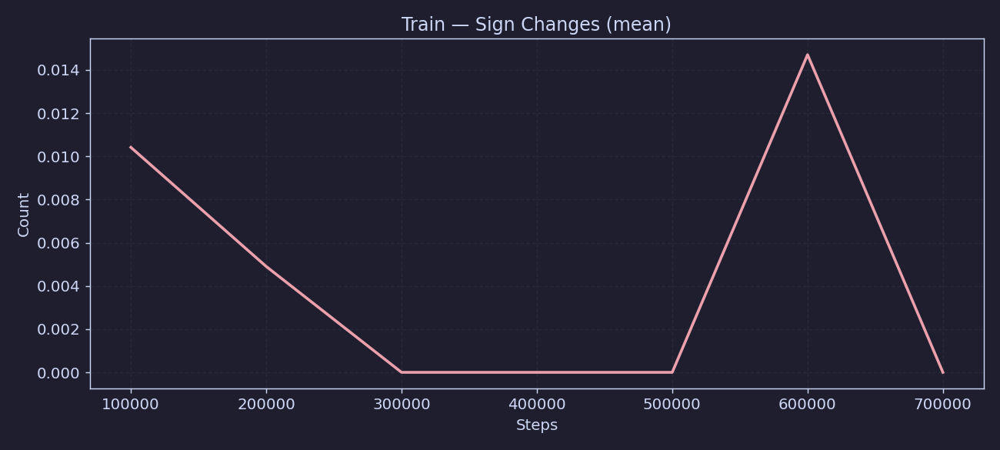
Nombre moyen de changements de direction de la porte par épisode. Indicateur d'oscillation de la politique.

### rh_10 — Stagnation Rate
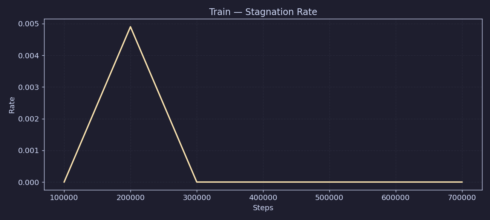
Taux d'épisodes stagnants (porte qui ne bouge plus). Doit être faible en fin d'entraînement.

### rh_11 — Stagnation Steps (mean)
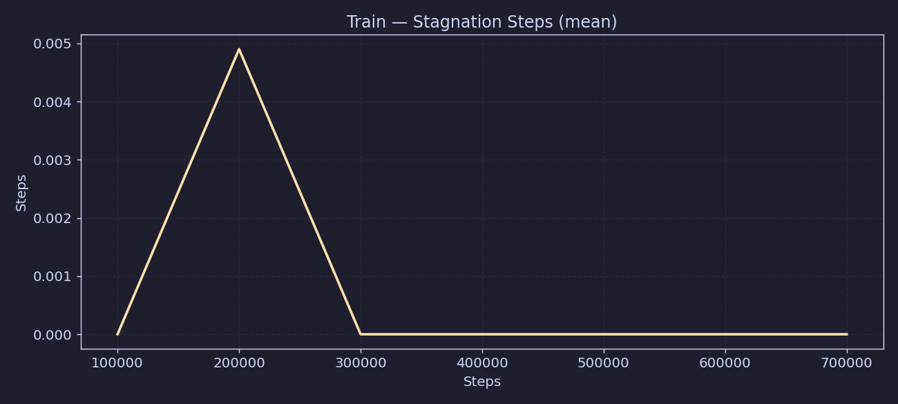
Nombre moyen de steps de stagnation par épisode.

### rh_12 — Episodes Logged
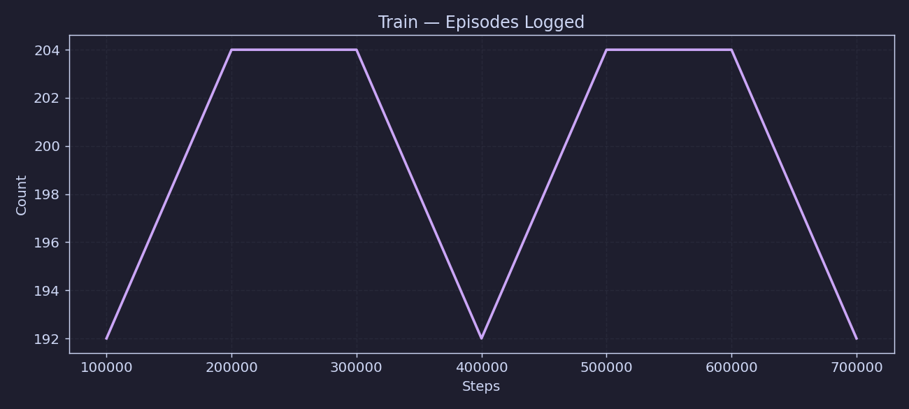
Nombre d'épisodes accumulés dans la fenêtre rolling de monitoring.

---

## Validation — Métriques de validation (19 courbes)

Évaluées sur des épisodes avec seed fixe (`validation_seed=10000`) toutes les `eval_freq` steps.

### val_01 — Success Rate

Taux de succès sur les épisodes de validation. Métrique principale.

### val_02 — Success Rate + Intervalle de Confiance

Success rate avec bornes basse et haute de l'intervalle de confiance.

### val_03 — Failure Rate
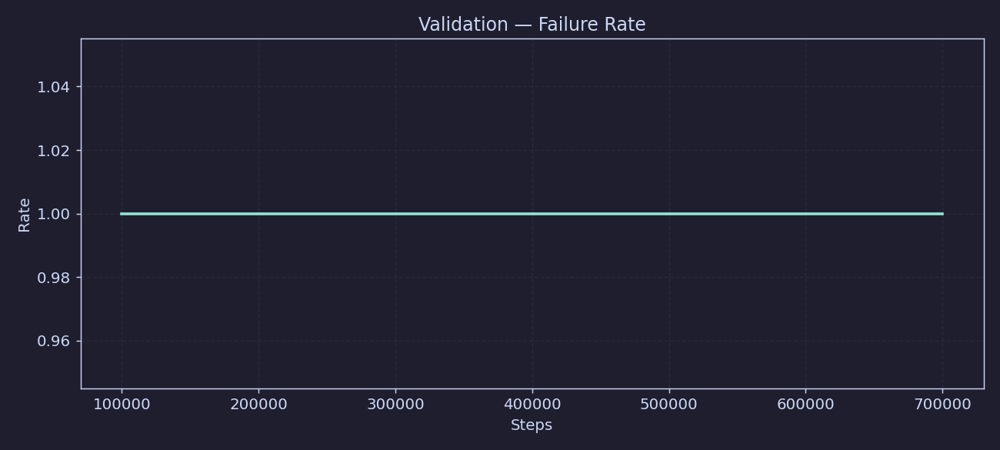
Taux d'échec (1 - success rate). Complémentaire pour voir les régessions.

### val_04 — Episode Return (mean)
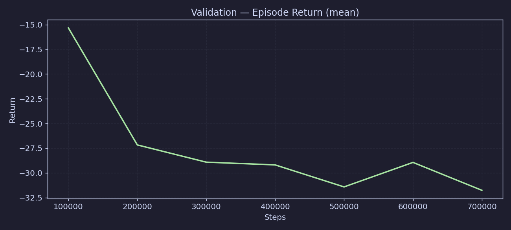
Récompense cumulée moyenne par épisode de validation.

### val_05 — Episode Return (mean / median / std)

Vue complète du retour : moyenne, médiane, écart-type.

### val_06 — Door Angle Final (mean)

Angle final de la porte en fin d'épisode (normalisé). Succès à ≥ 0.90.

### val_07 — Door Angle (final mean / final std / max mean)

Vue complète : angle final moyen, dispersion, et meilleur angle atteint.

### val_08 — Episode Length (mean)
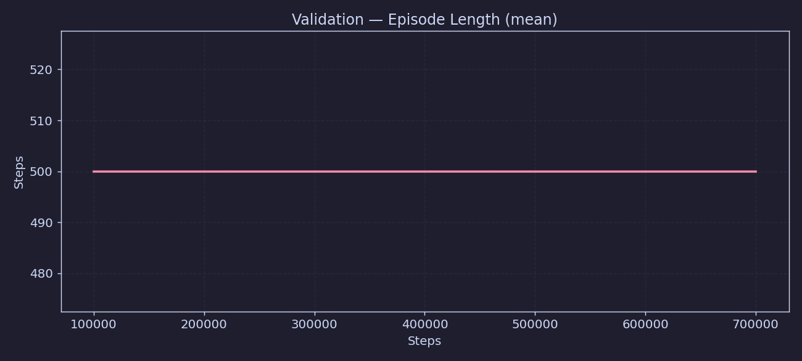
Longueur moyenne des épisodes. Diminue quand l'agent réussit plus vite.

### val_09 — Episode Length (mean / std)
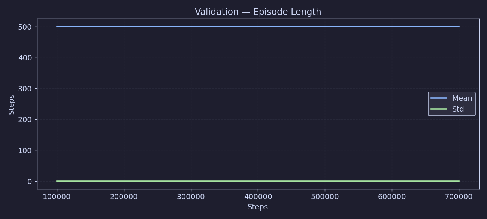
Longueur avec dispersion.

### val_10 — Action Magnitude (mean)
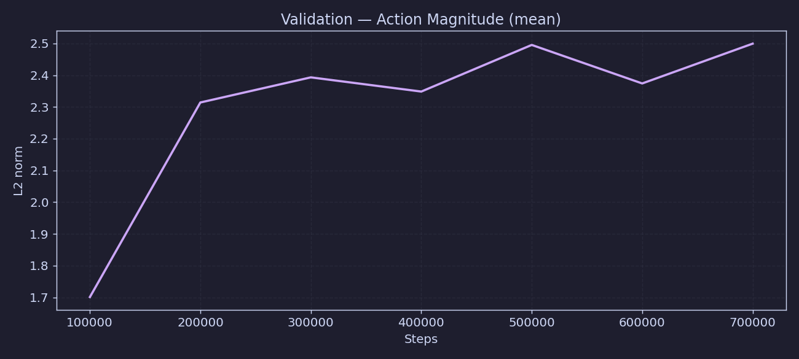
Norme L2 moyenne des actions — indique si la politique est agressive ou douce.

### val_11 — Action Magnitude (mean / std)

Magnitude avec dispersion.

### val_12 — Action Smoothness
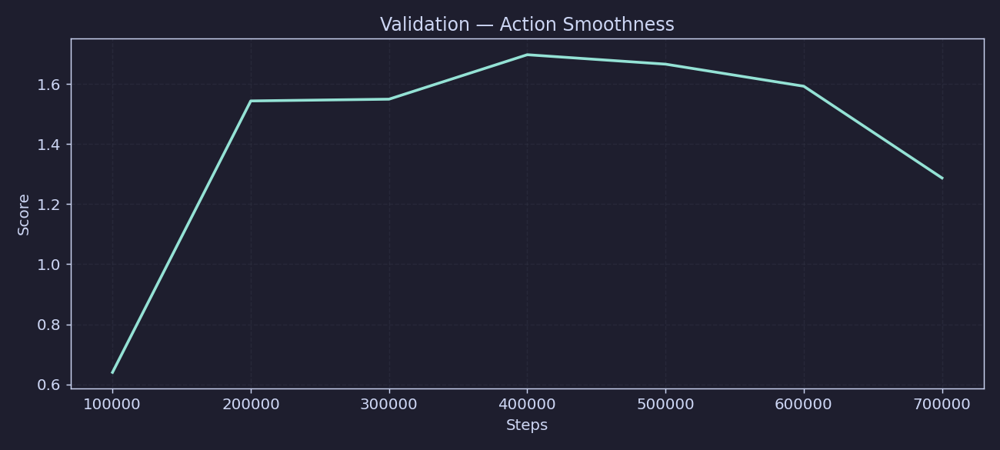
Score de fluidité des actions (moins de jerks = meilleur contrôle).

### val_13 — Approach Fraction

Fraction de récompense d'approche sur les épisodes de validation. Doit rester faible.

### val_14 — Reward Without Success
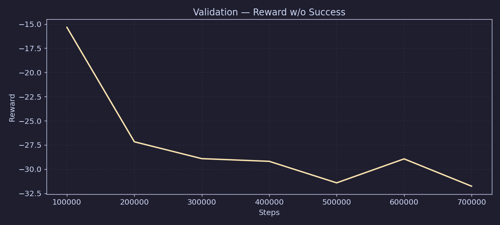
Récompense shapée sans bonus de succès (validation).

### val_15 — Sign Changes (mean)

Changements de direction de la porte sur les épisodes de validation.

### val_16 — Stagnation Steps (mean)

Steps de stagnation par épisode de validation.

### val_17 — Num Episodes Run

Nombre d'épisodes évalués à chaque checkpoint.

### val_18 — Success CI Low

Borne basse de l'intervalle de confiance du success rate.

### val_19 — Success CI High
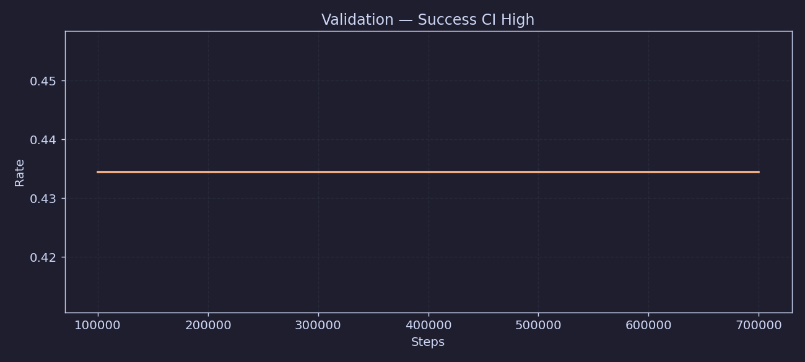
Borne haute de l'intervalle de confiance du success rate.
