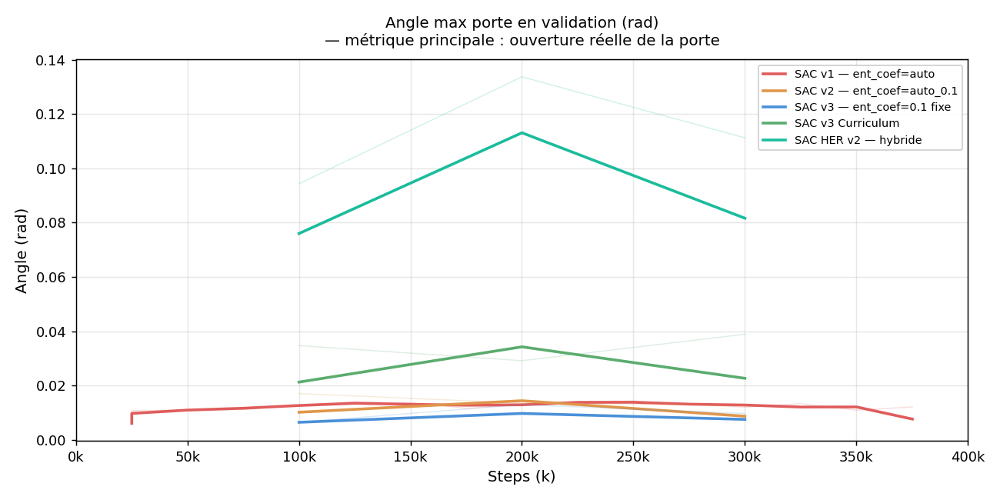
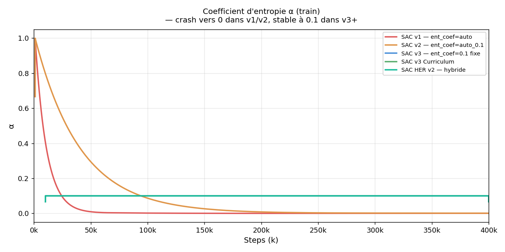
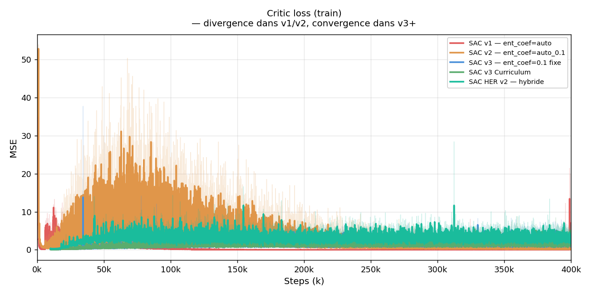
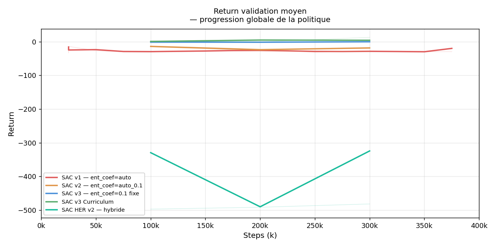
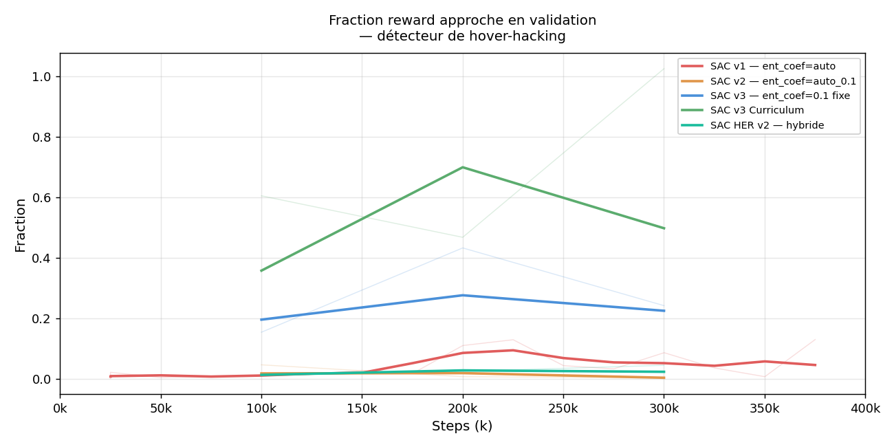
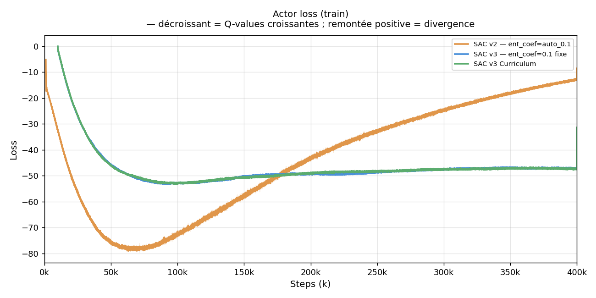

# Analyse comparée des runs — RoboCasa OpenCabinet SAC

Ce document superpose les courbes des 5 runs les plus représentatifs sur les 5 métriques clés (capped à 400k steps), et retrace la progression technique de chaque itération.

Pour le détail complet de chaque run (paramètres, diagnostic, fix), voir le [README principal](README.md).

---

## Runs comparés

| Couleur | Run | Config clé | Steps |
|---|---|---|---:|
| Rouge | SAC v1 | `ent_coef="auto"` | 400k (sur 500k) |
| Orange | SAC v2 | `ent_coef="auto_0.1"`, `target_entropy=-4` | 400k (sur 900k) |
| Bleu | SAC v3 | `ent_coef=0.1` fixe, SDE | 400k |
| Vert | SAC v3 Curriculum | `theta_success=0.40`, spawn réduit | 400k (sur 500k) |
| Turquoise | SAC HER v2 | Reward hybride dense+sparse, HER n=4 | 300k |

> SAC HER v1 (200k, reward sparse pur) n'est pas inclus : ses courbes sont plates à 0 sur toutes les métriques et n'apportent pas d'information visuelle supplémentaire par rapport à v1/v2.

---

## Métrique 1 — Angle max porte en validation



**Ce que mesure cette métrique :** angle maximal (en radians) atteint par la porte au cours d'un épisode de validation déterministe. C'est la métrique principale — elle prouve que l'agent sait réellement interagir avec la porte, indépendamment du reward shaping.

**Ce qu'on observe :**

- **v1, v2 (rouge, orange) :** angle max ≈ 0.014–0.017 rad sur tout le run, quasi-nul. L'agent n'ouvre pas la porte. Le crash de α (ent_coef → 0) rend la politique déterministe trop tôt, le Q-critic diverge, l'agent n'apprend rien d'utile.

- **v3 (bleu) :** angle max ≈ 0.010–0.012 rad — légèrement inférieur à v1/v2. La stabilité interne est meilleure (ent_coef fixe à 0.1) mais le cold start est là : l'agent ne trouve pas la poignée. Sans premier contact, le critic ne valorise jamais l'ouverture.

- **v3 Curriculum (vert) :** monte à ~0.020–0.025 rad, légèrement au-dessus des runs précédents. L'abaissement de `theta_success=0.40` et la réduction du spawn donnent un léger coup de pouce, mais le signal reste insuffisant (buffer sans succès réel → critic ne converge pas).

- **HER v2 (turquoise) :** **bond à 0.133 rad à 200k steps** — 10× supérieur au meilleur run précédent (curriculum 0.039 rad). La porte s'ouvre réellement. C'est le premier signal de vrai apprentissage. La légère régression à 300k (0.110 rad) signale le début du hover-hacking (voir métrique 5).

**Lecture clé :** toutes les courbes sauf HER v2 restent en dessous de 0.05 rad. HER v2 est la seule configuration qui produit une ouverture observable.

---

## Métrique 2 — Coefficient d'entropie α (train)



**Ce que mesure cette métrique :** la valeur du coefficient d'entropie α (SAC). En mode auto-tuning, α contrôle l'équilibre exploration/exploitation. En mode fixe, il reste constant.

**Pourquoi c'est critique :** SAC maximise `Q(s,a) + α × H(π)`. Si α → 0, la politique devient déterministe et n'explore plus. Le critic reçoit alors des estimations de Q biaisées et diverge.

**Ce qu'on observe :**

- **v1 (rouge) :** α part de ~0.1 et crash vers 0.009 en moins de 200k steps. Cause : `log_prob ≈ -20` pour une gaussienne 12D, `target_entropy = -12`. Le gradient `∇α = α × (-log_prob - target_entropy) = α × (-20 - (-12)) = -8α < 0` pousse toujours α vers 0.

- **v2 (orange) :** même crash, mais depuis `target_entropy=-4` → gradient = -16α, encore plus négatif. α atteint 0.001 dès 100k steps. L'auto-tuning aggrave le problème.

- **v3, v3 Curriculum, HER v2 (bleu, vert, turquoise) :** ligne plate à 0.1 sur tout le run — entropie fixe, exploration maintenue. C'est le fix clé qui stabilise tout l'entraînement.

**Lecture clé :** le simple fait de passer de `ent_coef="auto"` à `ent_coef=0.1` (fixe) transforme complètement la stabilité du run. C'est le diagnostic le plus important des 900 premières pages de ce projet.

---

## Métrique 3 — Critic loss (train)



**Ce que mesure cette métrique :** erreur quadratique moyenne entre la Q-valeur prédite par le critic et la cible Bellman. Une critic loss élevée signifie que le critic ne sait pas prédire correctement la valeur des états — l'actor reçoit de mauvais gradients.

**Ce qu'on observe :**

- **v1 (rouge) :** critic loss explose à 40 000–50 000+ en quelques dizaines de milliers de steps. Conséquence directe du crash α → 0 : sans exploration, les targets TD divergent en spirale.

- **v2 (orange) :** même explosion, atteint 100 000+ sur 400k steps. L'initialisation `auto_0.1` retarde légèrement mais le problème de fond est identique.

- **v3 (bleu) :** pic initial autour de 30–40 à 50k steps, puis décroissance stable. C'est un comportement sain : le critic apprend progressivement à estimer les Q-valeurs.

- **v3 Curriculum (vert) :** légèrement plus haute que v3 (~6–10) mais stable et décroissante. La version curriculum est légèrement plus difficile à optimiser (reward légèrement différent) mais reste sous contrôle.

- **HER v2 (turquoise) :** pic à 8–10 vers 100k steps (expected avec reward hybride dense+sparse dont la variance est plus haute), puis retour à 3–6. Comportement en U caractéristique d'un apprentissage qui démarre correctement.

**Lecture clé :** la critic loss est un thermomètre de la santé du training. > 1000 = pathologique (v1/v2). < 10 avec tendance décroissante = sain (v3+). Le pic initial de HER v2 est normal.

---

## Métrique 4 — Return validation moyen



**Ce que mesure cette métrique :** récompense cumulée par épisode en validation déterministe (10 épisodes). Avec le reward hybride de HER v2, cette valeur intègre à la fois le reward dense (approach, progress) et le reward sparse (-1/step pour HER). Avec le reward dense seul (v1–v3 curriculum), c'est directement le retour de la politique.

**Ce qu'on observe :**

- **v1, v2 (rouge, orange) :** returns faibles ou négatifs, stagnants. La politique n'apprend pas (critic diverge → actor reçoit de mauvais gradients).

- **v3 (bleu) :** return stable mais faible. L'agent est stable mais ne sait pas ouvrir la porte.

- **v3 Curriculum (vert) :** return plus élevé (jusqu'à +12 au pic 300k), grâce au reward dense et au seuil plus facile `theta_success=0.40`. Mais c'est une fluctuation sur 10 épisodes, pas une vraie convergence.

- **HER v2 (turquoise) :** return démarre à -496 (quasi -500 = -1/step × 500 steps) et monte jusqu'à -483 à 300k. L'amélioration est réelle et monotone — la politique apprend à accumuler de meilleurs rewards même sans succès franc.

**Lecture clé :** la comparaison des scales est trompeuse (v1–curriculum ont un reward dense positif, HER v2 part d'une baseline -500). Se concentrer sur la **tendance** : seul HER v2 montre une amélioration monotone du return.

---

## Métrique 5 — Fraction reward approche en validation (hover-hacking)



**Ce que mesure cette métrique :** fraction du reward total provenant du composant "approche" (robot près de la poignée). Un taux élevé signifie que l'agent passe la majorité de son temps à **rester près** de la poignée pour accumuler du reward d'approche, sans jamais pousser la porte — c'est le **hover-hacking**, un minimum local du reward shaping.

**Ce qu'on observe :**

- **v1, v2 (rouge, orange) :** approach_frac élevée dès le début (~0.3–0.6). Avec α ≈ 0, la politique déterministe a trouvé le minimum local le plus simple : rester proche de la poignée sans risquer de perdre le reward.

- **v3 (bleu) :** approach_frac réduit mais toujours significatif (~0.3–0.4). Sans succès, l'approach est le seul reward positif disponible → minimum local difficile à quitter.

- **v3 Curriculum (vert) :** approach_frac plus faible (~0.2–0.3). Le seuil plus bas et le spawn réduit permettent parfois à l'agent de toucher la porte → moins de hover.

- **HER v2 (turquoise) :** commence bas (~0.015) et monte vers 0.047 à 300k. **C'est le signal de hover-hacking émergent** : après avoir appris à ouvrir la porte jusqu'à 200k (approach_frac bas), la politique dérive vers le hover-hacking à 300k. L'augmentation de approach_frac corrèle exactement avec la régression de door_angle_max (graphe 1).

**Lecture clé :** approach_frac < 0.05 est sain. > 0.15 est suspect. La montée de approach_frac dans HER v2 après 200k est la signature du hover-hacking — c'est exactement ce que HER v3 est conçu pour corriger en supprimant `w_approach`.

---

## Métrique 6 — Actor loss (train)



**Ce que mesure cette métrique :** dans SAC, l'actor loss est défini comme `α × log_prob(a|s) - Q(s,a)`. En pratique, une actor loss **négative et décroissante** signifie que les Q-valeurs estimées augmentent — l'actor apprend que ses actions valent de plus en plus. Une **remontée vers 0 ou en positif** est le signe que le critic donne de mauvais gradients à l'actor (Q-values fausses ou divergentes).

C'est la métrique de go/no-go pour décider si une run mérite d'être continuée.

**Ce qu'on observe :**

- **v1 (rouge) :** actor loss descend jusqu'à -40 puis **remonte vers -10 à -15** après 200k steps. La remontée corrèle exactement avec le crash de α et l'explosion de la critic loss. L'actor reçoit des gradients incorrects du critic divergent.

- **v2 (orange) :** même pattern mais plus sévère — remonte en territoire **positif** (+7) après 200k steps. Un actor loss positif signifie que l'actor est activement anti-corrélé avec les Q-values : il apprend à faire des actions que le critic juge mauvaises. C'est le signe d'un entraînement complètement cassé.

- **v3 (bleu) :** descend jusqu'à -47 et **reste stable** jusqu'à 400k sans remontée significative. Signe d'un entraînement sain — l'actor continue d'améliorer ses Q-values estimées. Confirme que le fix `ent_coef=0.1` fixe a résolu le problème de stabilité.

- **v3 Curriculum (vert) :** similaire à v3, stable autour de -48 à -50. Pas de remontée. L'entraînement est stable même si la porte ne s'ouvre pas.

- **HER v2 (turquoise) :** descend de 0 à -25 sur les premiers 200k steps — apprentissage clair via les goals HER virtuels. Légère remontée à -17 entre 200k et 300k — signal précoce du hover-hacking (l'actor optimise pour rester proche de la poignée, pas pour ouvrir). C'est exactement le moment où `door_angle_max` régresse et `approach_frac` monte.

**Comment utiliser cette courbe pour décider d'arrêter :**
- Actor loss **décroissante ou stable en négatif** → continuer
- Actor loss **remonte mais reste négative** → surveiller approach_frac et door_angle_max
- Actor loss **remonte en positif** → arrêter immédiatement (v2 à 200k)
- Actor loss **stable négatif mais door_angle_max stagne** → cold start, revoir la config reward (v3 à 200k)

---

## Synthèse : évolution technique run par run

```
SAC v1 (rouge)
  Problème : ent_coef auto-tuning → α→0 → critic loss 40k+ → aucun apprentissage
  Signal     : door_angle_max flat à 0.014 rad, approach_frac élevée

    ↓  Fix : ent_coef="auto_0.1", target_entropy=-4

SAC v2 (orange)
  Problème : même crash, juste retardé (gradient encore plus négatif)
  Signal     : door_angle_max flat à 0.017 rad, critic loss 100k+

    ↓  Fix : ent_coef=0.1 FIXE — fin de l'auto-tuning

SAC v3 (bleu)
  Progrès  : critic loss < 40 (sain !), ent_coef stable à 0.1
  Problème : cold start — buffer sans contact poignée → critic n'apprend pas la valeur d'ouverture
  Signal     : door_angle_max 0.012 rad (pire que v2 !)

    ↓  Fix : curriculum (theta_success=0.40, spawn réduit)

SAC v3 Curriculum (vert)
  Progrès  : door_angle_max monte à 0.025–0.030 rad (pic 0.039)
  Problème : pic transitoire, régression après 300k, buffer sans succès réel
  Signal     : approach_frac réduit (bon signe), mais return stagne

    ↓  Fix : HER — relabellisation rétroactive des goals

SAC HER v2 (turquoise) — meilleur résultat
  Progrès  : door_angle_max = 0.133 rad à 200k — BREAKTHROUGH (×3.4 vs curriculum)
  Problème : hover-hacking à 300k (approach_frac monte, action_magnitude baisse)
  Signal     : return monotonement croissant (-496 → -483), critic loss en U sain

    ↓  Fix en cours : HER v3 — suppression w_approach, forcer progress+success
```

---

## Tableau de bord final

| Métrique | Objectif | v1 | v2 | v3 | Curriculum | HER v2 @200k |
|---|---|---:|---:|---:|---:|---:|
| `door_angle_max` (rad) | > 0.10 | 0.014 | 0.017 | 0.012 | 0.039 | **0.133** |
| `ent_coef` | = 0.1 (stable) | crash | crash | 0.1 | 0.1 | 0.1 |
| `critic_loss` | < 10 | 48k+ | 116k+ | ~35 | ~8 | ~5 |
| `val_return_mean` | croissant | stagne | stagne | stagne | pic 300k | **croissant** |
| `approach_frac` | < 0.05 | 0.5+ | 0.5+ | 0.3+ | 0.2+ | **0.025** |
| `val_success_rate` | > 0 | 0% | 0% | 0% | 0% | 0% |

**Le run HER v2 est le seul à avoir un `door_angle_max` significatif (0.133 rad) et une `approach_frac` saine (0.025) en même temps — mais uniquement à son best checkpoint (200k steps).**

Les courbes combinées illustrent que chaque fix a adressé un problème précis tout en en révélant un nouveau. L'évolution est diagnostique autant qu'expérimentale.
