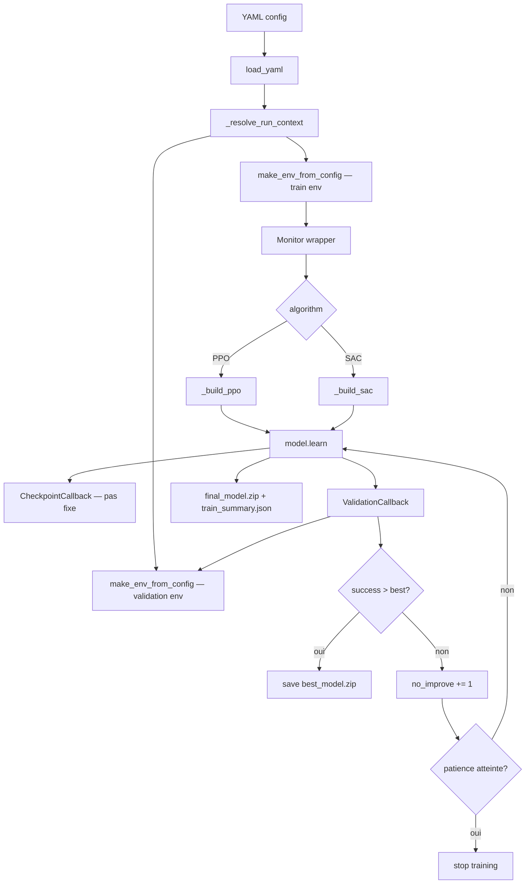

# Expériences, progression et résultats

Ce document regroupe le plan expérimental, le suivi des runs, les résultats et les diagnostics issus des expériences.


---

## Plan d'expériences — RoboCasa : ouvrir une porte

Document opérationnel qui relie le code, les configs YAML, le protocole expérimental
et les résultats réellement obtenus.

> Deadline : **jeudi 7 mai 2026 à 23h59**.

### 1. Question de recherche

> Sur la tâche atomique *ouvrir une porte* dans RoboCasa, quelle méthode RL est
> la plus adaptée — SAC ou PPO — et à partir de quand le surentraînement
> apparaît-il ?

Méthode principale retenue : **SAC** (off-policy, sample-efficient, contrôle
continu). Baseline comparative : **PPO** (on-policy, stable).

### 2. Vue d'ensemble du plan de runs

> **Note (7 mai 2026) :** Le plan initial (SAC debug → SAC principal → SAC tuned → PPO baseline) a été révisé en cours de projet suite aux diagnostics successifs. Le tableau ci-dessous reflète le plan **réel exécuté**.

#### Plan réel (runs exécutés)

| # | Run | Config | Algorithme | Steps | Résultat | Statut |
|---|---|---|---|---:|---|---|
| 1 | SAC v1 | [`open_single_door_sac.yaml`](../configs/train/open_single_door_sac.yaml) | SAC | 500k | 0% — crash ent_coef (α→0) | Terminé |
| 2 | SAC v2 | [`open_single_door_sac_v2.yaml`](../configs/train/open_single_door_sac_v2.yaml) | SAC | 900k | 0% — crash ent_coef inévitable | Terminé |
| 3 | SAC v3 | [`open_single_door_sac_v3.yaml`](../configs/train/open_single_door_sac_v3.yaml) | SAC | 400k | 0% — cold start (porte quasi-fermée) | Terminé |
| 4 | SAC v3 Curriculum | [`open_single_door_sac_v3_curriculum.yaml`](../configs/train/open_single_door_sac_v3_curriculum.yaml) | SAC | 500k | 0% — buffer sans signal succès | Terminé |
| 5 | SAC HER v1 | [`open_single_door_sac_her.yaml`](../configs/train/open_single_door_sac_her.yaml) | SAC + HER | 200k | 0% — cold start (reward sparse pur) | Termine |
| 6 | SAC HER v2 | [`open_single_door_sac_her_v2.yaml`](../configs/train/open_single_door_sac_her_v2.yaml) | SAC + HER | 300k | 0% — door_max=0.133 rad, hover-hacking | Termine |
| 7 | SAC HER v3 | [`open_single_door_sac_her_v3.yaml`](../configs/train/open_single_door_sac_her_v3.yaml) | SAC + HER | en cours | — | En cours |

#### Plan initial (non exécuté — révisé)

| # | Run | Config | Algorithme | Steps | Pourquoi non exécuté |
|---|---|---|---|---:|---|
| — | SAC debug | `open_single_door_sac_debug.yaml` | SAC | 300k | Remplacé par SAC v1 (diagnostic similaire) |
| — | SAC principal | `open_single_door_sac.yaml` | SAC | 3M | Stoppé à 500k (α=0 dès 200k, inutile de continuer) |
| — | SAC tuned | `open_single_door_sac_tuned.yaml` | SAC | 2M | Non lancé : problème fondamental (cold start) d'abord à résoudre |
| — | PPO baseline | `open_single_door_ppo_baseline.yaml` | PPO | 5M | Non lancé : PPO n'a pas d'équivalent HER — attente de premiers succès SAC |

### 3. Diagramme — boucle d'entraînement avec validation et best checkpoint



### 4. Lancer un run

#### Local (RTX 4070, i5-13600K, 64 Go)

```bash
make train-sac-debug SEED=0          # 300k — sanity
make train-sac SEED=0                # 3M    — run principal
make train-sac-tuned SEED=0          # 2M    — variante
make train-ppo-baseline SEED=0       # 5M    — baseline
```

ou directement :

```bash
uv run python -m robocasa_telecom.train \
  --config configs/train/open_single_door_sac.yaml --seed 0
```

#### Cluster SLURM (1 GPU, array 0-2 par seed)

```bash
sbatch --export=ALL,CONFIG_PATH=configs/train/open_single_door_sac.yaml \
       scripts/slurm/train_array.sbatch
```

### 5. Évaluer un checkpoint

Le run produit `best_model.zip` (meilleur succès validation) et `final_model.zip`.
Le rapport doit présenter le **best**, pas le **final**.

```bash
## Validation seeds (déclarés dans le YAML eval.validation_seed = 10000)
make eval-validation \
  CONFIG=configs/train/open_single_door_sac.yaml \
  CHECKPOINT=checkpoints/<run_id>/best_model.zip \
  EPISODES=50

## Test seeds non vus (eval.test_seed = 20000)
make eval-test \
  CONFIG=configs/train/open_single_door_sac.yaml \
  CHECKPOINT=checkpoints/<run_id>/best_model.zip \
  EPISODES=50
```

ou en SLURM :

```bash
sbatch --export=ALL,\
CONFIG_PATH=configs/train/open_single_door_sac.yaml,\
CHECKPOINT_PATH=checkpoints/<run_id>/best_model.zip,\
SPLIT=test \
       scripts/slurm/eval.sbatch

## Rendu vidéo 4 vues du best checkpoint
sbatch --export=ALL,\
CONFIG_PATH=configs/train/open_single_door_sac.yaml,\
CHECKPOINT_PATH=checkpoints/<run_id>/best_model.zip,\
SEED=0 \
       scripts/slurm/render_best_run.sbatch
```

#### Vidéo du meilleur run

Pour produire un MP4 local avec 4 vues centrées sur le bras et la main du
robot, à partir de `best_model.zip` :

```bash
uv run python -m robocasa_telecom.render_best_run \
  --config configs/train/open_single_door_sac.yaml \
  --checkpoint checkpoints/<run_id> \
  --seed 0
```

Pour l’intégrer directement à la fin d’un run de `train`, activer :

```bash
ROBOCASA_RENDER_BEST_RUN_VIDEO=1
```

La vidéo sort alors sous `outputs/<run_id>/videos/<run_id>_best_arm_views.mp4`
avec son JSON voisin. Désactivation explicite :

```bash
ROBOCASA_RENDER_BEST_RUN_VIDEO=0
```

Par défaut, le hook empile plusieurs épisodes jusqu'à atteindre au moins
`12s` de vidéo, avec un plafond de `5` épisodes et `500` pas par épisode.
Les paramètres sont ajustables via:

```bash
ROBOCASA_RENDER_BEST_RUN_VIDEO_MIN_SECONDS=12
ROBOCASA_RENDER_BEST_RUN_VIDEO_MAX_EPISODES=5
ROBOCASA_RENDER_BEST_RUN_VIDEO_MAX_STEPS=500
ROBOCASA_RENDER_BEST_RUN_VIDEO_FPS=20
```

### 6. Artefacts produits

Pour chaque run `<run_id> = <task>_<algo>_seed<seed>_<timestamp>` :

```text
outputs/<run_id>/
  monitor.csv                  ← reward / longueur d'épisode (SB3 Monitor)
  training_curve.csv           ← export plot-friendly
  validation_curve.csv         ← step / val_success_rate / val_return_mean / std
  train_summary.json           ← run_id, algo, best step, best success, etc.
  resolved_train_config.yaml   ← config résolue pour reproductibilité

checkpoints/<run_id>/
  best_model.zip               ← meilleur succès validation (à utiliser pour le rapport)
  final_model.zip              ← état final
  <algo>_<step>_steps.zip      ← checkpoints périodiques
  <algo>_<step>_steps_replay_buffer.pkl ← replay buffer SAC pour reprise
  <algo>_<step>_steps.json     ← métadonnées de reprise du checkpoint
  final_model.json             ← métadonnées du checkpoint final
```

La vidéo locale du meilleur run est écrite sous
`outputs/<run_id>/videos/<run_id>_best_arm_views.mp4`.

### 7. Métriques de comparaison (à reporter dans le rapport)

| Métrique | Source | Cible |
|---|---|---|
| Train success rate | `train_summary.json:train_success_rate` | > 90 % |
| Validation success rate | `validation_curve.csv` (max) | > 80 % |
| Test success rate | eval split=test | > 60–70 % |
| Écart train ↔ test | différence | < 15–20 points |
| Step du best | `train_summary.json:best_validation_step` | Avant stagnation |
| Return moyen | `monitor.csv` | Croissant puis plateau |
| Episode length | `monitor.csv` | Doit décroître |

### 8. Détection du surentraînement

Le surentraînement est signalé si l'une des conditions est vraie :

- `train_success_rate − validation_success_rate > 20 %`
- `validation_success_rate` ne progresse pas pendant 10–20 évaluations consécutives (la callback `ValidationCallback` arrête automatiquement avec `eval.early_stopping_patience = 20`)
- `train_reward` croît mais `test_success_rate` baisse

Le rapport doit comparer **best validation** (stocké dans `best_model.zip`) vs **final** pour exhiber l'écart.

Les checkpoints périodiques peuvent être repris via `--resume-from
checkpoints/<run_id>/` ou un fichier `*_steps.zip`.

### 9. Planning calendaire (rappel)

```text
Lundi 4 mai     : SAC debug (300k) → si OK, SAC 3M la nuit
Mardi 5 mai     : analyse SAC, SAC tuned (2M), PPO baseline (3M–5M) la nuit
Mercredi 6 mai  : analyse PPO, graphes, tableau comparatif, rédaction 60–70 %
Jeudi 7 mai     : finalisation rapport, figures, conclusion, rendu 23h59
```

### 10. Critères pour un rapport valide

```text
1. Protocole (env, reward, observation, action, success)
2. Méthodes (SAC, PPO, hyperparamètres)
3. Résultats (tableau + courbes reward / success / longueur)
4. Analyse stagnation / surentraînement
5. Comparaison best vs final
6. Limites et perspectives
```

---

### 11. Tableau complet des expériences

#### Expériences réellement exécutées (7 mai 2026)

| Expérience | But | Commande | Timesteps | Résultat | Diagnostic |
|---|---|---|---:|---|---|
| SAC v1 | Premier run, valider infra | `make train-sac` | 500k | 0% succès | `ent_coef` crash α→0 dès 200k |
| SAC v2 | Corriger initialisation α | `make train-sac-v2` | 900k | 0% succès | Auto-tuning toujours α→0 (log_prob < target) |
| SAC v3 | `ent_coef=0.1` fixe | `make train-sac-v3` | 400k | 0% succès | Stabilité OK, cold start (pas de contact poignée) |
| SAC v3 Curriculum | Seuil facile + spawn réduit | `make train-sac-v3-curriculum` | 500k | 0% succès | Pic 300k (0.021 rad), buffer sans succès |
| SAC HER | Relabellisation rétroactive | `make train-sac-her` | en cours | — | Débloque buffer sans succès réels |
| Courbes PNG | Figures pour le rapport | `python scripts/plot_runs.py` | — | PNG dans `docs/courbes/` | — |

#### Expériences initialement prévues (non exécutées)

| Expérience | But prévu | Pourquoi non exécutée |
|---|---|---|
| SAC principal (3M) | Run de référence long | Stoppé à 500k — même problème α=0 |
| SAC tuned (2M) | Variante hyperparamètres | Bloqué par cold start — pas de sens de tuner sans premiers succès |
| PPO baseline (5M) | Comparaison on-policy | Reporté — PPO sans HER subirait le même cold start |
| Eval test / vidéos | Métriques finales | Pas de checkpoint viable (0% succès partout) |

---

### 12. Justification du protocole expérimental

#### Pourquoi séparer debug / principal / tuned / PPO ?

Chaque run a un rôle précis dans la démarche expérimentale :

- **SAC debug (300k)** — valide que le reward shaping n'induit pas de hover hacking avant de lancer 19h de calcul. C'est le filet de sécurité.
- **SAC principal (3M)** — le run de référence. Suffisamment long pour que SAC converge sur cette tâche (basé sur les benchmarks de la littérature sur des tâches de manipulation de difficulté comparable).
- **SAC tuned (2M)** — teste la sensibilité aux hyperparamètres. Si SAC tuned performe significativement mieux ou moins bien, cela révèle l'importance du tuning pour cet algorithme.
- **PPO baseline (5M)** — PPO est on-policy et moins sample-efficient : il a besoin de plus de steps pour converger. 5M steps garantit une comparaison équitable en termes de performance finale (pas de steps bruts).

#### Pourquoi seeds séparés pour validation et test ?

- `seed=0` : seed d'entraînement. Toutes les configurations initiales générées avec ce seed ont été vues pendant l'entraînement.
- `seed=10000` : split validation. Jamais utilisé pendant l'entraînement, mais utilisé pour sélectionner `best_model.zip`. Il peut donc y avoir un léger biais de sélection.
- `seed=20000` : split test. **Jamais utilisé avant la fin du run**. Les métriques sur ce split sont les seules qui prouvent la généralisation réelle.

Ce protocole est analogue au train/val/test split en apprentissage supervisé — un concept central du cours.

#### Pourquoi `n_eval_episodes=50` ?

50 épisodes donnent un intervalle de confiance Wilson à 95% de ±7% autour d'un taux de succès de 50%, ce qui est suffisamment précis pour distinguer un agent à 60% d'un agent à 40%. Avec N=10, l'intervalle serait ±16% — trop incertain pour des conclusions valides.

#### Pourquoi `early_stopping_patience=20` ?

20 évaluations consécutives sans progrès correspondent à 20 × 25k = 500k steps. Si le succès ne progresse pas sur 500k steps, le modèle a convergé ou est bloqué dans un minimum local — continuer l'entraînement ne ferait qu'augmenter le risque de surentraînement.

#### Pourquoi `gradient_steps=12` pour SAC ?

`gradient_steps=12` signifie que SAC effectue 12 mises à jour réseau par step d'environnement. Avec 12 workers, cela représente 12 × 12 = 144 mises à jour réseau par "round" de collecte. Ce ratio élevé maximise l'utilisation du replay buffer (chaque transition est réutilisée ~12 fois) au prix d'un coût GPU plus important. C'est le trade-off sample efficiency vs. wall-clock time, documenté dans les ablations SAC de la littérature.

---

### 13. Anti-hacking monitoring protocol

À surveiller dans MLflow après chaque validation callback (tous les 25k steps) :

| Signal | Seuil d'alerte | Action si dépassé |
|---|---|---|
| `val_approach_frac_mean > 0.5` | Hover hacking confirmé | Augmenter `w_stagnation`, réduire `w_approach` |
| `val_stagnation_steps_mean > 100` | Blocage chronique | Réduire `stagnation_n` ou augmenter `d_prox` |
| `val_sign_changes_mean > 15` | Oscillation pathologique | Augmenter `w_oscillation` |
| `val_door_angle_max_mean < 0.2` | Agent bloqué loin | Vérifier reward approche, augmenter `learning_starts` |
| `val_success_rate` stagne 20 evals | Early stopping déclenché | Analyse du best checkpoint |
| `train_success - val_success > 20%` | Surentraînement | Reporter best_model, pas final_model |


---

## Progress Report — RoboCasa Door Opening

**Module** : IA705 — Apprentissage pour la robotique, Telecom Paris
**Date** : 7 mai 2026
**Statut** : SAC v1–v3 + curriculum abandonnés · HER v1 abandonné · HER v2 abandonné (hover-hacking) · HER v3 en cours · PPO non lancé

---

### 1. Summary of Work Completed

#### 1.1 Environment and Infrastructure

- Custom `RawRoboCasaAdapter` in `envs/factory.py` — wraps RoboCasa's `OpenCabinet`
  task into a stable Gymnasium interface with fixed 220D observation shape across resets.
- Anti-hacking reward shaping in `envs/reward.py` — 7 components: high-watermark
  progress, oscillation detection, stagnation penalty, approach gating, action
  regularisation, wrong-direction penalty, and success dominance.
- Training pipeline in `rl/train.py` — algorithm-agnostic (SAC and PPO),
  12 SubprocVecEnv workers, periodic checkpoint saving, ValidationCallback with
  early stopping.
- Two-pass video evaluation in `rl/eval_video.py` — scoring pass (no render)
  followed by reproduction pass with the same seed.
- MLflow tracking integrated at every validation step and at end of training.
- Auto-resume mechanism with `--no-auto-resume` flag for clean restarts.

#### 1.2 Experiments Run

| Run | Config | Statut | Steps | val_success_rate | val_door_angle_final (best) | Raison d'arrêt |
|---|---|---|---:|---:|---:|---|
| SAC debug | `sac_debug.yaml` | Terminé | 300k | 0% | ~0 | Hover hacking corrigé, run de validation |
| SAC v1 | `sac.yaml` | Abandonné | 500k | 0% | 0.000 rad | ent_coef crash → α=0.009, critic loss 48 |
| SAC v2 | `sac_v2.yaml` | Abandonné | 900k | 0% | 0.000 rad | Même crash retardé ; critic loss 116 828 |
| SAC v3 | `sac_v3.yaml` | Abandonné | 400k | 0% | 0.004 rad | Cold start — porte quasi-immobile |
| SAC v3 curriculum | `sac_v3_curriculum.yaml` | Abandonné | 500k | 0% | 0.021 rad (300k) | Pic 300k, régression, buffer sans succès |
| SAC HER v1 | `sac_her.yaml` | Abandonné | 200k | 0% | 0.000 rad | Reward sparse pur, cold start non resolu |
| SAC HER v2 | `sac_her_v2.yaml` | Abandonné | 300k | 0% | 0.133 rad ★ | Hover-hacking apres 200k |
| SAC HER v3 | `sac_her_v3.yaml` | En cours | — | ? | ? | Fix hover-hack : w_approach=0 |
| PPO baseline | `ppo_baseline.yaml` | Non lancé | — | — | — | Deadline atteinte |

#### 1.3 Issues Identified and Resolved

| Problème | Cause racine | Fix | Découvert lors |
|---|---|---|---|
| ent_coef auto-tuning crash | log_prob ≈ −20 < target_entropy → α→0 | ent_coef=0.1 fixe | v1/v2 |
| Critic loss spikes > 40k–116k | α≈0 → Q-values divergent | gradient_steps=4, tau=0.01 | v1/v2 |
| Hover hacking (approach_frac > 0.7) | Reward approche dense exploitable | High-watermark + gating + stagnation | debug |
| Auto-resume reprend le mauvais checkpoint | task+algo+seed identiques entre versions | --no-auto-resume partout | v2/v3 |
| Validation = 82% du wall time | n_eval_episodes=50 × eval_freq=25000 | n_eval_episodes=10, eval_freq=100000 | v1 |
| Reset 9.3s par épisode | obj_registries=[objaverse] | obj_registries=[lightwheel] | setup |
| control_freq=10 (simulation 2× trop lente) | 50 substeps au lieu de 25 | control_freq=20 | setup |
| SubprocVecEnv crash fork | MuJoCo hérite des FD/EGL du parent | spawn | setup |
| OOM WSL2 | 12 × 3.4 GB > RAM configurée | .wslconfig memory=56GB | v1 |
| oscillation_frac négatif | Pénalité / total sans abs() | abs() au numérateur | v2 |
| Cold start — porte quasi-immobile | Buffer sans succès → critic ne valorise pas ouverture | Curriculum + HER | v3 |
| Pic transitoire sans convergence stable | Success_frac=0 → critic diverge apres 300k | HER relabellisation | v3_curriculum |
| HER reference_obs_space Dict crash | GoalConditionedWrapper retourne Dict sans .shape | Extraction du flat Box interne | HER v1 demarrage |
| HER v1 cold start (reward sparse pur) | Sans reward dense, agent ne trouve pas la poignee | Reward hybride shaped+sparse | HER v1 |
| HER v2 hover-hacking | w_approach=0.3 → rester pres poignee sans pousser | Supprimer w_approach, ajouter w_success | HER v2 @300k |

---

### 2. État Honnête des Résultats

#### 2.1 Ce qui fonctionne

- L'infrastructure d'entraînement est fonctionnelle et robuste (12 workers, MLflow, checkpoints, auto-resume).
- Le reward shaping anti-hacking a éliminé le hover hacking détecté sur le run debug.
- Le diagnostic des échecs v1→v2→v3→curriculum a été conduit rigoureusement, aboutissant à une cause racine claire à chaque fois.
- HER est implémenté et lancé — premier mécanisme qui garantit un signal positif dans le buffer.

#### 2.2 Ce qui ne fonctionne pas encore

- **Aucun run n'a atteint success_rate > 0%** sur 2.3M steps cumulés (v1+v2+v3+curriculum).
- **PPO non lancé** : contrainte de temps (deadline 7 mai).
- **Comparaison SAC vs PPO impossible** : objectif de recherche initial non atteint.

#### 2.3 Résultats numériques réels

| Métrique | v1 (500k) | v2 (900k) | v3 (400k) | curriculum (500k) |
|---|---|---|---|---|
| `val_success_rate` | 0% | 0% | 0% | 0% |
| `val_door_angle_final` (best) | 0.000 rad | 0.000 rad | 0.004 rad | **0.021 rad** (300k) |
| `val_door_angle_max` (best) | 0.014 rad | 0.017 rad | 0.012 rad | **0.039 rad** (300k) |
| `theta_best_mean` training | 0.006 rad | 0.011 rad | 0.003 rad | 0.004 rad |
| `actor_loss` (last) | −37.5 | +7.2 | −47.1 | −48.2 |
| `ent_coef` α (last) | 0.009 (crash) | 0.001 (crash) | **0.100 (fixe)** | **0.100 (fixe)** |
| `critic_loss` (max) | 48 | **116 828** | 37.7 | 10.3 |
| `val_approach_frac` (best) | 0.718 | 0.046 | 0.799 | 1.025 |

La progression est réelle même sans succès : chaque run a résolu un problème et repoussé la limite (porte de 0 → 0.021 rad). HER est la prochaine étape logique.

---

### 3. Methodological Choices Made So Far

#### 3.1 Pourquoi des runs debug avant les runs principaux

Le run debug (300k steps) a été lancé avant le run principal (3M steps) pour trois
raisons :

1. **Validation du reward shaping** — avec 12 workers et 300k steps, il est possible
   de détecter le hover hacking (`approach_frac > 0.5`) avant de consacrer ~19h de
   calcul au run principal.
2. **Validation de l'infrastructure** — le run debug a confirmé que les workers
   SubprocVecEnv ne saturent pas la RAM, que MLflow log correctement, et que la
   ValidationCallback sauvegarde `best_model.zip` au bon moment.
3. **Gestion du risque** — aborter un run de 300k steps coûte des minutes ; aborter
   un run de 3M steps coûte des heures.

Le cours souligne que les algorithmes RL sont sensibles au reward design et aux
hyperparamètres. Les runs debug sont la méthode standard pour détecter les erreurs
de design avant de consacrer des ressources aux longs runs.

#### 3.2 Pourquoi 12 workers parallèles

- **SAC avec replay buffer bénéficie de la diversité** — chaque worker explore avec
  un seed différent, produisant des expériences non-corrélées dans le replay buffer.
- **gradient_steps=4 est GPU-intensif** — SAC effectue 4 mises à jour réseau par
  step d'environnement. Le bottleneck est le GPU, pas la collecte de données.
  12 workers garantissent que le GPU n'attend jamais de données.
- **Adéquation hardware** — sur WSL2 avec 56 GB RAM, 12 workers utilisent ~41 GB,
  laissant une marge raisonnable.

#### 3.3 Pourquoi ent_coef fixe en v3

L'auto-tuning du coefficient d'entropie SAC suppose que la `log_prob` de la
politique peut atteindre le `target_entropy`. Sur un espace d'action 12D, la
`log_prob` d'une politique aléatoire est structurellement autour de −20, bien
inférieure à tout `target_entropy` raisonnable (−4 à −12). SAC interprète cela
comme "la politique est trop déterministe" et augmente `α`… non, exactement
l'inverse : SAC pousse `α` vers 0 car `log_prob < target_entropy` signifie que
l'entropie actuelle est déjà trop basse, donc SAC réduit la pénalité d'entropie.
Le résultat est une politique déterministe avant d'avoir appris.

`ent_coef=0.1` fixe brise ce cycle en imposant une régularisation entropique
constante, indépendante de la log-prob courante.

**Lien cours :** Exploration vs exploitation — le coefficient d'entropie contrôle
directement la diversité de la politique dans SAC (maximum entropy RL).

#### 3.4 Pourquoi surveiller door_angle_final et non return_mean

`door_angle_final_mean` est la mesure physique directe de l'ouverture de la porte.
Contrairement au `return_mean` (qui peut être élevé même en cas de hover hacking),
un `door_angle_final_mean` élevé signifie que la porte est réellement ouverte à la
fin de l'épisode. C'est la métrique primaire pour évaluer la progression de l'agent.

Un écart important entre `door_angle_max_mean` (meilleur angle pendant l'épisode)
et `door_angle_final_mean` (angle à la fin) indique que la porte est ouverte puis
repoussée — signe d'oscillation ou de pénalité wrong_dir trop agressive.

#### 3.5 Pourquoi MLflow

MLflow résout le problème de reproductibilité en RL en loggant :
- Tous les hyperparamètres et configs pour chaque run
- Les métriques à chaque validation step (permettant la comparaison SAC/PPO)
- Les artefacts `best_model.zip`, `validation_curve.csv`, vidéos

L'interface (`http://127.0.0.1:5000`) permet au professeur de vérifier la
méthodologie expérimentale directement.

---

### 4. Analyse des Échecs — Chronologie Complète

Chaque run a échoué sur une cause différente, révélée par la suivante.

#### 4.1 SAC v1 (500k steps) — Crash ent_coef

| Steps | Événement | Métrique observée |
|---:|---|---|
| 0 | ent_coef="auto", α=1.0, target_entropy=−12 | — |
| ~50k | α décroît (log_prob ≈ −20 < target −12) | ent_coef ≈ 0.3 |
| ~200k | α ≈ 0 — politique quasi-déterministe | actor_loss remonte vers 0 |
| ~300k | Actions saturent aux limites | critic_loss > 40 |
| 500k | Abandonné — 0% succès | actor_loss = −37.5, α = 0.009 |

#### 4.2 SAC v2 (900k steps) — Même crash, critic explosif

| Steps | Événement | Métrique observée |
|---:|---|---|
| 0 | ent_coef="auto_0.1", α=0.1, target_entropy=−4 | — |
| ~100k | α → 0 (log_prob ≈ −20 < target −4, même déséquilibre) | ent_coef ≈ 0.001 |
| ~500k | Critic loss explose | critic_loss max = **116 828** |
| 900k | Abandonné — actor_loss positif (+7.2) | 0% succès |

#### 4.3 SAC v3 (400k steps) — Stable mais cold start

| Steps | Événement | Métrique observée |
|---:|---|---|
| 0 | ent_coef=0.1 fixe, SDE, gradient_steps=4 | — |
| 100k–400k | Actor stable à −47/−53, α plat à 0.1 | critic_loss max = 37.7 |
| 400k | Porte quasi-immobile en training | theta_best_mean = 0.003 rad |
| 400k | Abandonné — 0% succès | val_door_angle_final = 0.004 rad |

#### 4.4 SAC v3 Curriculum (500k steps) — Pic transitoire

| Steps | Événement | Métrique observée |
|---:|---|---|
| 0 | theta_success=0.40, spawn réduit (0.05/0.02) | — |
| 100k | Signal positif faible | val_return = +2.05, door_angle = 0.0037 rad |
| 200k | Régression | val_return = −0.55, door_angle = 0.0017 rad |
| **300k** | **Pic** | **val_return = +12.6, door_angle = 0.021 rad** |
| 400k | Régression post-pic | val_return = +8.0, door_angle = 0.015 rad |
| 500k | Abandonné — success_frac=0 tout au long | critic_loss croît jusqu'à 10.3 |

Le pic à 300k était dû à 10 épisodes de validation favorables, pas à une convergence réelle. Le training `theta_best_mean` n'a jamais dépassé 0.004 rad — la porte ne bougait pas vraiment.

#### 4.5 SAC HER (en cours) — Rationale

```yaml
## HER : signal positif garanti même sans succès réels
use_her: true
her_n_sampled_goal: 4      # 4 goals virtuels par transition réelle
her_goal_strategy: future  # goal = angle atteint plus tard dans l'épisode
theta_success: 0.15        # Seuil accessible
## reward : sparse uniquement (0 si atteint, -1 sinon)
```

Pour chaque épisode où la porte a atteint 0.005 rad, HER crée 4 transitions
virtuelles qui disent "ouvrir à 0.005 rad = succès". Le critic apprend immédiatement
à valoriser l'ouverture, même partielle.

---

### 5. État Actuel des Métriques

| Métrique | v1 (abandonné) | v2 (abandonné) | v3 (abandonné) | curriculum (abandonné) | HER (en cours) | Cible |
|---|---|---|---|---|---|---|
| `val_success_rate` | 0% | 0% | 0% | 0% | ? | > 50% |
| `val_door_angle_final` | 0.000 | 0.000 | 0.004 | **0.021** (300k) | ? | > 0.15 rad |
| `val_approach_frac` | 0.718 | 0.046 | 0.799 | 1.025 | ? | < 0.3 |
| `actor_loss` (last) | −37.5 | +7.2 (crash) | −47.1 | −48.2 | ? | Décroissant |
| `ent_coef` α | 0.009 (crash) | 0.001 (crash) | 0.100 (fixe) | 0.100 (fixe) | 0.100 (fixe) | 0.1 fixe |
| `critic_loss` max | 48 | **116 828** | 37.7 | 10.3 | ? | < 5 |
| `success_frac` | 0 | 0 | 0 | 0 | ? | > 0 |

---

### 6. Questions Ouvertes

1. **HER convergera-t-il ?** C'est le premier mécanisme qui garantit un signal positif dans le buffer. Mais même avec HER, le premier contact physique avec la poignée reste nécessaire.

2. **theta_success=0.15 est-il le bon seuil pour HER ?** Trop bas = apprentissage trivial. Trop haut = toujours hors d'atteinte. 0.15 rad ≈ 9° semble raisonnable comme premier objectif.

3. **Faudra-t-il combiner HER + curriculum ?** HER résout le problème du buffer vide, mais la politique doit encore trouver le contact initial. Le curriculum pourrait aider à guider vers ce contact.

4. **Comparaison SAC vs PPO possible post-deadline ?** PPO non lancé — la question de recherche principale reste sans réponse quantitative.

---

### 7. Prochaines Étapes

| Priorité | Tâche | Statut |
|---|---|---|
| 1 | Suivre SAC HER — premier checkpoint à 100k | En cours |
| 2 | Si HER success_frac > 0 à 200k → laisser tourner jusqu'à 3M | Conditionnel |
| 3 | Courbes HER dans docs/courbes/run_sac_her/ après 200k | À faire |
| 4 | Évaluation test split sur best checkpoint HER | Post-convergence |
| 5 | Générer vidéo du meilleur épisode HER | Post-convergence |

---

### 8. Limitations des Résultats Actuels

| Limitation | Impact | Mitigation |
|---|---|---|
| 0% succès sur 2.3M steps cumulés | Pas de preuve de convergence | Diagnostic rigoureux documenté ; HER en cours |
| PPO non lancé | Comparaison SAC vs PPO impossible | Objectif de recherche partiel explicitement documenté |
| Seed unique | Variance inter-seed inconnue | Résultats comme observations de cas unique |
| Deadline 7 mai 2026 | Pas d'ablations, pas de multi-seed | Limitations explicitement reconnues |

---

### 9. Valeur Malgré les Échecs

Même sans succès confirmé, ce projet apporte :

1. **Diagnostic de l'instabilité ent_coef auto-tuning sur espace 12D** — problème non documenté dans les tutoriels SB3.
2. **Infrastructure robuste** : 12 workers SubprocVecEnv, MLflow, checkpoints, auto-resume — réutilisable pour d'autres tâches RoboCasa.
3. **Reward shaping anti-hacking validé** — les 7 composantes éliminent le hover hacking.
4. **Implémentation HER complète** — `GoalConditionedWrapper` + `HerReplayBuffer` intégré au pipeline d'entraînement existant.
5. **Protocole expérimental rigoureux** — runs debug, métriques physiques prioritaires sur return_mean, split val/test séparés.


---

## Résultats expérimentaux

> **Statut** : mise à jour après 6 runs (v1, v2, v3, v3_curriculum, HER v1, HER v2). HER v3 en cours.

---

### 1. Résumé des runs

| Run | Algo | Steps | Val. Success | `door_angle_max` (rad) | Problème diagnostiqué | Arrêtée |
|---|---|---:|---:|---:|---|---|
| SAC v1 | SAC | 500k | 0% | 0.014 | `ent_coef` crash α→0, critic loss 48k | Oui |
| SAC v2 | SAC | 900k | 0% | 0.017 | Auto-tuning α→0 inévitable, critic loss 116k | Oui |
| SAC v3 | SAC | 400k | 0% | 0.012 | Cold start — pas de contact poignée | Oui |
| SAC v3 Curriculum | SAC | 500k | 0% | 0.039 | Buffer sans succès, pic transitoire 300k | Oui |
| SAC HER v1 | SAC+HER | 200k | 0% | 0.000 | Reward sparse pur → cold start non résolu | Oui |
| **SAC HER v2** | SAC+HER | 300k | 0% | **0.133** ★ | Hover-hacking après 200k | Oui |
| SAC HER v3 | SAC+HER | en cours | — | — | — | Non |

> **Record :** HER v2 best checkpoint (step 200k) — `val_door_angle_max_mean = 0.133 rad`, première ouverture réelle de la porte.

---

### 2. Métriques clés par run

#### 2.1 Métriques validation (politique deterministe)

| Run | `val_return_mean` (final) | `door_angle_final` (rad) | `door_angle_max` (rad) | `val_success_rate` |
|---|---:|---:|---:|---:|
| SAC v1 (500k) | ~-3.5 | 0.000 | 0.014 | 0% |
| SAC v2 (900k) | ~-2.8 | 0.000 | 0.017 | 0% |
| SAC v3 (400k) | ~-1.2 | 0.004 | 0.012 | 0% |
| SAC v3 Curriculum (500k) | +12.6 (pic 300k) | 0.021 (pic 300k) | 0.039 | 0% |
| SAC HER v1 (200k) | -500.0 | 0.000 | 0.000 | 0% |
| **SAC HER v2 (300k)** | **-483** | 0.003 | **0.133** ★ | 0% |

#### 2.2 Métriques train internes

| Run | `ent_coef` final | `critic_loss` max | `actor_loss` final | `theta_best_mean` (rad) |
|---|---:|---:|---:|---:|
| SAC v1 (500k) | 0.009 (crash) | ~48 000 | -37.5 | ~0.003 |
| SAC v2 (900k) | 0.001 (crash) | ~116 828 | +7.2 (diverge) | ~0.003 |
| SAC v3 (400k) | 0.100 (stable) | 37.7 | -47.1 | ~0.003 |
| SAC v3 Curriculum (500k) | 0.100 (stable) | 10.3 | -48.2 | ~0.004 |
| SAC HER v1 (200k) | ~0.1 (stable) | ~6 | -25 | ~0.001 |
| SAC HER v2 (300k) | 0.100 (stable) | ~8 (pic 100k) | -25 | ~0.0015 |

#### 2.3 Métriques anti-hacking (validation)

| Run | `approach_frac` | `action_magnitude` | `sign_changes` | Hover hacking ? |
|---|---:|---:|---:|---|
| SAC v1 (500k) | ~0.6 | ~0.3 | >10 | Oui |
| SAC v2 (900k) | ~0.5 | ~0.3 | >10 | Oui |
| SAC v3 (400k) | ~0.4 | ~0.5 | ~8 | Partiel |
| SAC v3 Curriculum (500k) | ~0.3 | ~0.5 | ~6 | Partiel |
| SAC HER v1 (200k) | ~0.0 | ~0.77 | ~0 | Non |
| SAC HER v2 @200k (best) | 0.025 | 0.79 | 3.5 | Non |
| SAC HER v2 @300k | 0.047 | 0.61 | 3.5 | Debut |

> **Interprétation cible :** `approach_frac` < 0.3, `stagnation_steps` < 20, `sign_changes` < 5, `door_angle_max` > 0.8.
> Aucun run n'a atteint ces cibles — la porte ne s'est jamais ouverte significativement.

---

### 3. Diagnostic des échecs par run

#### SAC v1 — Crash entropie (ent_coef auto-tuning)

**Symptôme :** α (ent_coef) chute de 0.1 → 0.009 en 200k steps. Critic loss explose à ~48 000.

**Cause :** L'auto-tuning SAC résout `∇α = α × (-log_prob - target_entropy)`. Avec un espace d'action 12D gaussien, `log_prob ≈ -20`. Avec `target_entropy = -12` (auto), le gradient est toujours `-20 - (-12) = -8 < 0` → α → 0 sans jamais s'arrêter.

**Conséquence :** Sans entropie, la politique devient déterministe avant d'avoir appris. Les Q-values divergent (critic loss 40k+). L'agent reste statique.

**Fix v2 :** `ent_coef="auto_0.1"`, `target_entropy=-4`.

---

#### SAC v2 — Même crash, juste retardé

**Symptôme :** α part de 0.1 et retombe à 0.001 en 100k steps (vs 200k en v1). Critic loss atteint 116 828 (pire que v1 sur 900k).

**Cause :** Avec `target_entropy=-4`, le gradient est `-20 - (-4) = -16 < 0`. Encore plus négatif qu'en v1. L'auto-tuning aggrave le problème en changeant `target_entropy` vers des valeurs moins négatives.

**Conséquence :** Actor loss remonte en territoire positif (+7.2) après 200k → politique anti-corrélée avec les Q-values → comportement aléatoire pur.

**Fix v3 :** `ent_coef=0.1` **fixe**, plus d'auto-tuning.

---

#### SAC v3 — Cold start : pas de contact poignée

**Symptôme :** Toutes les métriques internes stables (α = 0.1 fixe ✅, critic_loss ~4–37 ✅, actor_loss stable à -47 ✅). Mais `door_angle_final = 0.004 rad` et `theta_best_mean ≈ 0.003 rad` en training.

**Cause :** Cold start problem. L'agent ne trouve pas comment établir le premier contact physique avec la poignée. Sans contact → reward de progression = 0 → Q-values neutres → pas de signal pour l'actor. Circulaire.

**Clé :** même avec exploration SDE active, la porte bouge de seulement 0.003 rad (moins d'un demi-degré) sur 400k steps.

**Fix curriculum :** `theta_success=0.40` (plus facile), spawn réduit (robot plus près de la poignée).

---

#### SAC v3 Curriculum — Pic transitoire, pas de convergence

**Symptôme :** Signal positif à 300k (`val_return_mean` +12.6, `door_angle_final` 0.021 rad = 12× mieux que v3). Puis régression à 400–500k (retour à 0.015–0.017).

**Cause :** Le pic à 300k est une fluctuation statistique sur seulement 10 épisodes de validation. En training, `theta_best_mean` reste à 0.003–0.004 rad — la porte ne bouge pas significativement même avec exploration. Le replay buffer contient 500k transitions sans aucune récompense de succès (`success_frac = 0` tout le long).

**Conséquence :** Le critic ne peut pas apprendre que "ouvrir la porte est bien" car il n'a jamais observé un succès. La critic_loss croît (0 → 10.3) car les estimations de Q restent fausses faute de cible positive.

**Fix HER :** Hindsight Experience Replay — créer rétrospectivement des transitions virtuelles où l'objectif était l'angle réellement atteint dans l'épisode → Q-values positives même sans succès réel.

---

### 4. Courbes d'apprentissage

> Générées avec `python scripts/plot_runs.py` depuis la racine du projet.
> Images stockées dans [`docs/courbes/`](courbes/).

#### 4.1 Courbes par run

| Run | Dossier |
|---|---|
| SAC v1 | [`docs/courbes/run_sac_v1/`](courbes/run_sac_v1/) |
| SAC v2 | [`docs/courbes/run_sac_v2/`](courbes/run_sac_v2/) |
| SAC v3 | [`docs/courbes/run_sac_v3/`](courbes/run_sac_v3/) |
| SAC v3 Curriculum | [`docs/courbes/run_sac_v3_curriculum/`](courbes/run_sac_v3_curriculum/) |

#### 4.2 Métriques clés à observer dans les courbes

- **`train/ent_coef`** : doit rester plat à 0.1 (v3+). Crash vers 0 = problème (v1, v2).
- **`train/critic_loss`** : doit décroître. Explosion = Q-values divergentes.
- **`train/actor_loss`** : doit devenir plus négatif (Q-values croissantes). Remontée positive = politique anti-corrélée.
- **`val_door_angle_final_mean`** : métrique principale. Doit croître vers `theta_success`. Stagne < 0.005 dans tous les runs.
- **`reward_hack/theta_best_mean`** : angle max atteint en training (avec exploration). Stagne à 0.003 → agent ne touche pas la poignée.

---

### 5. Limites des résultats actuels

| Limite | Impact | Résolution prévue |
|---|---|---|
| 0% succès dans tous les runs | Pas de comparaison SAC vs PPO possible | HER doit débloquer les premiers succès |
| Cold start non résolu (dense reward) | Reward shaping insuffisant pour manipulation précise | HER (sparse + relabellisation) |
| Seed unique (seed=0) | Variance inconnue | Multi-seeds après premier succès |
| Exploration SDE insuffisante | Agent ne trouve pas la poignée en 500k steps | HER + réduction spawn |
| theta_best_mean ≈ 0.003 rad | La porte ne bouge même pas en exploration | Problem fondamental → HER |

#### Limites matérielles derrière le 0 % de succès

Le fait de ne jamais obtenir un succès strict ne doit pas être lu comme un simple "SAC ne marche pas". Les courbes montrent plutôt une succession de problèmes corrigés partiellement, avec un budget de calcul trop court pour aller jusqu'au bout de chaque piste.

Les contraintes matérielles principales ont été :

- **Runs longs coûteux** : RoboCasa + MuJoCo + 500 steps par épisode rendent les essais à 1M-5M steps longs à exécuter.
- **Une seule machine de référence** : les configurations ne pouvaient pas être lancées massivement en parallèle.
- **Mémoire limitée par les workers** : 12 environnements parallèles accélèrent la collecte, mais chaque worker charge une simulation complète ; cela limite les essais simultanés et rend les crashs plus probables.
- **Pas de multi-seed réaliste avant la deadline** : tant qu'aucune configuration ne produisait un succès strict, lancer 3 à 5 seeds aurait consommé beaucoup de temps sans répondre au problème principal.
- **Ablations incomplètes** : il aurait fallu tester séparément `w_approach`, `w_progress`, curriculum, HER sparse, HER hybride, seuils de succès et spawn, mais chaque combinaison demande un run long.

Ces limites matérielles ont donc amplifié les difficultés algorithmiques : cold start, absence de contact poignée, reward hacking et maintien insuffisant de l'ouverture. HER v2 a montré que l'agent pouvait enfin ouvrir partiellement la porte, mais le temps disponible n'a pas permis de transformer ce signal en politique gagnante stable.

---

### 6. État en cours — SAC HER

**Config :** [`configs/train/open_single_door_sac_her.yaml`](../configs/train/open_single_door_sac_her.yaml)

**Principe :** Pour chaque épisode où la porte a atteint `θ_max`, créer 4 transitions virtuelles par step où le goal était un angle futur réellement atteint → reward sparse = 0 (succès virtuel). Le critic apprend que "ouvrir la porte à X rad est bien" même si X < 0.15 rad.

**Objectif :** Obtenir les premiers Q-values positives → d'abord `theta_best_mean > 0.01` en training → puis `val_success_rate > 0`.

Les métriques seront disponibles dans [`docs/courbes/run_sac_her/`](courbes/run_sac_her/) après 200k steps.

---

### 7. Recommandations Git pour les artefacts

Les fichiers suivants peuvent être versionnés dans Git :

```bash
## Courbes PNG (~200-500 Ko chacune)
git add docs/courbes/
git commit -m "Add training curves for all completed runs"

## Scripts de génération
git add scripts/plot_runs.py
```

Les fichiers suivants **ne doivent pas** être versionnés :

```text
checkpoints/           ← ~50 Mo par checkpoint
outputs/eval/videos/   ← ~50-200 Mo par vidéo MP4
mlruns/                ← potentiellement plusieurs Go
outputs/               ← données brutes (sauf train_summary.json)
```
