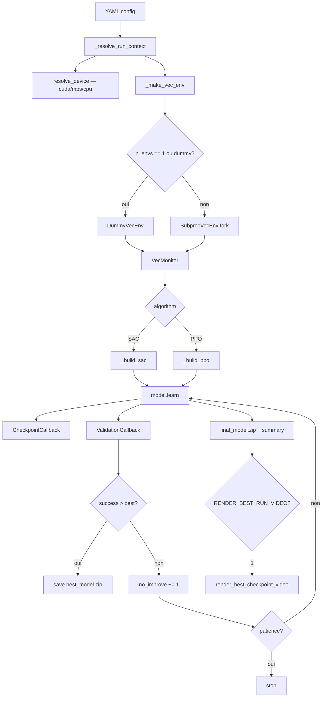

# Guide technique et exploitation

Ce document regroupe les anciennes notes techniques du projet : architecture, runbook, plateformes, paquets, CI, génération vidéo, dépannage et référence des fichiers.


---

## Architecture détaillée

### 1) Principes d'architecture

Le dépôt suit une logique proche de `robosuite` :

- un package Python principal à la racine (`robocasa_telecom/`),
- des scripts d'orchestration séparés (`scripts/`),
- des configurations déclaratives (`configs/`),
- des documents opératoires (`docs/`).

Cette séparation permet de garder la logique métier testable hors cluster, d'avoir des entrées CLI simples, et de limiter l'impact quand on remplace une méthode RL ou une tâche RoboCasa.

### 2) Vue des couches

#### Couche Configuration

- `configs/env/open_single_door.yaml` : paramètres de la simulation RoboCasa.
- `configs/train/open_single_door_sac.yaml` : hyperparamètres SAC + chemins d'artefacts.
- `configs/train/open_single_door_ppo_baseline.yaml` : hyperparamètres PPO baseline.
- Tous les configs `train` déclarent `device: auto` — résolu au runtime par `utils/device.py`.

#### Couche Environnement

- `robocasa_telecom/envs/factory.py` : traduit la config YAML en env RoboCasa exécutable.
  - Auto-détecte `MUJOCO_GL` à l'import (`egl` Linux, `cgl` macOS, `wgl` Windows).
  - Fournit deux adaptateurs Gymnasium :
    - `GymnasiumAdapter` (si le `GymWrapper` RoboSuite garde une shape stable),
    - `RawRoboCasaAdapter` (fallback robuste, flatten dict observations).

#### Couche RL

- `robocasa_telecom/rl/train.py` : boucle d'entraînement PPO + SAC, checkpoints, export courbes, vidéo post-training.
- `robocasa_telecom/rl/evaluate.py` : chargement checkpoint + rollouts d'évaluation (splits validation/test).
- `robocasa_telecom/rl/eval_video.py` : passage deux phases (scoring + rendu) pour la vidéo best-episode.
- `robocasa_telecom/rl/render_best_run.py` : rendu vidéo post-training du meilleur checkpoint.

#### Couche Utilitaires

- `robocasa_telecom/utils/device.py` : résolution cross-plateforme du device PyTorch (`cuda > mps > cpu`). Contourne le bug SB3 v2.3.x qui ignore MPS sur macOS.
- `robocasa_telecom/utils/io.py` : IO YAML + création de dossiers.
- `robocasa_telecom/utils/success.py` : logique homogène de détection du succès de tâche.
- `robocasa_telecom/utils/metrics.py` : calcul de métriques (door angle, action magnitude, anti-hacking).
- `robocasa_telecom/utils/checkpoints.py` : résolution et sauvegarde des artefacts de checkpoint.
- `robocasa_telecom/utils/video.py` : helpers MP4 (grid 2×2, uint8, imageio-ffmpeg).

#### Couche Exécution

- `scripts/setup_uv.sh` : provisioning environnement (clone externals, `uv sync`, assets).
- `scripts/run_train.sh` / `scripts/run_eval.sh` : wrappers locaux.
- `scripts/slurm/*.sbatch` : exécution GPU cluster.

### 3) Flux d'exécution détaillé

#### 3.1 Train

1. `uv run python -m robocasa_telecom.train --config ... --seed N`
2. `parse_args()` → `_resolve_run_context()` : merge YAML + overrides CLI (`--n-envs`, `--vec-env`, `--total-timesteps`).
3. `resolve_device(cfg["train"]["device"])` → string `"cuda"` / `"mps"` / `"cpu"`.
4. `_make_vec_env(n_envs, vec_env_backend)` :
   - `vec_env_backend="dummy"` ou `n_envs=1` → `DummyVecEnv` (single-process).
   - Sinon → `SubprocVecEnv(start_method="fork")` (multiprocessing, Linux/WSL2).
5. Chargement ou construction du modèle PPO/SAC.
6. `model.learn(...)` avec `PeriodicCheckpointCallback` + `ValidationCallback`.
7. `ValidationCallback` : rollouts périodiques sur seed=10000, sauvegarde `best_model.zip` si succès améliore.
8. Arrêt anticipé si `patience` atteinte (SAC uniquement).
9. `final_model.zip` + `train_summary.json` + `validation_curve.csv`.
10. Optionnel : `render_best_checkpoint_video()` si `ROBOCASA_RENDER_BEST_RUN_VIDEO=1`.



#### 3.2 Évaluation

1. `uv run python -m robocasa_telecom.evaluate --checkpoint ... --split test`
2. Résolution du seed selon le split (`validation_seed=10000`, `test_seed=20000`, ou `--seed N`).
3. Rollouts déterministes/non-déterministes.
4. Calcul `return_mean`, `success_rate`, `door_angle_final`, `action_magnitude`.
5. Export JSON + log MLflow (URI absolue `file://`).

#### 3.3 Vidéo best-episode (eval_video)

Deux passes sur les mêmes N épisodes (même seed, politique déterministe) :

1. **Pass 1 — scoring** : rollouts rapides sans rendu pour identifier le meilleur épisode.
2. **Pass 2 — rendu** : replay du meilleur épisode avec capture caméra 4 vues (grid 2×2).

Les `SubprocVecEnv` workers ne peuvent pas rendre — le rendu se fait en single-process dans `eval_video.py`.

#### 3.4 Sanity

1. `uv run python -m robocasa_telecom.sanity ...`
2. Reset env + N pas aléatoires.
3. Succès si aucune exception + fermeture propre.

### 4) Device resolution

`utils/device.py::resolve_device(preference)` :

```
"auto"  → cuda si disponible, sinon mps (macOS Darwin + torch.backends.mps), sinon cpu
"cuda"  → cuda si disponible, sinon cpu (warning)
"mps"   → mps si disponible, sinon cpu (warning)
"cpu"   → cpu toujours
```

SB3 v2.3.x `get_device("auto")` retourne `"cpu"` même si MPS est disponible. Ce wrapper corrige ce comportement.

### 5) VecEnv et multiprocessing

`_make_vec_env(n_envs, vec_env_backend)` choisit le backend :

| Condition | Backend | Usage |
|---|---|---|
| `n_envs == 1` ou `--vec-env dummy` | `DummyVecEnv` | Single-process, debug, Windows |
| `n_envs > 1` et `--vec-env subproc` (défaut) | `SubprocVecEnv(start_method="fork")` | Parallèle, production (Linux/WSL2) |

`fork` est le mode natif Linux/WSL2 : plus rapide que `spawn` (pas de re-import), pas de contrainte de picklabilité. Sur macOS avec MPS, il faudrait revenir à `spawn`.

### 6) Gestion de compatibilité robosuite / robocasa

- Le code importe `robocasa` avant `robosuite.make(...)` pour enregistrer les tâches RoboCasa.
- Les alias `OpenSingleDoor` et `OpenDoor` sont convertis en `OpenCabinet`.
- Le contrôleur est résolu avec fallback : `load_composite_controller_config` → `load_part_controller_config` → composite par défaut.
- Le `GymWrapper` est sondé sur plusieurs resets ; s'il dérive, bascule automatique sur `RawRoboCasaAdapter`.

### 7) Artefacts et reproductibilité

- Le nom de run inclut `task`, `algo`, `seed`, timestamp.
- Chaque checkpoint périodique est accompagné d'un `.json` de métadonnées (step, run_id).
- Le replay buffer SAC est sauvegardé avec chaque checkpoint (`*_replay_buffer.pkl`).
- Les chemins sont tous en `pathlib.Path` — cross-plateforme.
- Le tracking MLflow est ancré sur un URI absolu `file://` à l'init — fonctionne depuis n'importe quel répertoire de travail.

### 8) Extensibilité

**Nouvelle tâche :** dupliquer `configs/env/open_single_door.yaml`, changer `env.task`, dupliquer la config train.

**Nouvel algo :** ajouter l'entrée dans `SUPPORTED_ALGOS`, implémenter `_build_<algo>()` dans `train.py`, réutiliser `envs.factory` et `utils.success`.


---

## Runbook

### Pré-requis

| Plateforme | Pré-requis supplémentaires |
|---|---|
| macOS Apple Silicon | `brew install cmake` |
| Linux / WSL2 | Drivers NVIDIA + CUDA, `sudo apt install cmake libgl1-mesa-glx` |
| Windows 11 | Visual C++ Build Tools 2022, CUDA Toolkit 12.x |

Voir la section "Platform Compatibility" plus bas dans ce document pour les instructions complètes par OS.

Commun à toutes les plateformes : `uv` dans le `PATH`, `git`, accès réseau au moment du setup.

### Setup

```bash
bash scripts/setup_uv.sh
```

Exemple complet :

```bash
PYTHON_VERSION=3.11 \
ROBOCASA_COMMIT=9a3a78680443734786c9784ab661413edb87067b \
ROBOSUITE_COMMIT=aaa8b9b214ce8e77e82926d677b4d61d55e577ab \
DOWNLOAD_ASSETS=1 \
VERIFY_ASSETS=1 \
DOWNLOAD_DATASETS=0 \
RUN_SETUP_MACROS=1 \
bash scripts/setup_uv.sh
```

Ce setup :

- clone `external/robosuite` et `external/robocasa`,
- installe le projet avec `uv sync`,
- installe `robocasa` et `robosuite` depuis les sources locales déclarées dans `pyproject.toml`,
- relie automatiquement `robocasa/models/assets` vers les assets du checkout externe si besoin,
- vérifie les imports et la présence d'assets critiques.

### Validation

```bash
## Smoke tests cross-plateforme (aucun GPU ni MuJoCo requis, < 5 s)
pytest tests/test_platform_smoke.py -v

## Vérification de l'environnement
make check
uv run python -m robocasa_telecom.sanity --config configs/env/open_single_door.yaml --steps 20
```

Smoke train recommandé :

```bash
## Mode single-process (sûr sur toutes les plateformes, y compris Windows)
uv run python -m robocasa_telecom.train \
  --config configs/train/open_single_door_sac_debug.yaml \
  --seed 0 \
  --total-timesteps 10 \
  --vec-env dummy \
  --no-auto-resume

## Mode parallèle (SubprocVecEnv, fork — Linux/WSL2)
uv run python -m robocasa_telecom.train \
  --config configs/train/open_single_door_sac_debug.yaml \
  --seed 0 \
  --total-timesteps 10 \
  --n-envs 2 \
  --no-auto-resume
```

### Train

```bash
uv run python -m robocasa_telecom.train --config configs/train/open_single_door_sac.yaml --seed 0
```

Ou via le wrapper shell :

```bash
bash scripts/run_train.sh configs/train/open_single_door_ppo.yaml 0
```

Reprise d'un run interrompu :

```bash
uv run python -m robocasa_telecom.train \
  --config configs/train/open_single_door_sac.yaml \
  --seed 0 \
  --resume-from checkpoints/<run_id>/sac_100000_steps.zip
```

Sans `--resume-from`, l'entraînement active `--auto-resume` par défaut et reprend le dernier run interrompu correspondant au même `task/algo/seed`. Utilise `--no-auto-resume` pour forcer un départ depuis zéro.

#### Options CLI notables

| Flag | Valeurs | Effet |
|---|---|---|
| `--n-envs N` | entier pair ≥ 2 | override le nombre de workers parallèles |
| `--vec-env` | `subproc` (défaut) / `dummy` | backend VecEnv ; `dummy` = single-process (debug) |
| `--total-timesteps N` | entier | override la durée de l'entraînement |
| `--algorithm` | `SAC` / `PPO` | override l'algo déclaré dans le YAML |
| `--seed N` | entier | override le seed |

#### Vidéo post-training

Pour générer automatiquement une vidéo 4 vues du meilleur checkpoint à la fin du `train` :

```bash
ROBOCASA_RENDER_BEST_RUN_VIDEO=1 uv run python -m robocasa_telecom.train \
  --config configs/train/open_single_door_sac.yaml --seed 0
```

La vidéo est écrite sous `outputs/<run_id>/videos/`. Variables d'ajustement :

```bash
ROBOCASA_RENDER_BEST_RUN_VIDEO_MAX_STEPS=600
ROBOCASA_RENDER_BEST_RUN_VIDEO_FPS=20
ROBOCASA_RENDER_BEST_RUN_VIDEO_MIN_SECONDS=12
ROBOCASA_RENDER_BEST_RUN_VIDEO_MAX_EPISODES=5
```

#### Configs disponibles

```bash
uv run python -m robocasa_telecom.train --config configs/train/open_single_door_sac_debug.yaml --seed 0    # 300k — sanity
uv run python -m robocasa_telecom.train --config configs/train/open_single_door_sac.yaml --seed 0          # 3M   — run principal
uv run python -m robocasa_telecom.train --config configs/train/open_single_door_sac_tuned.yaml --seed 0    # 2M   — variante
uv run python -m robocasa_telecom.train --config configs/train/open_single_door_ppo.yaml --seed 0          # 200k — smoke PPO
uv run python -m robocasa_telecom.train --config configs/train/open_single_door_ppo_baseline.yaml --seed 0 # 5M   — baseline PPO
```

### Eval

```bash
uv run python -m robocasa_telecom.evaluate \
  --config configs/train/open_single_door_sac.yaml \
  --checkpoint checkpoints/<run_id>/best_model.zip \
  --num-episodes 50 \
  --split test \
  --deterministic
```

Splits disponibles : `--split validation` (seed=10000), `--split test` (seed=20000), `--split custom --seed N`.

### Vidéo best-episode

```bash
uv run python -m robocasa_telecom.rl.eval_video \
  --config configs/train/open_single_door_sac.yaml \
  --checkpoint checkpoints/<run_id>/best_model.zip \
  --n-episodes 20 \
  --seed 0 \
  --output-dir outputs/eval/videos/
```

### Render best run (post-training)

```bash
uv run robocasa-telecom-render-best-run \
  --config configs/train/open_single_door_sac.yaml \
  --checkpoint checkpoints/<run_id>/best_model.zip
```

### MLflow

```bash
## macOS / Linux / WSL2
uv run mlflow ui --backend-store-uri $(realpath mlruns)

## Windows PowerShell
uv run mlflow ui --backend-store-uri (Resolve-Path mlruns).Path
```

Le tracking URI est ancré en chemin absolu (`file://`) à l'initialisation — `mlflow ui` fonctionne depuis n'importe quel répertoire.

### SLURM

```bash
sbatch scripts/slurm/train_array.sbatch
sbatch --export=ALL,CHECKPOINT_PATH=checkpoints/<run_id>/final_model.zip scripts/slurm/eval.sbatch
sbatch --export=ALL,CONFIG_PATH=configs/train/open_single_door_sac.yaml,CHECKPOINT_PATH=checkpoints/<run_id>/best_model.zip,SEED=0 scripts/slurm/render_best_run.sbatch
```

### Dépannage rapide

| Symptôme | Solution |
|---|---|
| `uv run` échoue | `.venv` absent — relancer `bash scripts/setup_uv.sh` |
| Assets RoboCasa manquants | `DOWNLOAD_ASSETS=1 VERIFY_ASSETS=1 bash scripts/setup_uv.sh` |
| Shape d'observation instable | Normal — bascule automatique sur `RawRoboCasaAdapter` |
| `MUJOCO_GL` non défini / render vide | Auto-défini par `factory.py` (egl/cgl/wgl) ; forcer avec `MUJOCO_GL=osmesa` si nécessaire |
| `SubprocVecEnv` / pickling sur Windows | Utiliser `--vec-env dummy` pour passer en single-process |
| Device inattendu (`cpu` au lieu de `mps`) | `resolve_device()` dans `utils/device.py` — vérifier avec `python -c "from robocasa_telecom.utils.device import resolve_device; print(resolve_device('auto'))"` |
| Port 5000 occupé (MLflow) | `uv run mlflow ui --port 5001` |

Voir les sections "Troubleshooting" et "Platform Compatibility" plus bas dans ce document pour les cas détaillés.


---

## Platform Compatibility

### Support matrix

| Feature | macOS Apple Silicon (M1/M2/M3) | Windows 11 CUDA | WSL2 / Linux CUDA |
|---|---|---|---|
| Training (SAC/PPO) | ✅ MPS or CPU | ✅ CUDA | ✅ CUDA |
| Device auto-detection | ✅ `resolve_device("auto")` → mps | ✅ → cuda | ✅ → cuda |
| Parallel workers (`SubprocVecEnv`) | ✅ spawn | ✅ fork | ✅ fork |
| MuJoCo rendering | ✅ `MUJOCO_GL=cgl` | ⚠️ `MUJOCO_GL=wgl` (see note) | ✅ `MUJOCO_GL=egl` |
| Video export (MP4) | ✅ imageio-ffmpeg | ✅ imageio-ffmpeg | ✅ imageio-ffmpeg |
| MLflow UI | ✅ | ✅ | ✅ |
| `uv sync` | ✅ | ✅ base install, `--extra cuda` for NVIDIA | ✅ base install, `--extra cuda` for NVIDIA |

---

### macOS Apple Silicon

#### Prerequisites

```bash
brew install cmake   # if not already present
pip install uv       # or: curl -Ls https://astral.sh/uv/install.sh | sh
```

#### Install

```bash
git clone --recurse-submodules <repo-url>
cd robocasa-project-B
uv sync
```

#### Train

```bash
uv run robocasa-telecom-train --config configs/train/open_single_door_sac.yaml
```

Device resolution: `resolve_device("auto")` checks `torch.backends.mps.is_available()` and returns `"mps"` on Apple Silicon. SB3's built-in `get_device("auto")` does **not** pick MPS — this project works around that.

#### Notes

- `MUJOCO_GL` is auto-set to `cgl` (CoreGL) by `factory.py` at import time.
- To use CPU instead of MPS: `--device cpu` is not yet a CLI flag, but you can set `device: cpu` in your YAML or `export PYTORCH_ENABLE_MPS_FALLBACK=1` for unsupported ops.
- 12 parallel workers (`n_envs: 12`) work on Apple Silicon via `SubprocVecEnv(start_method="spawn")` (macOS does not support fork with MPS — if targeting macOS, revert to spawn).

---

### Windows 11 (NVIDIA CUDA)

#### Prerequisites

1. **Visual C++ Build Tools 2022** (required by MuJoCo): [download](https://visualstudio.microsoft.com/visual-cpp-build-tools/)
2. **CUDA Toolkit 12.x**: [download](https://developer.nvidia.com/cuda-downloads)
3. **Python 3.11 or 3.12**: [download](https://www.python.org/downloads/windows/)
4. **uv**: `pip install uv`

#### Install

```powershell
git clone --recurse-submodules <repo-url>
cd robocasa-project-B
uv sync --extra cuda
```

#### Train (PowerShell)

```powershell
uv run robocasa-telecom-train --config configs/train/open_single_door_sac.yaml
```

#### Debug (single process)

```powershell
uv run robocasa-telecom-train `
  --config configs/train/open_single_door_sac_debug.yaml `
  --vec-env dummy
```

#### Notes

- **MuJoCo GL**: `MUJOCO_GL=wgl` is set automatically. If rendering fails (no display), try:
  ```powershell
  $env:MUJOCO_GL = "osmesa"
  uv run robocasa-telecom-train ...
  ```
- **Dependency policy**: the committed `uv.lock` is cross-platform. Use plain `uv sync` for CPU setups, and `uv sync --extra cuda` on Windows/Linux NVIDIA machines.
- **SubprocVecEnv on WSL2/Linux**: uses `start_method="fork"` (Linux default, fast). If you encounter issues, use `--vec-env dummy` to debug.
- **MLflow UI**:
  ```powershell
  uv run mlflow ui --backend-store-uri (Resolve-Path mlruns).Path
  ```

---

### WSL2 / Linux (NVIDIA CUDA)

#### Prerequisites

```bash
## NVIDIA drivers + CUDA toolkit installed on the host
nvidia-smi  # verify GPU visible
sudo apt install cmake libgl1-mesa-glx   # EGL/osmesa deps
pip install uv
```

#### Install

```bash
git clone --recurse-submodules <repo-url>
cd robocasa-project-B
uv sync --extra cuda
```

#### Train

```bash
uv run robocasa-telecom-train --config configs/train/open_single_door_sac.yaml
```

#### Headless rendering

`MUJOCO_GL=egl` is set automatically by `factory.py`. EGL requires a NVIDIA driver with EGL support. If unavailable:

```bash
MUJOCO_GL=osmesa uv run robocasa-telecom-train ...
```

#### MLflow UI

```bash
uv run mlflow ui --backend-store-uri $(realpath mlruns)
```

---

### Smoke tests (all platforms)

Run before any experiment to verify the environment is correctly set up:

```bash
pytest tests/test_platform_smoke.py -v
```

Expected: **11 passed** in under 5 seconds. No GPU or MuJoCo scene required.

---

### CLI flags for portability

| Flag | Purpose | Example |
|---|---|---|
| `--vec-env dummy` | Single-process VecEnv (debug, Windows) | `--vec-env dummy` |
| `--vec-env subproc` | Parallel workers (default) | `--vec-env subproc` |
| `--n-envs 2` | Override worker count (must be even) | `--n-envs 2` |

The `device` is set in the YAML (`device: auto`) and resolved automatically — no CLI flag needed.

---

### Environment variables

| Variable | Values | Set by |
|---|---|---|
| `MUJOCO_GL` | `egl`, `cgl`, `wgl`, `osmesa` | `factory.py` (auto) or user |
| `PYTORCH_ENABLE_MPS_FALLBACK` | `1` | User (macOS, for ops not supported on MPS) |
| `ROBOCASA_RENDER_BEST_RUN_VIDEO` | `1` | User (enable post-training best-run video) |


---

## Packages

### Base

Le packaging du projet est désormais défini dans [`pyproject.toml`](../pyproject.toml).

### Dépendances Python directes

- `stable-baselines3`
- `gymnasium`
- `pyyaml`
- `numpy`
- `pandas`
- `tensorboard`
- `tqdm`
- `matplotlib`
- `imageio`
- `robosuite_models`

### Dépendances externes

- `robosuite`
- `robocasa`

### Dépendances système

- `git`
- `cmake`
- `ffmpeg`

### Remarque

Les anciens exports Conda/Pip restent disponibles dans `docs/packages/` à titre d'historique, mais ils ne sont plus la source de vérité pour l'installation.


---

## CI/CD

Le pipeline GitHub Actions doit maintenant s'appuyer sur `uv` plutôt que sur Conda.

### Jobs

### 1) `quick-linux`

Vérifications recommandées:
- `uv sync`
- `shellcheck` / validation syntaxe scripts shell
- `uv pip check`
- `uv run python -m compileall robocasa_telecom tests`
- test de chargement de config
- vérification que le message d'erreur "assets manquants" reste explicite quand `DOWNLOAD_ASSETS=0`

### 2) `full-assets-linux`

Vérifications recommandées:
- `DOWNLOAD_ASSETS=1`
- `VERIFY_ASSETS=1`
- `RUN_SETUP_MACROS=1`
- lancement de `uv run python -m robocasa_telecom.sanity ...`
- smoke train court: `uv run python -m robocasa_telecom.train --config configs/train/open_single_door_sac_debug.yaml --seed 0 --total-timesteps 10 --no-auto-resume`

### Setup local recommandé

```bash
DOWNLOAD_ASSETS=1 \
VERIFY_ASSETS=1 \
RUN_SETUP_MACROS=1 \
DOWNLOAD_DATASETS=0 \
bash scripts/setup_uv.sh
```


---

## Génération vidéo — Guide complet

> Implémentation : `robocasa_telecom/rl/eval_video.py`
> Commande Make : `make eval-video`

---

### 1. Pourquoi générer des vidéos ?

Les vidéos servent à :

1. **Comprendre le comportement de l'agent** : les métriques quantitatives (success_rate, door_angle) ne révèlent pas *comment* l'agent ouvre la porte, ni s'il adopte un comportement étrange (oscillation, approche par le dessus, etc.).
2. **Vérifier l'absence de reward hacking** : une vidéo montre immédiatement si l'agent reste immobile devant la poignée ou oscille la porte.
3. **Communication** : les vidéos sont plus convaincantes qu'un tableau de métriques pour présenter les résultats au professeur.
4. **Débogage** : comparer la vidéo du meilleur épisode avec celle du pire épisode révèle les limites de la politique.

---

### 2. Contrainte principale : SubprocVecEnv

Pendant l'entraînement, **il est impossible de générer des vidéos depuis les workers parallèles**. Les workers `SubprocVecEnv` s'exécutent dans des processus séparés (fork/spawn), et le contexte OpenGL/MuJoCo ne peut pas être partagé entre processus.

Options théoriques :

| Option | Description | Problème |
|---|---|---|
| A — Pendant l'entraînement | Rendre dans le worker | Impossible avec SubprocVecEnv |
| B — Post-training | Re-jouer avec un env dédié | **Solution retenue** |
| C — Env worker unique | Entraîner avec 1 seul worker pour avoir le rendu | Beaucoup plus lent |

**Option B retenue** : génération post-training via `eval_video.py` avec une approche two-pass.

---

### 3. Approche two-pass

#### Pass 1 — Scoring sans rendu (rapide)

- N épisodes (par défaut : 20) joués avec l'environnement **sans rendu**.
- Toutes les métriques sont collectées à chaque step (θ, d_ee, reward components).
- Chaque épisode reçoit un **score composite** anti-hacking.
- Durée : ~30–120 secondes selon N et le checkpoint.

#### Pass 2 — Rendu du meilleur épisode (reproductible)

- Le meilleur et le pire épisodes sont **re-joués** avec **le même seed** dans un environnement avec rendu offscreen activé.
- Reproductible : même seed + même politique déterministe = même trajectoire.
- Les frames sont assemblées en grille 2×2 (4 caméras bras) et exportées en MP4.

---

### 4. Critère de sélection du meilleur épisode

```
score = 1000 × success
       + 100  × door_angle_final   [normalised 0-1]
       + 10   × door_angle_max     [high-watermark]
       + 1    × episode_return     [tiebreaker]
       - 0.1  × stagnation_steps   [pénalise hover hacking]
       - 0.01 × episode_length     [préfère les succès rapides]
```

**Priorité explicite :**
1. Succès (pondéré 1000 → domine tout)
2. Angle final (pondéré 100 → parmi les succès, préfère la plus grande ouverture)
3. Angle max (pondéré 10 → high-watermark, anti-oscillation)
4. Return (pondéré 1 → tiebreaker seulement)
5. Pénalité stagnation (−0.1 → discrimine les succès "hover-hacky")
6. Pénalité longueur (−0.01 → préfère les succès rapides)

Ce scoring est **résistant au reward hacking** : un agent qui réussit vite et proprement a un score bien supérieur à un agent qui réussit en oscillant longtemps.

---

### 5. Commandes

#### Commande Make (recommandée)

```bash
make eval-video \
  CONFIG=configs/train/open_single_door_sac.yaml \
  CHECKPOINT=checkpoints/<run_id>/best_model.zip \
  EPISODES=20 \
  SEED=0
```

Variables Makefile disponibles :

| Variable | Défaut | Description |
|---|---|---|
| `EPISODES` | 20 | Nombre d'épisodes pour le scoring (pass 1) |
| `SEED` | 0 | Seed de base |
| `VIDEO_OUT` | `outputs/eval/videos` | Dossier de sortie |
| `VIDEO_FPS` | 20 | Images par seconde du MP4 |

#### CLI complet

```bash
uv run python -m robocasa_telecom.rl.eval_video \
  --config configs/train/open_single_door_sac.yaml \
  --checkpoint checkpoints/<run_id>/best_model.zip \
  --episodes 20 \
  --seed 0 \
  --out outputs/eval/videos/ \
  --fps 20
```

#### Générer sans vidéo du pire épisode

```bash
uv run python -m robocasa_telecom.rl.eval_video \
  --config configs/train/open_single_door_sac.yaml \
  --checkpoint checkpoints/<run_id>/best_model.zip \
  --episodes 20 --seed 0 \
  --no-worst
```

#### Attacher à un run MLflow existant

```bash
uv run python -m robocasa_telecom.rl.eval_video \
  --config configs/train/open_single_door_sac.yaml \
  --checkpoint checkpoints/<run_id>/best_model.zip \
  --episodes 20 --seed 0 \
  --mlflow-run-id <mlflow_run_id>
```

---

### 6. Fichiers générés

```text
outputs/eval/videos/
  <run_id>_best_episode_<timestamp>.mp4
      ← Vidéo du meilleur épisode (grille 4 caméras bras)
  <run_id>_worst_episode_<timestamp>.mp4
      ← Vidéo du pire épisode (optionnel, pour analyse des échecs)
  <run_id>_best_episode_metadata_<timestamp>.json
      ← Toutes les métadonnées du meilleur épisode
  <run_id>_video_selection_debug_<timestamp>.csv
      ← Une ligne par épisode avec score + métriques (pour audit)
```

#### Structure du JSON de métadonnées

```json
{
  "run_id": "OpenCabinet_SAC_seed0_20260505_120000",
  "checkpoint_path": "checkpoints/.../best_model.zip",
  "algorithm": "SAC",
  "n_episodes_scored": 20,
  "base_seed": 0,
  "deterministic": true,
  "cameras": ["robot0_eye_in_hand", "robot0_agentview_center", ...],
  "best": {
    "episode_id": 7,
    "seed_used": 7,
    "success": true,
    "episode_return": 312.4,
    "door_angle_final": 0.943,
    "door_angle_max": 0.943,
    "stagnation_steps": 0,
    "time_to_success": 142,
    "score": 1194.3,
    "reason_selected": "max(1000*success + ...)",
    "video_path": "outputs/eval/videos/...best_episode.mp4"
  },
  "aggregate": {
    "success_rate": 0.65,
    "return_mean": 198.2,
    "door_angle_final_mean": 0.71
  }
}
```

---

### 7. Logging MLflow

Les métriques et les vidéos sont automatiquement loggées dans MLflow si un run actif existe ou si `--mlflow-run-id` est fourni.

**Métriques loggées :**

| Métrique MLflow | Description |
|---|---|
| `eval_video/success_rate` | Taux de succès sur les N épisodes scorés |
| `eval_video/return_mean` | Return moyen |
| `eval_video/door_angle_final_mean` | Angle de porte final moyen |
| `eval_video/door_angle_max_mean` | High-watermark moyen |
| `eval_video/best_success` | Le meilleur épisode est-il un succès ? |
| `eval_video/best_door_angle_final` | Angle final du meilleur épisode |
| `eval_video/best_score` | Score du meilleur épisode |

**Artefacts loggés :**
- `videos/best_episode.mp4`
- `videos/worst_episode.mp4`
- `videos/best_episode_metadata.json`
- `videos/video_selection_debug.csv`

---

### 8. Vidéo en 4 vues

Le rendu utilise 4 caméras orientées sur le bras et la pince, assemblées en grille 2×2 (512×512 px) :

```
+------------------+------------------+
|  eye_in_hand     |  agentview_center|
+------------------+------------------+
|  frontview       |  sideview        |
+------------------+------------------+
```

Les caméras disponibles sont résolues automatiquement via `resolve_arm_video_cameras()` depuis la configuration d'environnement. Si une caméra n'est pas disponible, un frame noir est inséré.

---

### 9. Vérifier que la vidéo correspond au bon épisode

Pour vérifier que la vidéo correspond bien au meilleur épisode :

1. Ouvrir `video_selection_debug.csv`
2. Chercher la ligne avec `selected_as_best=1`
3. Vérifier que `seed_used`, `success`, `score`, `door_angle_final` correspondent aux valeurs dans le JSON de métadonnées
4. Re-jouer manuellement le même épisode :

```bash
## Test de reproductibilité : rejouer le seed du meilleur épisode
uv run python -c "
from robocasa_telecom.envs.factory import load_env_config, make_env_from_config
from stable_baselines3 import SAC
cfg = load_env_config('configs/env/open_single_door.yaml')
env = make_env_from_config(cfg, seed=7)  # seed_used du meilleur épisode
model = SAC.load('checkpoints/<run_id>/best_model.zip')
obs, _ = env.reset(seed=7)
print('Reproductibilité OK si comportement identique')
env.close()
"
```

---

### 10. Cas des 12 workers

Pendant l'entraînement avec 12 workers, chaque worker génère des épisodes avec des seeds différents. La vidéo post-training via `eval_video.py` utilise un **seul worker dédié** et rejoue les épisodes séquentiellement — aucun problème de rendu.

Le seed utilisé pour chaque épisode est : `base_seed + episode_id`. Pour N=20 épisodes et `base_seed=0`, les seeds sont 0, 1, 2, ..., 19.

---

### 11. Dépannage vidéo

| Symptôme | Cause probable | Solution |
|---|---|---|
| Vidéo noire | Rendu offscreen non initialisé | Vérifier MuJoCo + `has_offscreen_renderer: true` |
| Vidéo courte | `max_steps` trop petit | Augmenter via `--fps` ou modifier `eval_video.py` |
| Même seed mais trajectoire différente | Non-déterminisme de l'env | Vérifier que le même checkpoint est utilisé |
| Score 0 pour tous les épisodes | Problème d'extraction de θ | Vérifier `reward_components` dans `info` |
| Erreur `imageio` | Dépendance vidéo manquante | `uv run pip install imageio[ffmpeg]` |


---

## Troubleshooting — Résolution des problèmes courants

---

### Installation et setup

#### `.venv` manquant ou corrompu

**Symptôme :** `uv run` échoue avec "No virtual environment found".

```bash
## Solution
bash scripts/setup_uv.sh
```

Si le setup échoue à mi-parcours :

```bash
rm -rf .venv
bash scripts/setup_uv.sh
```

---

#### Assets RoboCasa manquants

**Symptôme :** `FileNotFoundError` mentionnant `robocasa/models/assets/`.

```bash
## Solution : retélécharger les assets
DOWNLOAD_ASSETS=1 VERIFY_ASSETS=1 bash scripts/setup_uv.sh
```

Si les assets sont déjà sur le disque mais mal liés :

```bash
## Vérifier le lien symbolique
ls -la external/robocasa/robocasa/models/assets/
## Si cassé, relancer le setup
bash scripts/setup_uv.sh
```

---

#### Warnings `mink`, `mimicgen`, `gym`

**Symptôme :**
```
WARNING: mimicgen environments not imported since mimicgen is not installed!
WARNING: mink environments not imported...
```

**Cause :** dépendances optionnelles non installées.

**Solution :** ces warnings sont **non bloquants** et attendus sur cette stack. Ignorer. Les fonctionnalités utilisées dans ce projet ne dépendent ni de mimicgen ni de mink.

---

### Device et plateforme

#### Device inattendu — `cpu` au lieu de `mps` ou `cuda`

**Symptôme :** le training tourne lentement ; `resolved_device` dans MLflow affiche `cpu`.

**Cause :** SB3 v2.3.x `get_device("auto")` retourne toujours `cpu` sur macOS, même avec MPS disponible.

**Solution :** le projet utilise `utils/device.resolve_device()` qui corrige ce comportement. Vérifier que la valeur dans le YAML est bien `device: auto` (et non `device: mps` ou `device: cpu` explicite) :

```bash
python -c "from robocasa_telecom.utils.device import resolve_device; print(resolve_device('auto'))"
## Attendu : mps (macOS Apple Silicon), cuda (Linux/Windows GPU), cpu (CPU uniquement)
```

---

#### `MUJOCO_GL` non défini / erreur de rendu au démarrage

**Symptôme :** `mujoco.FatalError: gladLoadGL error` ou rendu vide dès le premier reset.

**Cause :** la variable `MUJOCO_GL` n'est pas adaptée à l'OS.

**Solution :** `factory.py` la définit automatiquement à l'import. Si l'erreur persiste, forcer manuellement :

```bash
## Linux headless (WSL2, cluster sans display)
MUJOCO_GL=egl uv run python -m robocasa_telecom.train ...

## macOS
MUJOCO_GL=cgl uv run python -m robocasa_telecom.train ...

## Windows ou si egl/cgl échoue partout
MUJOCO_GL=osmesa uv run python -m robocasa_telecom.train ...
```

---

#### `SubprocVecEnv` / erreur au démarrage des workers

**Symptôme :** freeze ou crash au démarrage des workers parallèles.

**Cause :** problème d'import ou de path dans le subprocess forké.

**Solution immédiate :** passer en single-process avec `--vec-env dummy` pour isoler le problème :

```bash
uv run python -m robocasa_telecom.train \
  --config configs/train/open_single_door_sac_debug.yaml \
  --vec-env dummy --total-timesteps 1000
```

---

### MLflow

#### MLflow UI ne s'affiche pas / port occupé

**Symptôme :** `Address already in use` sur le port 5000.

```bash
## Utiliser un port alternatif
uv run mlflow ui --backend-store-uri ./mlruns --port 5001
## Puis ouvrir http://127.0.0.1:5001
```

Sur macOS, le port 5000 est souvent occupé par AirPlay Receiver :
- Désactiver dans Réglages Système → AirDrop et Handoff → AirPlay Receiver
- Ou simplement utiliser le port 5001

---

#### Aucun run dans MLflow UI

**Symptôme :** l'interface MLflow s'ouvre mais affiche "No runs found".

**Causes probables :**
1. Le dossier `mlruns/` est vide (aucun run n'a été lancé)
2. Le `backend-store-uri` pointe au mauvais endroit

```bash
## Vérifier que mlruns existe et contient des données
ls mlruns/
## Utiliser le chemin absolu (plus fiable)
uv run mlflow ui --backend-store-uri $(realpath mlruns)     # Linux/macOS
uv run mlflow ui --backend-store-uri (Resolve-Path mlruns).Path  # Windows PowerShell
```

Le tracking URI est ancré en absolu (`file://`) par le code — si `mlruns/` existe au bon endroit, les runs apparaissent quelle que soit la commande `mlflow ui` utilisée.

---

### Entraînement

#### Reward élevée mais 0 % de succès (hover hacking)

**Symptôme :** `val_return_mean` croît mais `val_success_rate` reste à 0. `val_approach_frac_mean > 0.5`.

**Cause :** l'agent a appris à rester proche de la poignée sans ouvrir la porte.

**Diagnostic dans MLflow :**
- Ouvrir MLflow UI
- Chercher `val_approach_frac_mean` — si > 0.5, c'est confirmé
- Chercher `val_door_angle_max_mean` — si < 0.2, l'agent n'a jamais bien ouvert

**Solutions :**
1. Augmenter `w_stagnation` (de 0.05 à 0.1–0.2) dans `configs/env/open_single_door.yaml`
2. Réduire `w_approach` (de 0.05 à 0.01)
3. Vérifier que `AntiHackingReward` est bien utilisé (non la reward native RoboCasa)
4. Lancer un SAC debug plus long (500k au lieu de 300k)

---

#### Run reprend en boucle infinie (auto-resume)

**Symptôme :** le run détecte un run précédent comme "incomplet" et le reprend, mais le checkpoint contient déjà 300k steps.

**Cause :** un run a crashé après `final_model.zip` mais avant `train_summary.json`. `_run_is_complete()` le considère incomplet.

```bash
## Solution : forcer un départ neuf
uv run python -m robocasa_telecom.train \
  --config configs/train/open_single_door_sac_debug.yaml \
  --seed 0 --no-auto-resume
```

---

#### `VecMonitor.reset() got an unexpected keyword argument 'seed'`

**Symptôme :** erreur à la fin du training lors de l'évaluation finale.

**Cause :** ancien code utilisant `train_env` (VecMonitor) pour l'évaluation finale.

**Solution :** déjà corrigé dans `utils/metrics.py` — détecte `isinstance(env, VecEnv)` et utilise `env.seed(n); env.reset()`. Si l'erreur persiste, vérifier que vous utilisez la dernière version du code.

---

#### `not enough values to unpack (expected 5, got 4)`

**Symptôme :** erreur lors du step dans l'évaluation.

**Cause :** `VecEnv.step()` retourne 4 valeurs (sans `truncated` séparé) dans l'ancienne API.

**Solution :** déjà corrigé. L'évaluation finale utilise un environnement single-worker avec l'API Gymnasium 0.29.1.

---

#### Entraînement lent (< 1 000 steps/min)

**Causes possibles et solutions :**

| Cause | Diagnostic | Solution |
|---|---|---|
| `gradient_steps=12` est lent par design | Normal avec SAC + 12 workers | C'est intentionnel — trade-off sample efficiency |
| Device mal configuré | `device: cpu` au lieu de `mps`/`cuda` | Modifier dans le YAML ou `--device mps` |
| Trop de workers en RAM | Swap excessif | Réduire `n_envs` à 6 ou 4 |
| Disque SSD lent | Logs écrits fréquemment | Réduire `save_freq_steps` ou utiliser un SSD rapide |

**Vitesses de référence :**
- SAC 12 workers, MPS (M3 Pro) : ~2 600 steps/min
- SAC 12 workers, RTX 4070 : ~3 500 steps/min
- PPO 1 worker, CPU : ~800 steps/min

---

#### OOM (Out of Memory) avec 12 workers

**Symptôme :** processus tué, `MemoryError`, ou swap excessif.

**Diagnostic :**

```bash
## Vérifier l'utilisation RAM
top -l 1 | grep -E "PhysMem|Swap"  # macOS
free -h                              # Linux
```

**Référence :** 12 workers SAC ≈ 10 Go RAM total (3.3 Go main + 5.5 Go workers).

**Solutions :**

```yaml
## Dans open_single_door_sac.yaml
n_envs: 6    # Réduire à 6 workers
## ou
n_envs: 4    # Réduire à 4 workers
```

Adapter aussi `gradient_steps` si `n_envs` change.

---

#### `CUDA out of memory`

```bash
## Réduire la taille du batch
## Dans le YAML :
batch_size: 256  # au lieu de 512
## ou utiliser CPU
device: cpu
```

---

### Évaluation

#### `best_model.zip` introuvable

**Symptôme :** `FileNotFoundError: checkpoints/<run_id>/best_model.zip`.

**Cause :** le run n'a pas encore terminé, ou le premier checkpoint n'a pas été sauvegardé (trop peu de steps).

**Solutions :**
1. Utiliser `final_model.zip` comme fallback temporaire
2. Vérifier que `eval.eval_freq > 0` dans le YAML (sinon la validation ne s'exécute jamais)
3. Vérifier que `eval.n_eval_episodes > 0`

---

#### Success rate différent entre deux runs avec le même seed

**Causes possibles :**
1. GPU non-déterministe (CUDA/MPS) — utiliser `device: cpu` pour la reproductibilité parfaite
2. Version de RoboCasa différente — vérifier que `setup_uv.sh` utilise les mêmes commits
3. Seed de l'environnement non fixé lors de l'évaluation — vérifier `--seed` dans la commande eval

---

### Vidéo

#### Vidéo vide (noire)

**Causes et solutions :**

1. `has_offscreen_renderer` non activé :
   - `eval_video.py` l'active automatiquement — vérifier que vous utilisez bien `eval_video.py` et non `evaluate.py` pour la vidéo

2. MuJoCo sans support d'affichage (serveur headless) :
   ```bash
   # Forcer le rendu EGL (headless)
   MUJOCO_GL=egl uv run python -m robocasa_telecom.rl.eval_video ...
   ```

3. Display manquant sur Linux :
   ```bash
   # Installer un display virtuel
   Xvfb :1 -screen 0 1280x1024x24 &
   DISPLAY=:1 uv run python -m robocasa_telecom.rl.eval_video ...
   ```

---

#### Erreur `imageio` / `ffmpeg`

**Symptôme :** `ImageIOError: No reader found for format`.

```bash
## Réinstaller imageio avec support ffmpeg
uv run pip install imageio[ffmpeg]
## ou
uv run pip install imageio imageio-ffmpeg
```

---

#### Vidéo courte ou trajectoire différente de celle attendue

**Symptôme :** la vidéo dure 2 secondes au lieu de 10.

**Cause :** l'épisode se termine très vite (succès rapide ou timeout à 0 steps).

**Vérifier :** `max_steps` dans `_render_episode()` — par défaut 600 steps (> 500 de l'épisode), donc pas un problème.

**Si la trajectoire semble différente entre pass 1 et pass 2 :**
- Vérifier que le même seed est utilisé
- Vérifier que la politique est déterministe (`deterministic=True`)
- Vérifier que le même checkpoint est utilisé

---

### Environnement RoboCasa

#### Shape d'observation instable entre resets

**Symptôme :** `ValueError: observation space shape changed between resets`.

**Cause :** `GymWrapper` RoboSuite retourne parfois des shapes différentes.

**Solution :** déjà géré automatiquement — `make_env_from_config()` détecte ce cas et bascule sur `RawRoboCasaAdapter` qui flattèn les observations. Ce comportement est **attendu** et n'indique pas d'erreur.

---

#### Collisions excessives / robot qui tremble

**Symptôme :** le robot vibre ou entre en collision avec le placard.

**Causes et solutions :**
1. `w_action_reg` trop faible → augmenter à 0.05 ou 0.1
2. `learning_rate` trop élevé → réduire à 1e-4
3. `control_freq` trop élevé → réduire à 5 Hz pour des actions plus stables

---

#### Résultats différents entre seeds

C'est **attendu et normal** — la variance entre seeds est une propriété fondamentale des algorithmes RL. Pour la caractériser :

```bash
## Lancer 3 seeds
make train-sac SEED=0
make train-sac SEED=1
make train-sac SEED=2

## Comparer
uv run python scripts/plot_training.py \
  --run outputs/OpenCabinet_SAC_seed0_*/ \
        outputs/OpenCabinet_SAC_seed1_*/ \
        outputs/OpenCabinet_SAC_seed2_*/ \
  --label "seed0" "seed1" "seed2" \
  --out outputs/plots/multi_seed/
```


---

## Référence fichier par fichier

### Fichiers racine

#### `pyproject.toml`
Packaging PEP 621, dépendances pinées, entrées console. Dépendances notables : `stable-baselines3==2.3.2`, `imageio-ffmpeg>=0.5` (MP4 sans ffmpeg système), `mlflow==2.20.3`.

#### `README.md`
Point d'entrée utilisateur : installation, tableau de support plateforme, démarrage rapide, commandes principales.

#### `uv.lock`
Versions exactes de toutes les dépendances (185 packages). Régénérer avec `uv lock` si l'OS cible change (wheels différents Linux/macOS/Windows).

#### `Makefile`
Raccourcis : `make train-sac`, `make eval-test`, `make eval-video`, `make plot`, `make check`, `make sanity`.

### Configuration

#### `configs/env/open_single_door.yaml`
Paramètres de simulation RoboCasa : tâche, robot, contrôleur, caméras, `max_steps`, `control_freq`.

#### `configs/train/open_single_door_sac.yaml`
SAC principal — 3M steps, 12 workers, `device: auto`. Déclare `eval.validation_seed` et `eval.test_seed`.

#### `configs/train/open_single_door_sac_debug.yaml`
SAC debug — 300k steps, utilisable pour sanity et smoke tests.

#### `configs/train/open_single_door_sac_tuned.yaml`
SAC variante — 2M steps, lr=1e-4, batch=512.

#### `configs/train/open_single_door_ppo_baseline.yaml`
PPO baseline — 5M steps, 12 workers, `device: auto`.

#### `configs/train/open_single_door_ppo.yaml`
PPO smoke — 200k steps, 4 workers, eval désactivée. Utilisable pour des tests rapides.

### Package principal

#### `robocasa_telecom/utils/device.py`
Résolution cross-plateforme du device PyTorch. `resolve_device("auto")` choisit `cuda > mps > cpu`. Contourne le bug SB3 v2.3.x qui ignore MPS sur macOS Apple Silicon. Utilisé par tous les modules RL.

#### `robocasa_telecom/envs/factory.py`
Création d'environnement RoboCasa compatible Gymnasium. Auto-détecte `MUJOCO_GL` à l'import (`egl`/`cgl`/`wgl` selon l'OS). Fournit `GymnasiumAdapter` et `RawRoboCasaAdapter` (fallback).

#### `robocasa_telecom/rl/train.py`
Boucle d'entraînement PPO/SAC. CLI flags notables : `--n-envs` (workers pairs), `--vec-env subproc|dummy`, `--total-timesteps`, `--algorithm`, `--resume-from`, `--auto-resume`. Inclut `ValidationCallback`, `PeriodicCheckpointCallback`, sauvegarde `best_model.zip`, export `validation_curve.csv` et `train_summary.json`.

#### `robocasa_telecom/rl/evaluate.py`
Évaluation d'un checkpoint. Splits `--split validation|test|custom`. Log MLflow avec URI absolue. Export JSON des métriques.

#### `robocasa_telecom/rl/eval_video.py`
Vidéo best-episode en deux passes (scoring puis rendu). Single-process obligatoire — les workers SubprocVecEnv ne peuvent pas rendre.

#### `robocasa_telecom/rl/render_best_run.py`
Rendu vidéo post-training du meilleur checkpoint. Appelé automatiquement si `ROBOCASA_RENDER_BEST_RUN_VIDEO=1`.

#### `robocasa_telecom/utils/io.py`
IO YAML (`load_yaml`) + création de dossiers (`ensure_dir`).

#### `robocasa_telecom/utils/success.py`
Détection homogène du succès de tâche (compatible toutes versions RoboCasa).

#### `robocasa_telecom/utils/metrics.py`
Calcul de métriques RL : `door_angle`, `action_magnitude`, métriques anti-hacking (oscillation, stagnation, `approach_frac`).

#### `robocasa_telecom/utils/checkpoints.py`
Résolution et sauvegarde des artefacts checkpoint. Supporte reprise automatique (`find_latest_resume_candidate`).

#### `robocasa_telecom/utils/video.py`
Helpers MP4 : `grid_2x2` (mosaïque 4 caméras), `ensure_uint8_frame`, `save_mp4` (via imageio-ffmpeg).

#### `robocasa_telecom/sanity.py`
Smoke test minimal : reset + N steps aléatoires. Valide l'installation sans training.

### Tests

#### `tests/test_platform_smoke.py`
11 tests cross-plateforme sans GPU ni MuJoCo. Vérifie : `resolve_device`, `MUJOCO_GL` auto-set, `pathlib`, URI MLflow absolue, imports imageio-ffmpeg/SB3/torch. Lancer avant tout push : `pytest tests/test_platform_smoke.py -v`.

#### `tests/test_config_loading.py`
Test de cohérence des configs YAML.

#### `tests/test_env_factory.py`
Test de la factory d'environnement.

#### `tests/test_metrics.py`
Test des utilitaires de métriques.

#### `tests/test_checkpoints.py`
Test de la gestion des checkpoints.

#### `tests/test_train_video_env.py`
Test de l'environnement de rendu vidéo.

### Scripts

#### `scripts/setup_uv.sh`
Bootstrap complet : clone des externals (commits figés), `uv sync`, liaison/téléchargement des assets RoboCasa, validation d'imports.

#### `scripts/run_train.sh` / `scripts/run_eval.sh`
Wrappers locaux. La voie standard reste `uv run`.

#### `scripts/slurm/train_array.sbatch`
Lancement batch train sur cluster SLURM (array par seed).

#### `scripts/slurm/eval.sbatch`
Lancement batch évaluation sur cluster.

#### `scripts/slurm/render_best_run.sbatch`
Lancement rendu vidéo sur cluster.

### Documentation

#### `docs/RUNBOOK.md`
Procédures opératoires : setup, validation, train, eval, vidéo, MLflow, SLURM, dépannage rapide.

#### `docs/ARCHITECTURE.md`
Architecture en couches, flux d'exécution détaillé, device resolution, VecEnv, reproductibilité.

#### `docs/platform_compatibility.md`
Instructions complètes par OS (macOS/Windows/WSL2) : prérequis, install, commandes de test, variables d'environnement.

#### `docs/EXPERIMENTS.md`
Plan de runs : SAC debug/principal/tuned + PPO baseline. Diagramme boucle entraînement.

#### `docs/reproducibility.md`
Guide complet reproductibilité : versions, seeds, déterminisme par hardware, stratégie artefacts Git.

#### `docs/troubleshooting.md`
Résolution des problèmes courants : install, MLflow, vidéo, rendu, seeds, device.

#### `docs/METHODS.md`
Justification des choix algorithmiques (SAC vs PPO, reward shaping, anti-hacking).

#### `docs/metrics.md`
Description des métriques collectées et de leur interprétation.

#### `docs/reward_shaping.md`
Détail du reward shaping et des termes anti-hacking.

#### `docs/CI.md`
Synthèse CI/CD.

#### `docs/PACKAGES.md`
Inventaire et justification des dépendances.

### Historique

Les exports dans `docs/packages/` sont conservés comme historique de l'environnement.
